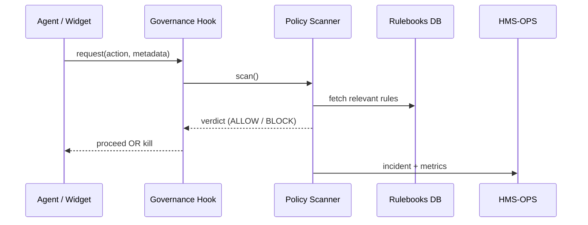

# Chapter 12: Security & Compliance Module (HMS-ESQ + Governance Hooks)
[← Back to Chapter 11: Data Repository & Management Service (HMS-DTA)](11_data_repository___management_service__hms_dta__.md)

---

## 1 — Why do we need a 24/7 “digital body-scanner”?

Picture this very real nightmare:

1. A Veterans Affairs (VA) **Agent-Bot** finishes generating a hospital-stay summary.  
2. It blindly pushes the PDF—full of Protected Health Information (PHI)—to the public “Research Data” bucket meant for anonymised aggregates.  
3. Within minutes the file is indexed by internet crawlers.

Result: privacy breach, lawsuits, and erosion of public trust.

**HMS-ESQ** (pronounced “Esquire”) is the platform’s **legal counsel + security checkpoint**.  
Every data flow, file transfer, or AI action passes through ESQ’s body-scanner:

```
Action enters →  Scan against 3 rulebooks  →  Block OR Allow + Audit
```

Rulebooks  
1. Statutes (HIPAA, Privacy Act, etc.)  
2. Executive Orders (AI Risk Memos, Zero-Trust)  
3. Agency-specific policies (VA Directive 6502)

If anything conflicts, ESQ pulls the **kill-switch** and files an **incident report**.

---

## 2 — Five Core Concepts (plain-English)

| # | Term | Beginner-friendly rule | Analogy |
|---|------|-----------------------|---------|
| 1 | Guardrail | A machine rule like “PHI must stay inside HIPAA zones”. | Highway barrier. |
| 2 | Governance Hook | One line of code that calls ESQ before an action. | Swipe badge before opening a door. |
| 3 | Policy Scanner | Service that matches data & action vs. rulebooks. | TSA X-ray machine. |
| 4 | Incident Report | JSON file with who, what, when, why blocked. | Police ticket. |
| 5 | Kill Switch | Immediate cancel of the offending action. | Emergency stop button. |

Remember: **Hook → Scanner → (Allow | Kill + Report)**.

---

## 3 — Hands-On: Feel the Guardrail in 14 Lines

Goal: watch ESQ stop a rogue export of PHI to an unapproved bucket.

```python
# demo_block.py (14 lines)
from hms_esq import guardrail

@guardrail        # 1-line Governance Hook 🎉
def export_phi(file, dest):
    # pretend we copy bytes — skipped
    print(f"Exported {file} to {dest}")

# --- run two tests ---
export_phi("patient_007.pdf", "s3://hipaa_zone/reports")   # ✅ allowed
export_phi("patient_007.pdf", "s3://public_dump")          # ❌ blocked
```

Expected console output:

```
✔  Allowed: patient_007.pdf → hipaa_zone/reports
✖  BLOCKED by HMS-ESQ: Rule HIPAA-SC-12 violated (PHI to public bucket)
    Incident ID: INC-8D34  Logged to HMS-OPS
```

What you saw:

1. The decorator sent a **policy request** to ESQ.  
2. First call matched “HIPAA zone” → allowed.  
3. Second call failed → ESQ fired the kill switch and logged INC-8D34.

---

## 4 — How does ESQ decide? (Step-by-Step)



Five actors. Half the time, ALLOW returns in <30 ms; blocks are fully audited.

---

## 5 — Peeking Inside the Code (all ≤ 20 lines)

### 5.1 Governance Hook decorator

```python
# hms_esq.py   (excerpt)
import functools, requests, os

API = os.getenv("ESQ_URL", "https://esq.hms.gov/scan")

def guardrail(fn):
    @functools.wraps(fn)
    def wrapper(*a, **k):
        payload = {"func": fn.__name__, "args": a, "dest": k.get("dest")}
        verdict = requests.post(API, json=payload, timeout=2).json()
        if verdict["allow"]:
            return fn(*a, **k)
        else:
            print(f"✖  BLOCKED by HMS-ESQ: {verdict['reason']}")
            return None
    return wrapper
```

• Adds **one network call** before your function.  
• If `allow == False` the original function never runs.

### 5.2 Tiny Policy Scanner (demo)

```python
# esq_core/scanner.py  (simplified)
RULES = [
  {"id":"HIPAA-SC-12", "match": 
        lambda p: p["dest"].startswith("s3://public"),
   "msg":"PHI to public bucket"}
]

def scan(payload):
    for rule in RULES:
        if rule["match"](payload):
            return {"allow":False, "reason":f"Rule {rule['id']} violated ({rule['msg']})"}
    return {"allow":True}
```

### 5.3 Incident Logger

```python
# esq_core/incident.py
import uuid, json, time, pathlib
LOG = pathlib.Path("/var/esq/incidents")
def log(payload, reason):
    rec = {"id": "INC-"+uuid.uuid4().hex[:4].upper(),
           "ts": time.time(),
           "payload": payload,
           "reason": reason}
    (LOG / f"{rec['id']}.json").write_text(json.dumps(rec))
    return rec["id"]
```

---

## 6 — Where ESQ Hooks into Other HMS Layers

* **Agents** ([HMS-AGT](05_agent_framework__hms_agt__.md)) decorate risky tools with `@guardrail`.  
* **Micro-frontends** ([HMS-MFE](03_micro_frontend_interface__hms_mfe__.md)) auto-wrap file upload widgets.  
* **Workflows** ([HMS-ACT](06_agent_orchestration___workflow_engine__hms_act__.md)) block a whole step if any guarded action fails.  
* **Inter-Agency messages** ([HMS-A2A](08_inter_agency_communication_protocol__hms_a2a__.md)) pass through ESQ before leaving the agency boundary.  
* **Operations Suite** (next chapter) stores every incident for dashboards & paging.

---

## 7 — Frequently Asked Questions

**Q1: Does ESQ slow my app down?**  
No—95 % of calls are simple “ALLOW” responses in <30 ms, cached per rule.

**Q2: How do new laws get added?**  
Policy owners push a YAML rule file to the Rulebooks repo; ESQ hot-reloads without downtime.

**Q3: Can developers bypass ESQ in dev mode?**  
Only inside isolated `sandbox` namespaces. Attempting in `stage` or `prod` raises a governance violation.

**Q4: What data does the incident report store?**  
Function name, args hash (not raw PHI), caller identity, rule violated, timestamp.

---

## 8 — Try It Yourself (3-minute exercise)

1. Install the lite package:  
   ```bash
   pip install hms-esq-lite
   ```

2. Paste `demo_block.py` from Section 3 and run it.  
3. Change the destination to `"s3://hipaa_zone/reports"` and verify it passes.  
4. Open `/var/esq/incidents` to view the JSON ticket for the blocked attempt.

Congratulations—your laptop now enforces HIPAA!

---

## 9 — What you learned

* HMS-ESQ is the **legal counsel + body scanner** for every HMS action.  
* One-line **Governance Hooks** make any function compliant without rewriting logic.  
* Behind the scenes ESQ matches payloads to statutes, blocks violations, and files incident reports.  
* All other layers—agents, workflows, A2A, UI—gain security “for free” by calling ESQ.

Ready to **monitor all those allow/deny decisions, latencies, and incident counts in real time**?  
Jump to [Chapter 13: Operations & Monitoring Suite (HMS-OPS)](13_operations___monitoring_suite__hms_ops__.md) →

---

Generated by [AI Codebase Knowledge Builder](https://github.com/The-Pocket/Tutorial-Codebase-Knowledge)