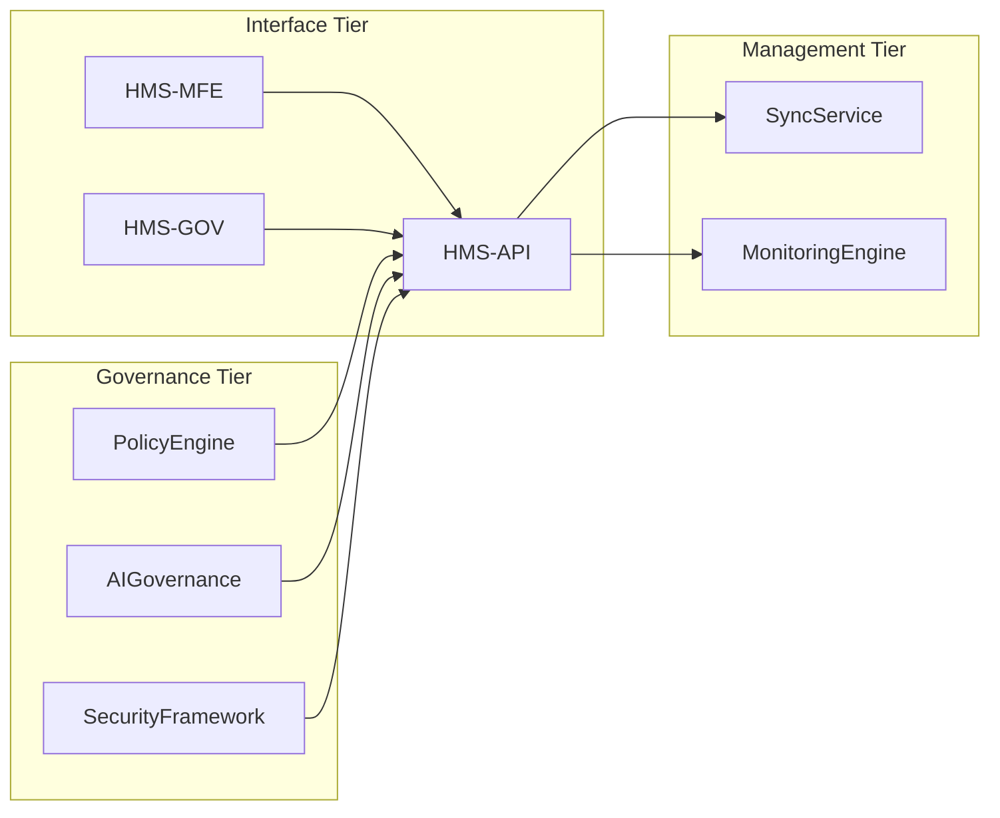
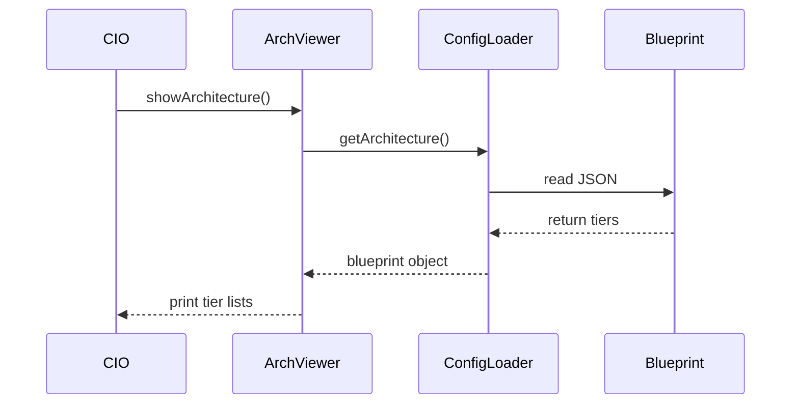

# Chapter 12: System Architecture Layer

In [Chapter 11: Monitoring & Metrics Engine](11_monitoring___metrics_engine_.md) we learned how to watch and alert on service health. Now let’s step back and look at the **System Architecture Layer**—the high-level blueprint that shows how all major parts of HMS-EMR fit together. Think of it as a city zoning plan: it tells you where residences (interfaces), businesses (management), and utilities (governance) go, and helps an agency CIO or program manager see how to plug in new microservices.

---

## 1. Motivation & Central Use Case

**Use Case:**  
A CIO at the Bureau of Engraving and Printing wants to integrate a new “Foreign Currency Converter” microservice. Before coding, they need to know:

1. Which interface tier services face external users.  
2. How the management tier routes requests and applies business rules.  
3. Where governance services enforce policies, security, and AI checks.

With a clear architecture map, the CIO can spot the right insertion point—just like zoning an expansion to avoid utility conflicts.

---

## 2. Key Concepts

1. **Interface Tier**  
   User-facing portals and APIs (e.g., HMS-MFE for citizens, HMS-GOV for staff).

2. **Management Tier**  
   Core services that process data: Backend API, Microservices, SyncService, Metrics Engine.

3. **Governance Tier**  
   Policy engines, AI governance, Security & Compliance modules that oversee rules.

---

## 3. Defining Your Architecture Blueprint

Below is a minimal JSON blueprint. It lives in `config/system-architecture.json`.

```json
{
  "interfaceTier":   ["HMS-MFE", "HMS-GOV"],
  "managementTier":  ["HMS-API", "SyncService", "MonitoringEngine"],
  "governanceTier":  ["PolicyEngine", "AIGovernance", "SecurityFramework"]
}
```
This simple file lists each tier’s components.

### 3.1 Loading the Blueprint

```js
// src/arch/configLoader.js
import arch from '../../config/system-architecture.json';

export function getArchitecture() {
  return arch;  // Returns the JSON object above
}
```
> `getArchitecture` gives you all three tiers in code.

### 3.2 Displaying a Text Summary

```js
// src/arch/archViewer.js
import { getArchitecture } from './configLoader';

export function showArchitecture() {
  const a = getArchitecture();
  console.log('Interface Tier:  ', a.interfaceTier.join(', '));
  console.log('Management Tier: ', a.managementTier.join(', '));
  console.log('Governance Tier: ', a.governanceTier.join(', '));
}
```
> Running `showArchitecture()` prints each tier’s components.

---

## 4. Visualizing with Mermaid

Here’s a small diagram to see how tiers connect:



- Interface Tier calls into the Management Tier.  
- Governance Tier plugs into the API to enforce rules, log audits, and vet AI calls.

---

## 5. Step-by-Step Sequence



1. **Viewer** asks **ConfigLoader** for the blueprint.  
2. **ConfigLoader** reads `system-architecture.json`.  
3. **Viewer** prints or renders the tiered map.

---

## 6. Internal Implementation Notes

- **config/system-architecture.json**  
  Maintains your tiers in one place for easy updates.

- **src/arch/configLoader.js**  
  Abstracts file loading so you can later switch to a database or service.

- **src/arch/archViewer.js**  
  Could be replaced with a web component that draws the Mermaid graph dynamically.

By keeping the blueprint in a single config, your teams—frontend, backend, AI, security—can all refer to the same map.

---

## Conclusion

In this chapter you learned how to:

- Define the **Interface**, **Management**, and **Governance** tiers.  
- Store a high-level blueprint in a JSON file.  
- Load, print, and visualize the complete system layout.  

With this **System Architecture Layer**, agency CIOs and program managers have a clear zoning plan—showing where new capabilities belong and how services interconnect. This foundation makes future integrations, audits, and expansions straightforward and low-risk.

---

Generated by [AI Codebase Knowledge Builder](https://github.com/The-Pocket/Tutorial-Codebase-Knowledge)