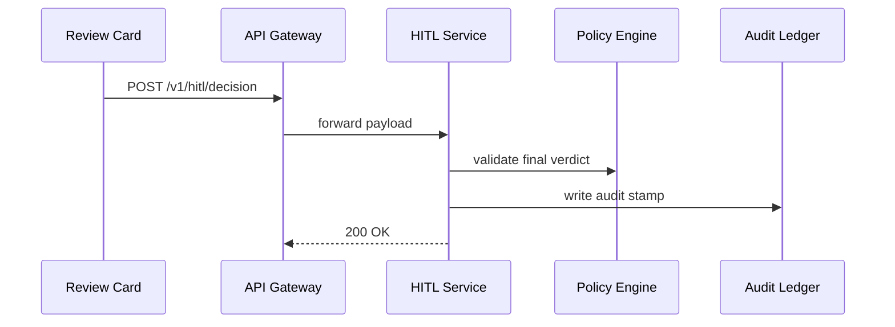
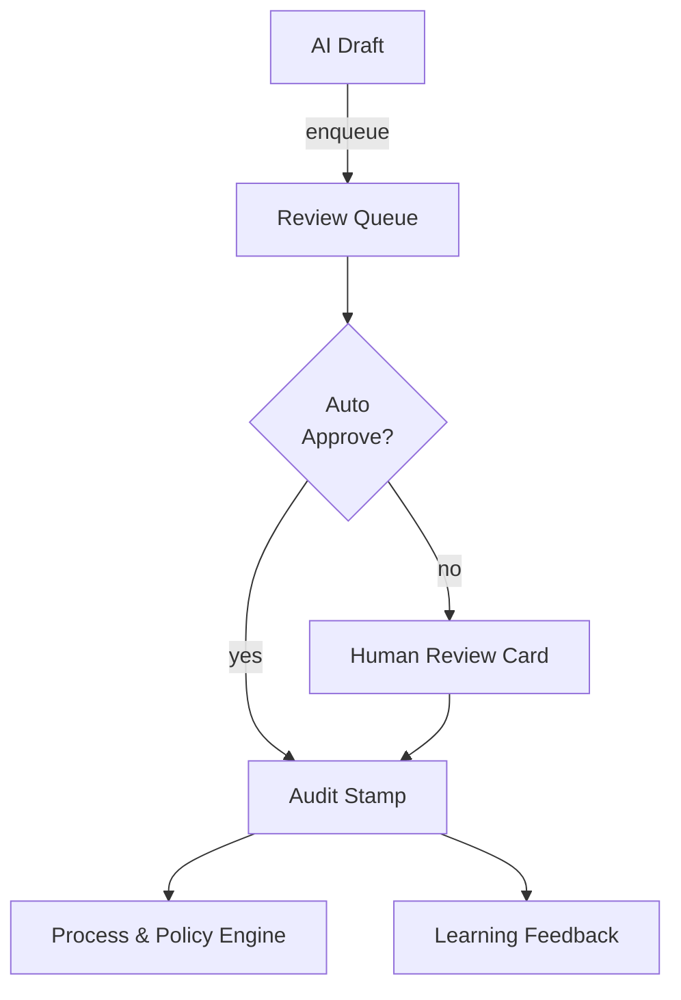

# Chapter 13: Human-in-the-Loop (HITL) Oversight
*(continuing from [Chapter 12: AI Representative Agent Framework (HMS-A2A)](12_ai_representative_agent_framework__hms_a2a__.md))*  

---

## 1. Why Keep a Human in the Loop?

Imagine the **Department of Labor (DOL)** is flooded with **Unemployment Benefit Appeals**.  
Yesterday our AI agent (see Chapter 12) drafted 4,300 proposed rulings.  
Great—but only a **licensed adjudicator** can make a binding decision.

Without a checkpoint we risk:

* Approving claims that fail the statute.  
* Denying legitimate citizens and triggering media scandals.  
* Losing public trust (“robots took my benefits!”).

**HITL Oversight** adds a final *human stamp* before AI work goes live—exactly how a judge reviews a clerk’s draft opinion.

---

## 2. Concrete Use Case

*Citizen Maria* appeals a denied benefit.  
HMS-A2A reviews her file and drafts a **“Grant Appeal”** recommendation.  
Maria’s fate now enters the **HITL Review Queue** where Adjudicator Lee must **Approve**, **Tweak**, or **Reject** the draft within 24 h.

We’ll build that flow—end-to-end—in a handful of beginner-friendly steps.

---

## 3. Five Key Concepts (Tiny Bricks)

| Brick | Analogy (Courthouse) | Beginner Meaning |
|-------|----------------------|------------------|
| Review Queue | Case docket | List of AI drafts waiting for people |
| Decision Card | Case folder | One record with AI proposal + evidence |
| Override Action | Judge’s pen | Human edits or rejects the draft |
| Audit Stamp | Court seal | Immutable record of the final ruling |
| Feedback Loop | Clerk’s lesson | Sends human notes back to the AI for learning |

---

## 4. Step-by-Step Walk-Through

### 4.1 AI Pushes a Draft into the Queue

```bash
curl -X POST https://hitl.hms.gov/queue \
  -H "Authorization: Bearer $SERVICE_TOKEN" \
  -d '{"caseId":"APL-7712","proposed":"GRANT","reason":"Meets §303"}'
```

Explanation  
1. Any HMS service (often HMS-A2A) may enqueue a draft.  
2. The **Review Queue** now shows *APL-7712* with status `PENDING_HUMAN`.

### 4.2 Human Adjudicator Opens the Decision Card (React, 12 lines)

```jsx
import { ReviewCard } from "@hms-emr/mfe";

<ReviewCard
  caseId="APL-7712"
  loadURL="/v1/hitl/case/APL-7712"
  onSubmit={(decision) =>
    fetch("/v1/hitl/decision", {
      method: "POST",
      headers: {"Content-Type":"application/json"},
      body: JSON.stringify(decision)
    })
  }
/>
```

What the component does  
* Fetches the AI’s draft + evidence.  
* Shows **Approve**, **Tweak**, **Reject** buttons and a text box for notes.  
* Sends the human’s choice back to the HITL API.

### 4.3 Typical Human Response Payload

```json
{
  "caseId": "APL-7712",
  "final": "GRANT_WITH_BACKPAY",
  "notes": "Add \$600 retro to cover missing weeks.",
  "reviewer": "LEE-104",
  "time": "2024-06-11T09:15Z"
}
```

### 4.4 What Happens Behind the Curtain?



Five actors, crystal-clear roles.

---

## 5. Inside the HITL Service – Tiny Code Peeks

### 5.1 Writing the Audit Stamp (Go, 14 lines)

```go
func Record(dec Decision) {
    entry := AuditEntry{
        CaseID:  dec.CaseID,
        Final:   dec.Final,
        By:      dec.Reviewer,
        Time:    time.Now(),
        Notes:   dec.Notes,
    }
    // immutable append-only table
    ledger.Put(entry)          
    // send feedback event
    bus.Publish("decision_finalized", entry)
}
```

• `ledger.Put` guarantees no edits later.  
• The feedback event feeds the **Learning Loop** in HMS-A2A.

### 5.2 Quick Guardrail Check (Python, 12 lines)

```python
def validate(dec):
    allowed = {"GRANT", "DENY", "GRANT_WITH_BACKPAY"}
    if dec["final"] not in allowed:
        raise ValueError("unknown verdict")

    if dec["final"] == "GRANT" and dec["amount"] > 10000:
        raise ValueError("exceeds adjudicator cap")
```

Simple `if` rules keep humans within policy too!

---

## 6. Configuring SLAs & Escalations (YAML, 10 lines)

```yaml
# hitl_policies/appeals.yml
queue: UNEMP_APPEALS
slaHours: 24
escalateTo: "ChiefAdjudicator"
maxAutoApproveConfidence: 0.95   # if AI ≥ 95%, skip queue
```

Policy analysts edit this file in the [Governance Portal](02_governance_portal__hms_gov__.md); HITL service hot-reloads instantly.

---

## 7. Putting It All Together



* If AI confidence ≥ `maxAutoApproveConfidence`, the case skips to audit.  
* Otherwise a human must act.  
* All roads end in **Audit Stamp**—the single source of truth.

---

## 8. Frequently Asked Beginner Questions

**Q: Can multiple reviewers work on the same queue?**  
Yes. The queue locks one case at a time, so no double work.

**Q: What if the human disagrees with AI every time?**  
Their notes flow back to A2A; model accuracy should improve within a few cycles.

**Q: Can I see stats (avg. approval time, override rate)?**  
Absolutely—those metrics feed the [Observability & Metrics Pipeline](14_observability___metrics_pipeline_.md).

**Q: Is skipping the queue risky?**  
You choose the confidence threshold. Many agencies start at 0.99 and lower only after audits show AI reliability.

---

## 9. Summary & What’s Next

You now know how **HITL Oversight**:

• Places a human safety net over every AI recommendation.  
• Keeps a tamper-proof audit trail for auditors and the public.  
• Feeds human feedback back into the AI, closing the learning loop.

In the next chapter we’ll see **how those audit stamps and queue metrics light up real-time dashboards** in the [Observability & Metrics Pipeline](14_observability___metrics_pipeline_.md).  

Ready to watch the whole system pulse on a big screen? ➜ [Chapter 14: Observability & Metrics Pipeline](14_observability___metrics_pipeline_.md)

---

Generated by [AI Codebase Knowledge Builder](https://github.com/The-Pocket/Tutorial-Codebase-Knowledge)