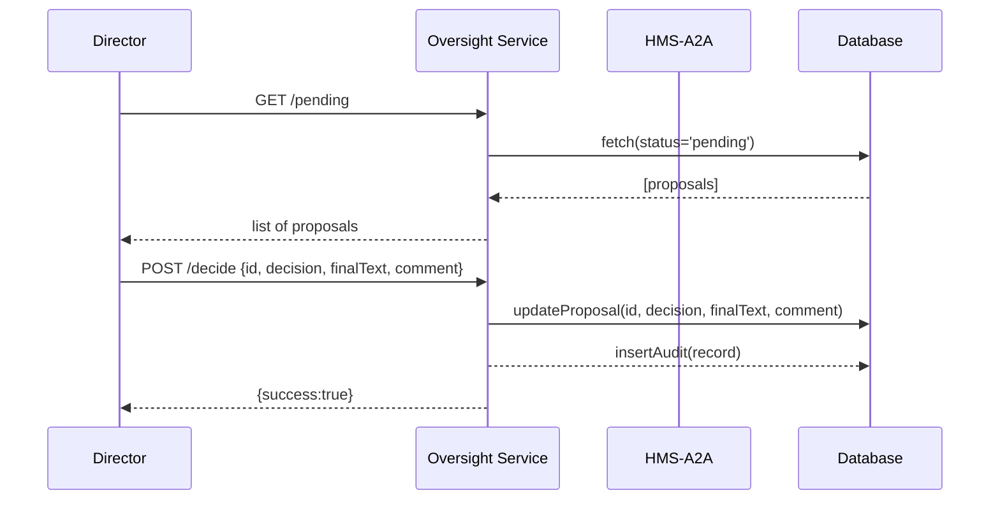

# Chapter 13: Human-in-the-Loop Oversight

Welcome back! In the previous chapter, you saw how the [AI Representative Agent (HMS-A2A)](12_ai_representative_agent__hms_a2a__.md) drafts data-driven proposals for workflow improvements. Now it’s time to bring humans back into the governance cycle. In this chapter, we’ll build the **Human-in-the-Loop Oversight** workflow that lets decision-makers review, adjust, and approve or reject AI-generated suggestions before they go live.

---

## 13.1 Why Human-in-the-Loop Oversight?

Imagine the Rural Utilities Service director receives an AI-suggested rule for allocating broadband grants across counties. AI might propose funding based purely on population density—but local knowledge (like recent flood damage) could change priorities. A **Human-in-the-Loop** step ensures that every AI recommendation:

1. Gets looked at by a real person.  
2. Can be edited to fit legal, ethical, or political constraints.  
3. Is explicitly approved or rejected before publication.

Think of it like an editor proofreading a draft article: the AI writes the first pass, and the human fine-tunes it for context and compliance.

---

## 13.2 Key Concepts

1. **Review Queue**  
   A list of all AI suggestions waiting for human review.  

2. **Decision Editor**  
   A simple interface where a human can read the AI text, make edits, and record a comment.  

3. **Approval Workflow**  
   Actions to **approve**, **reject**, or **request changes**.  

4. **Audit Log**  
   Records who made the decision, when, and any comments—so every change is traceable.

---

## 13.3 Using Human-in-the-Loop Oversight

Let’s walk through a minimal example: fetching AI proposals and posting decisions.

### 1. Fetch Pending Proposals

```jsx
// File: ReviewDashboard.jsx
import React, { useEffect, useState } from 'react';
import axios from 'axios';

export function ReviewDashboard() {
  const [list, setList] = useState([]);

  useEffect(() => {
    axios.get('/api/oversight/pending')
      .then(res => setList(res.data));
  }, []);

  return (
    <ul>
      {list.map(p => (
        <li key={p.id}>
          <strong>Rule:</strong> {p.text}
          <button onClick={() => window.open(`/review/${p.id}`)}>
            Review
          </button>
        </li>
      ))}
    </ul>
  );
}
```

This component:

- Calls `GET /api/oversight/pending` to load AI suggestions.  
- Renders each suggestion with a **Review** button.

### 2. Review and Decide

```jsx
// File: ReviewForm.jsx
import React, { useEffect, useState } from 'react';
import axios from 'axios';

export function ReviewForm({ match }) {
  const id = match.params.id;
  const [text, setText] = useState('');
  const [comment, setComment] = useState('');

  useEffect(() => {
    axios.get(`/api/oversight/proposal/${id}`)
      .then(r => setText(r.data.text));
  }, [id]);

  const submitDecision = decision => {
    axios.post(`/api/oversight/decide`, {
      id, decision, finalText: text, comment
    }).then(() => alert('Decision recorded'));
  };

  return (
    <>
      <textarea
        value={text}
        onChange={e => setText(e.target.value)}
      />
      <input
        placeholder="Comment (optional)"
        onChange={e => setComment(e.target.value)}
      />
      <button onClick={() => submitDecision('approve')}>Approve</button>
      <button onClick={() => submitDecision('reject')}>Reject</button>
    </>
  );
}
```

Explanation:

- We load the proposal’s draft text.  
- A human can edit the text in a `<textarea>`.  
- They add an optional comment.  
- Clicking **Approve** or **Reject** posts their final decision to `/api/oversight/decide`.

### Example Request

```json
POST /api/oversight/decide
{
  "id": "prop-123",
  "decision": "approve",
  "finalText": "Allocate 60% to rural flood-affected areas.",
  "comment": "Adjusted for recent flood data"
}
```

### What Happens Next

- The decision is saved to the database.  
- An audit record logs user, timestamp, decision, and comment.  
- If approved, the rule is published; if rejected, it’s sent back for AI retraining or manual drafting.

---

## 13.4 Under the Hood: Workflow Sequence



1. **Director** loads pending proposals.  
2. **Oversight Service** fetches them from the database.  
3. **Director** submits a decision.  
4. The service updates the proposal record and writes an audit log.

---

## 13.5 Internal Implementation

Here’s a minimal file layout for the Oversight Service:

```
hms-oversight/
└── src/
    ├── server.js
    ├── routes.js
    └── store.js
```

### src/store.js

```js
// In-memory stub for demo
export const proposals = [
  { id: 'prop-123', text: 'Allocate by population.', status: 'pending' }
];
export const audits = [];
```

A simple array to hold proposals and audit logs.

### src/routes.js

```js
import express from 'express';
import { proposals, audits } from './store';

const router = express.Router();

// List pending
router.get('/pending', (req, res) =>
  res.json(proposals.filter(p => p.status==='pending'))
);

// Get a single proposal
router.get('/proposal/:id', (req, res) => {
  const p = proposals.find(x => x.id===req.params.id);
  res.json(p || {});
});

// Record decision
router.post('/decide', (req, res) => {
  const { id, decision, finalText, comment } = req.body;
  const p = proposals.find(x => x.id===id);
  if (p) {
    p.status = decision;
    p.finalText = finalText;
    audits.push({ id, decision, comment, user:'director-1', time: new Date() });
  }
  res.json({ success: !!p });
});

export default router;
```

- **GET /pending** returns pending proposals.  
- **GET /proposal/:id** returns the draft text.  
- **POST /decide** updates status, saves final text, and logs an audit record.

### src/server.js

```js
import express from 'express';
import routes from './routes';

const app = express();
app.use(express.json());
app.use('/api/oversight', routes);
app.listen(8000, () => console.log('Oversight on port 8000'));
```

Just wire up Express and mount the routes.

---

## 13.6 Conclusion

In this chapter you learned how to:

- Build a **Human-in-the-Loop** review workflow for AI suggestions.  
- Present a **Review Queue**, let a human **edit** and **approve/reject**, then write an **audit log**.  
- Connect a minimal React front end to an Express back end, showing the entire review cycle.

By adding this oversight step, you ensure AI proposals align with real-world constraints before publication. Congratulations—you’ve completed the core HMS-EMR tutorial!

---

Generated by [AI Codebase Knowledge Builder](https://github.com/The-Pocket/Tutorial-Codebase-Knowledge)