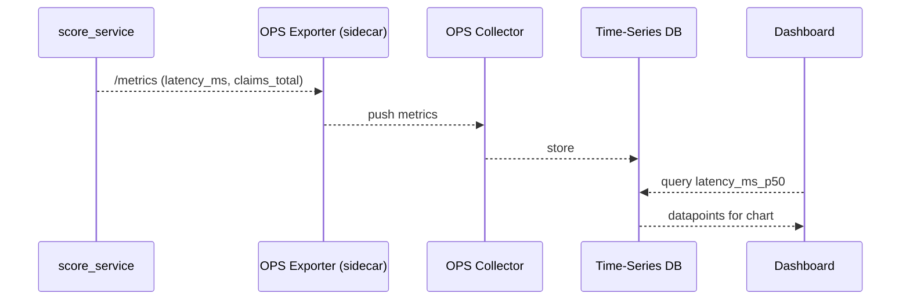

# Chapter 13: Operations & Monitoring Suite (HMS-OPS)
*Your agency’s “Mission-Control” screen*

[← Back to Chapter 12: Security & Compliance Module (HMS-ESQ + Governance Hooks)](12_security___compliance_module__hms_esq___governance_hooks__.md)

---

## 1 — Why do we need a digital control room?

Imagine the U.S. Department of Agriculture (USDA) launches **Crop-Relief Online**, a new portal that:

1. Accepts thousands of farm-damage claims per hour.  
2. Calls five micro-services (uploads, scoring, payments, notifications, audits).  
3. Must meet a public SLA: **99.9 % uptime** and **< 250 ms median latency**.

On Monday at 2 a.m. payment requests suddenly spike → latency triples.  
Without instant visibility the on-call engineer could spend hours guessing:

* “Is it the scoring service? The database? A runaway AI agent?”  
* “Are we breaching the 99.9 % SLA?”  
* “How much extra are we spending on auto-scaling?”  

**HMS-OPS** is the all-seeing dashboard that answers those questions in seconds.

```
            ┌──────────────────────────┐
            │  Real-time dashboards    │
 Citizens → │  + Alerts + Cost view    │ ← SREs / Policy Chiefs
            └──────────────────────────┘
```

---

## 2 — Key Concepts (plain-English cheat-sheet)

| Term | What it really means | Analogy |
|------|----------------------|---------|
| Metric | A number changing over time (latency, cost, errors). | Heart-rate monitor. |
| Log | One text line describing an event. | Entry in a ship’s logbook. |
| Trace | A tree showing how one request hopped across services. | Bread-crumb trail. |
| Alert Rule | “If *X* > threshold for *Y* minutes → page me.” | Smoke detector. |
| Runbook | Step-by-step fix guide linked to an alert. | Fire-evac plan on the wall. |

Keep these five in mind—90 % of OPS revolves around them.

---

## 3 — Hands-On: See your first metric in **14 lines**

We’ll instrument the *claim-scoring* micro-service from earlier chapters.

```python
# score_service.py (14 lines)
from hms_ops import Counter, Histogram, expose

claims_total   = Counter("claims_total")
latency_ms     = Histogram("latency_ms")

@expose("/score")          # tiny web handler
def score(claim):
    import time, random
    start = time.time()
    # --- pretend we do ML here -------------
    approved = random.choice([True, False])
    # ---------------------------------------
    latency_ms.observe((time.time() - start)*1000)
    claims_total.inc()
    return {"approved": approved}
```

Explanation  
1. `Counter` and `Histogram` are convenience classes that buffer numbers in-memory.  
2. `expose()` auto-creates an **`/metrics`** endpoint—HMS-OPS will scrape it every 15 s.  
3. No changes to business logic required (2 import lines!).

---

## 4 — Spin up a local dashboard (one command)

```bash
$ hms-ops up
Dashboard running at http://localhost:9090
```

Open the URL and type:

```
latency_ms_p50
```

You’ll see a live chart of the 50th-percentile latency for `/score`.  
Add another panel for:

```
sum(rate(claims_total[5m]))
```

→ shows claims per minute.

---

## 5 — What happens under the hood?



Five actors, each small and replaceable:

* **Exporter** — lightweight process (it ships with HMS-OPS)  
* **Collector** — central ingest service (single port)  
* **Time-Series DB** — stores numbers with timestamps  
* **Dashboard** — Grafana-style UI auto-provisioned by `hms-ops up`

---

## 6 — Adding an alert in **1 YAML file**

```yaml
# alerts/latency.yml  (10 lines)
alert: "High Scoring Latency"
expr:  "latency_ms_p95 > 400"
for:   "5m"
labels:
  severity: "critical"
annotations:
  summary: "Scoring service is slow"
  runbook: "runbooks/latency.md"
```

Save the file and run:

```bash
$ hms-ops reload-alerts
```

Now, if the 95th-percentile latency stays above 400 ms for 5 minutes, OPS:

1. Sends a Slack page to `@usda-sre-oncall`.  
2. Opens `runbooks/latency.md` side-panel telling the engineer to:  
   * scale replicas,  
   * review recent code deploys,  
   * check database indices.

All glue code is baked into HMS-OPS—no extra scripting.

---

## 7 — Peeking inside OPS (tiny, friendly snippets)

### 7.1 Exporter skeleton (15 lines)

```python
# hms_ops/exporter.py
import http.server, threading, time, json
BUFFER = {}

class MetricsHandler(http.server.BaseHTTPRequestHandler):
    def do_GET(self):
        data = "\n".join(f"{k} {v}" for k,v in BUFFER.items())
        self.wfile.write(data.encode())

def start():
    threading.Thread(
        target=http.server.HTTPServer(("",8000), MetricsHandler).serve_forever,
        daemon=True
    ).start()

def inc(name, val=1): BUFFER[name] = BUFFER.get(name,0)+val
def observe(name, val):
    lst = BUFFER.setdefault(name, [])
    lst.append(val)
```

Very small: a thread exposes `BUFFER` at `:8000`.

### 7.2 Collector snippet (12 lines)

```python
# hms_ops/collector.py
import requests, time, sqlite3
SERVICES = ["http://score-service:8000/metrics"]
DB = sqlite3.connect("/var/ops/metrics.db")

while True:
    for url in SERVICES:
        text = requests.get(url, timeout=1).text.splitlines()
        ts   = int(time.time())
        for line in text:
            key, val = line.split()
            DB.execute("INSERT INTO m (k,v,t) VALUES (?,?,?)",
                       (key, float(val), ts))
    DB.commit(); time.sleep(15)
```

Stores each `<key,value,timestamp>` row in SQLite (good for demos; switch to Prometheus in prod).

---

## 8 — How HMS-OPS connects to other layers

* **Governance Layer** → OPS stores every “PASS/BLOCK” decision from [Chapter 1](01_governance_layer__ai_governance_values__.md) as a metric (`gov_checks_total`).  
* **Agent Framework** → mix-in `OpsMixin` auto-creates counters like `agent_runs_total` ([Chapter 5](05_agent_framework__hms_agt__.md)).  
* **HITL** → task queue length is exposed as `hitl_tasks_waiting` ([Chapter 7](07_human_in_the_loop_oversight__hitl__.md)).  
* **Security Module** → incident count (`esq_incidents_total`) drives a red banner when > 0 ([Chapter 12](12_security___compliance_module__hms_esq___governance_hooks__.md)).  
* **Workflow Engine** → each workflow step duration feeds `act_step_duration_ms` ([Chapter 6](06_agent_orchestration___workflow_engine__hms_act__.md)).

One suite, zero duplication.

---

## 9 — Frequently Asked Questions

**Q1: Does OPS replace Datadog / Prometheus?**  
Under the hood OPS bundles open-source Prometheus + Grafana with HMS-flavoured defaults. You can still scrape the `/metrics` endpoint with any external tool.

**Q2: How is cost measured?**  
Each micro-service sidecar reads its Kubernetes CPU / memory usage and posts `$` estimates using the agency’s rate card—visible as `service_cost_usd`.

**Q3: Can non-technical policy chiefs see SLAs?**  
Yes. “Executive Dashboard” ships as a pre-built micro-frontend widget:  

```html
<ops-sla-card service="crop-relief" period="24h"></ops-sla-card>
```

No login → read-only public dashboards are possible.

**Q4: What about incident drill simulations?**  
Run `hms-ops drill --scenario db-down`  
The suite injects faults into a staging namespace and times your response.

---

## 10 — Try it yourself (3-minute exercise)

1. Add OPS instrumentation to any Python script:

   ```python
   from hms_ops import Counter
   hits = Counter("demo_hits")
   for _ in range(1000): hits.inc()
   ```

2. Run `hms-ops up` and confirm `demo_hits` appears in the “Explore” tab.  
3. Create an alert that fires if `demo_hits` drops to **0** for 10 minutes.  
4. Stop the script—watch the alert turn red and send you an email (SMTP config needed).

---

## 11 — What you learned

* HMS-OPS turns raw numbers, logs, and traces into one **mission-control dashboard**.  
* Just two import lines (`Counter`, `Histogram`) instrument any micro-service.  
* YAML alert rules + runbooks give you 24/7 guardrails without vendor lock-in.  
* OPS ties every HMS layer together—governance checks, agents, workflows, security incidents—all flow into the same heads-up display.

Ready to **trade & market** all these well-monitored capabilities to other agencies?  
Continue to [Chapter 14: Marketplace of Capabilities (HMS-MKT)](14_marketplace_of_capabilities__hms_mkt__.md) →

---

Generated by [AI Codebase Knowledge Builder](https://github.com/The-Pocket/Tutorial-Codebase-Knowledge)