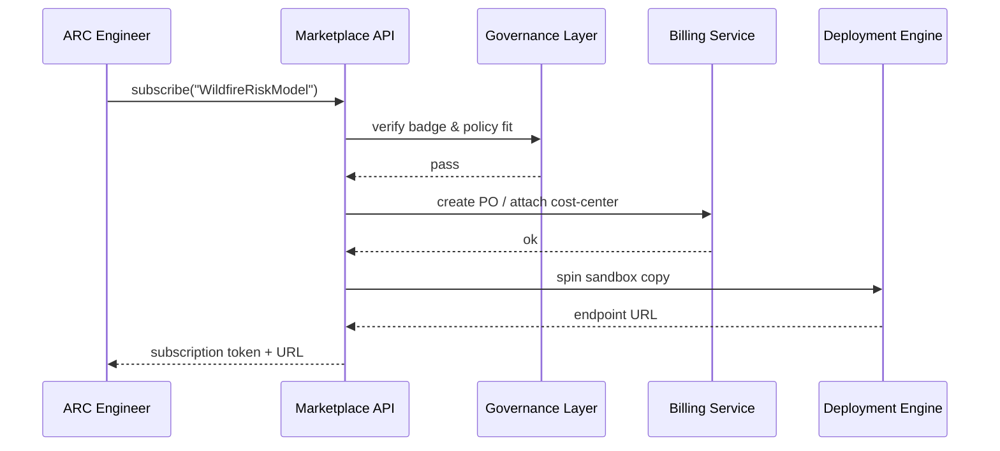

# Chapter 14: Marketplace of Capabilities (HMS-MKT)
[← Back to Chapter 13: Operations & Monitoring Suite (HMS-OPS)](13_operations___monitoring_suite__hms_ops__.md)

---

## 1 — Why invent an “App Store for Government”?

Picture this day at the **Appalachian Regional Commission (ARC)**:

1. ARC wants to predict **wildfire risk** for 20 rural counties.  
2. The **U.S. Forest Service** already runs an excellent “Wildfire Risk Model”.  
3. ARC engineers search the web, file FOIA requests, wait weeks for legal review, and finally receive a zip file with out-of-date code.

Result: duplication, delays, and citizens still at risk.

**Marketplace of Capabilities (HMS-MKT)** works like the iOS App Store but for **government-approved micro-services and AI skills**:

```
Search  →  Click “Subscribe”  →  Auto-deploy in your agency sandbox  →  Ready in minutes
```

No more emailing zip files, re-negotiating licenses, or guessing if the model passed a security scan—MKT bakes all that in.

---

## 2 — Core Concepts (plain-English cheat-sheet)

| Term | Beginner-friendly rule | Quick analogy |
|------|-----------------------|---------------|
| Capability | A reusable micro-service or AI skill. | An app in the store. |
| Listing | Metadata page that describes a capability. | Product page. |
| Vetting Badge | Proof that Governance & Security checks passed. | FDA approval stamp. |
| License | Usage tier (free, per-request, enterprise). | App’s pricing plan. |
| Procurement Flow | One-click process that handles legal + billing. | In-app purchase. |

Remember these five words—90 % of MKT is just surfacing them nicely.

---

## 3 — Hands-On: Install the “Wildfire Risk Model” in **18 lines**

We’ll stand in ARC’s shoes and subscribe to the Forest Service model.

```python
# demo_install.py  (18 lines)
from hms_mkt import search, subscribe, invoke

# 1) Search the marketplace
hits = search("wildfire risk")
print(hits[0]["name"])         # => "WildfireRiskModel"

# 2) Subscribe (auto-runs procurement flow)
pkg = subscribe("WildfireRiskModel", tier="free")

# 3) Call the capability right away 🎉
result = invoke(pkg, {"lat": 37.4, "lon": -81.1})
print(result)                   # {'risk': 'HIGH', 'confidence': 0.82}
```

What happened?

1. `search()` hit the public **listing catalog**.  
2. `subscribe()` triggered a **procurement flow**—MKT checked ARC’s cost center, applied governance vetting, and spun up a sandboxed copy.  
3. `invoke()` routed the request through [Backend Service Layer (HMS-SVC)](09_backend_service_layer__hms_svc__.md) just like any internal API.

---

## 4 — How does “Subscribe” work under the hood?



Only **five actors**—every step is automated and auditable.

---

## 5 — Tiny Internal Code Peeks (≤ 20 lines each)

### 5.1 Search helper

```python
# hms_mkt/catalog.py
import json, pathlib
CATALOG = json.loads(pathlib.Path("/var/mkt/catalog.json").read_text())

def search(term):
    return [c for c in CATALOG if term.lower() in c["name"].lower()]
```

Loads a local JSON file—replace with a real DB later.

### 5.2 Subscribe flow

```python
# hms_mkt/procure.py
from governance import vet
from billing    import create_po
from deploy     import provision

def subscribe(name, tier):
    listing = next(c for c in CATALOG if c["name"] == name)
    vet(listing["badge"])               # Chapter 1 hook
    po = create_po(listing, tier)       # charge the right pot of money
    url = provision(listing, tier)      # K8s spin-up
    return {"url": url, "token": po["token"]}
```

Five lines, three clear sub-calls—easy to swap implementations.

### 5.3 Invoke wrapper

```python
# hms_mkt/runtime.py
import requests
def invoke(pkg, payload):
    hdr = {"Authorization": "Bearer "+pkg["token"]}
    return requests.post(pkg["url"], json=payload, headers=hdr, timeout=5).json()
```

Treats the capability like any HTTPS endpoint.

---

## 6 — Where MKT plugs into other HMS layers

* **Governance Layer** (Chapter 1) issues the Vetting Badge; no badge → no listing.  
* **Security Module** (Chapter 12) scans each capability container at publish time.  
* **Ops Suite** (Chapter 13) auto-creates dashboards prefixed with the capability ID.  
* **Agent Framework** (Chapter 5) can `invoke()` capabilities as tools, no code changes.  
* **Data Repository** (Chapter 11) stores versioned model binaries so agencies can roll back.  
* **Inter-Agency Protocol** (Chapter 8) wraps capability calls that cross agency boundaries.

---

## 7 — Frequently Asked Questions

**Q1: Can private vendors list capabilities?**  
Yes, but they must pass the same governance scans and agree to federal procurement terms baked into the Marketplace.

**Q2: What about sensitive models (e.g., PHI processors)?**  
Listings specify a `security_tier`. Agencies whose authority matches can see and install them; others cannot even **search** for the listing.

**Q3: How are updates handled?**  
Publishers push v2 → MKT notifies subscribers → each agency clicks “Upgrade” or freezes at old version. Ops dashboards show mixed-version rollouts.

**Q4: Can I rate a capability?**  
Yes. After 30 days usage the dashboard prompts a 1-5 star rating plus optional feedback. Ratings appear on the listing page.

---

## 8 — Try it Yourself (3-minute exercise)

1. Install the mini SDK:

   ```bash
   pip install hms-mkt-lite
   ```

2. Run the demo:

   ```bash
   python demo_install.py
   ```

3. Open `~/.hms/mkt/subscriptions.json`—verify the token and endpoint are stored.

4. Unsubscribe:

   ```python
   from hms_mkt import unsubscribe
   unsubscribe("WildfireRiskModel")
   ```

   The deployment is torn down and the billing PO closed.

---

## 9 — What you learned

* HMS-MKT is the **app store for government micro-services and AI skills**.  
* Five concepts—Capability, Listing, Vetting Badge, License, Procurement Flow—drive the whole system.  
* In <20 lines you searched, subscribed, and invoked a government-grade model.  
* Governance, billing, deployment, and monitoring are all automated behind the scenes.

Ready to **synchronize HMS-EMR with totally external systems (legacy mainframes, partner clouds, vendor SaaS)**?  
Continue to [Chapter 15: External System Synchronization](15_external_system_synchronization_.md) →

---

Generated by [AI Codebase Knowledge Builder](https://github.com/The-Pocket/Tutorial-Codebase-Knowledge)