# Chapter 14: Observability & Metrics Pipeline  
*(continuing from [Chapter 13: Human-in-the-Loop (HITL) Oversight](13_human_in_the_loop__hitl__oversight_.md))*  

---

## 1. Why Do We Need a “NORAD Board” for Government Apps?

Picture November 1st—**Open-Enrollment Day** for *HealthCare.gov*.  
Citizens flood the site to:

1. Price-shop plans.  
2. Upload tax forms.  
3. Chat with support.

If anything breaks—latency spike, bad deploy, policy mis-route—the news hits prime-time quicker than you can say “SRE.” 
Teams need a **live command board** that:

* Spots anomalies before Twitter does.  
* Proves Service-Level Agreements (SLAs) to Congress and GAO.  
* Feeds AI agents (Chapter 12) and HITL reviewers (Chapter 13) with ground truth.

That board is powered by the **Observability & Metrics Pipeline** (OMP).

---

## 2. High-Level Use Case

Goal: Show a real-time widget **“Login Success % (last 5 min)”** on a public dashboard so that:

* If success dips below 97 %, the on-call gets paged.  
* The AI agent logs the dip and suggests improvements.  
* Auditors can download the raw numbers later.

We’ll build all that in ~30 lines of code + YAML.

---

## 3. Five Key Bricks (Beginner Edition)

| Brick           | Analogy                        | Purpose                                        |
|-----------------|--------------------------------|------------------------------------------------|
| Telemetry Hook  | Flight sensor                 | Emits data from every request/worker           |
| Collector       | Air-traffic tower             | Buffers & forwards raw events                  |
| Stream Processor| Radar computer                | Aggregates, samples, triggers alerts           |
| Dashboard       | NORAD wall                    | Visualizes time-series & logs                  |
| Compliance Sink | Black-box recorder            | Stores immutable copies for auditors           |

Keep these five bricks in mind; the rest of the chapter just wires them up.

---

## 4. Instrumenting a Service (≤ 15 Lines)

```js
// svc/login.js
import { record } from "hms-observability";

export async function login(req, res) {
  const start = Date.now();
  const ok    = await doAuth(req.body);     // pretend function
  const ms    = Date.now() - start;

  record("login_attempt", { ok, ms });      // 👈 one-liner
  res.json({ ok });
}
```

Explanation  
1. `record()` tags the event `login_attempt`.  
2. The SDK auto-adds `service=auth`, timestamp, user agent, etc.  
3. Event ships to the **Collector** over the Service Mesh (Chapter 7).

---

## 5. A 60-Second Peek Under the Hood

```mermaid
sequenceDiagram
    participant APP  as Auth Service
    participant COL  as Collector
    participant PROC as Stream Processor
    participant DB   as Metrics DB
    participant DASH as Dashboard UI
    APP->>COL : login_attempt{ok,ms}
    COL->>PROC: batch push
    PROC->>DB : upsert (prom-like)
    DASH-->>DB: SELECT … (every 15 s)
```



Only five actors—easy mental model.

---

## 6. Writing the Aggregation Rule (YAML, 10 Lines)

```yaml
# rules/login_success.yml
stream:  login_attempt
groupBy: [minute]
metrics:
  total: count()
  fails: sum(!ok)
  success_pct: 100 - (fails / total * 100)
alert:
  when:  success_pct < 97
  notify: "OnCall#Auth"
```

Save ➜ Governance Portal signs ➜ Stream Processor hot-reloads.

---

## 7. Building the Dashboard Widget (React, 14 Lines)

```jsx
import { TimeSeries } from "@hms-emr/mfe";

<TimeSeries
  title="Login Success % (5 min)"
  query="SELECT minute, success_pct FROM login_success LIMIT 5"
  refreshMs={15000}
/>
```

The MFE component:

* Runs the SQL via [HMS-API](05_api_gateway___policy_endpoints__hms_api__.md).  
* Draws an accessible line chart.  
* Flashes red if the `alert` fires (web-socket push).

---

## 8. Compliance Sink: Immutable Storage (Go, 18 Lines)

```go
// sink/append.go
func Append(evt Event) {
    id := uuid.New()
    blob := encrypt(json.Marshal(evt))          // Vault keys!
    s3.Put("compliance", id, blob)
    ledger.Log(id, evt.Time, evt.Type)          // small index
}
```

• Uses Privacy Vault keys (Chapter 9) so raw events stay encrypted.  
• GAO auditors run `hms omp export --from 2024-11-01` anytime.

---

## 9. Full Lifecycle in One Diagram


OMP is the **single highway** everyone else drives on.

---

## 10. Quick CLI Tour (3 Commands)

```bash
# 1. Tail live events
hms omp tail --stream login_attempt

# 2. Test alert rule
hms omp alert test login_success

# 3. Export for auditors
hms omp export --from -24h --stream login_attempt > last_day.ndjson
```

Zero YAML edits needed.

---

## 11. Frequently Asked Beginner Questions

**Q: Does this slow my app?**  
The SDK buffers in-memory and ships every 200 ms—< 1 % CPU.

**Q: Is Prometheus required?**  
No. OMP ships its own lightweight TSDB; Prometheus scraping is optional.

**Q: Can I hide PHI fields?**  
Yes. Set `record(..., { redacted:["ssn","dob"] })`; the SDK blanks them before shipping.

**Q: Where do alert notifications go?**  
Any webhook: Slack, Teams, SMS—configure in `alert.notify`.

---

## 12. Summary & What’s Next

You learned how the **Observability & Metrics Pipeline**:

• Collects every pulse of the platform with a one-line `record()` call.  
• Aggregates & alerts via declarative YAML.  
• Displays live NORAD-style dashboards while archiving immutable logs for auditors and AI agents.

Next, we’ll see how all these components ship to prod safely using fully automated pipelines in [Chapter 15: CI/CD & Infrastructure-as-Code Pipeline](15_ci_cd___infrastructure_as_code_pipeline_.md).  

*Ready to push code like a pro?* 🚀

---

Generated by [AI Codebase Knowledge Builder](https://github.com/The-Pocket/Tutorial-Codebase-Knowledge)