# Chapter 15: CI/CD & Infrastructure-as-Code Pipeline  
*(continuing from [Chapter 14: Observability & Metrics Pipeline](14_observability___metrics_pipeline_.md))*  

---

## 1. Why Ship Like a Modern Postal Service?  

Picture the **Wage and Hour Division (WHD)** hours before releasing a rule update that raises the federal minimum wage:

1. Engineers modify the **Process & Policy Engine** rule file.  
2. Security staff must ensure no one sneaked in malware.  
3. Compliance officers need documentation showing **DISA STIG** checks passed.  
4. The change must roll first to **staging**, then to **production**—with an electronic signature from the Deputy Administrator.  

Manually copying files or “click-deploy” buttons is begging for audit findings.  
**CI/CD & Infrastructure-as-Code (IaC) Pipeline** automates the whole journey—like an automated postal sorter that stamps, scans, and routes every parcel.

---

## 2. The Use-Case We’ll Build  

> “Publish a new *Minimum Wage Rule* to production within 30 minutes, fully audited.”

We’ll walk through:

1. **Editing** a rule in Git.  
2. **Pipeline** stages (build → scan → test → review → deploy).  
3. **IaC** that spins up identical staging & production clusters.  

Beginners welcome—each code block is under 20 lines.

---

## 3. Key Concepts—Postal Service Edition  

| Concept | Postal Analogy | Plain-English Meaning |
|---------|----------------|-----------------------|
| CI (Continuous Integration) | Sorting machine | Every commit is compiled & tested automatically |
| CD (Continuous Delivery) | Delivery truck | Tested parcels move to the correct address (env) |
| IaC (Infrastructure-as-Code) | Shipping label | Servers, networks, and policies defined in files |
| Gate | Security dog | Blocks the parcel until scans & signatures pass |
| Promotion | Route stamp | Moves a build from *dev* ➜ *staging* ➜ *prod* |

Keep these five bricks in mind; we’ll wire them next.

---

## 4. Pipeline at a Glance

```mermaid
flowchart LR
    A[Commit to Git] --> B(CI Build & Unit Tests)
    B --> C(Security Scan 🔍)
    C --> D(Deploy to Staging)
    D -->|Deputy Signs| E(Prod Release)
    C -.->|Fail| X[Reject & Alert]
```



Five stops—each logged for FedRAMP auditors.

---

## 5. Step 1 — Edit & Commit the Rule  

`policies/min_wage.yaml` (excerpt, 6 lines):

```yaml
minWageUSD: 15.00
effectiveDate: 2025-01-01
version: 3
```

Git commit:

```bash
git add policies/min_wage.yaml
git commit -m "Raise minimum wage to $15 – version 3"
git push origin main
```

This push **automatically** triggers CI.

---

## 6. Step 2 — CI Build & Unit Tests  

`.github/workflows/ci.yml` (≤ 18 lines):

```yaml
name: CI
on: [push]
jobs:
  build:
    runs-on: ubuntu-latest
    steps:
    - uses: actions/checkout@v4
    - name: Install deps
      run: npm ci
    - name: Unit tests
      run: npm test            # must pass
    - name: Package artifact
      run: zip -r build.zip .
      if: success()            # only if tests pass
    - uses: actions/upload-artifact@v4
      with: {name: build, path: build.zip}
```

Explanation  
1. Checks out code.  
2. Runs `npm test`.  
3. Packages everything into `build.zip` for later stages.

---

## 7. Step 3 — Security & Compliance Scan  

`pipeline/scan.sh` (bash, 14 lines):

```bash
#!/usr/bin/env bash
set -e
echo "🛡️  Running STIG scanner..."
stig-cli scan build.zip > stig_report.json
if grep -q "HIGH" stig_report.json; then
  echo "❌ STIG violations"; exit 1
fi
echo "✔️  Security clean"
```

• Fails the pipeline if any **HIGH** finding appears.  
• Report is stored as an artifact for auditors.

---

## 8. Step 4 — Deploy to Staging with IaC  

`iac/main.tf` (Terraform, 17 lines):

```hcl
module "hms_cluster" {
  source   = "git::https://govrepo/terraform-hms.git"
  env      = var.env          # "staging" or "prod"
  version  = "v2.0"
  min_size = 3
}

resource "hms_policy_bundle" "rules" {
  name    = "min_wage"
  file    = "../policies/min_wage.yaml"
  version = "3"
}
```

Pipeline snippet to apply (YAML, 6 lines):

```yaml
- name: "Terraform Apply (staging)"
  run: |
    terraform init -backend-config=staging.hcl
    terraform apply -auto-approve -var="env=staging"
```

Staging cluster now runs **version 3** of the rule.

---

## 9. Step 5 — Human Gate & Promotion  

`pipeline/manual_approval.yml` (GitHub Actions, 8 lines):

```yaml
- name: "Await Deputy Signature"
  uses: hmsext/approval-action@v1
  with:
    approvers: "deputy_admin@whd.gov"
    timeout-minutes: 30
```

Deputy clicks **Approve** in the portal.  
The next job promotes the same artifact to production:

```yaml
- name: "Deploy to Prod"
  run: terraform apply -auto-approve -var="env=prod"
  if: steps.approval.outputs.approved == 'true'
```

All steps, signatures, and timestamps flow into the [Observability & Metrics Pipeline](14_observability___metrics_pipeline_.md).

---

## 10. Under the Hood—What Really Fires?  


Five actors—nothing mystical.

---

## 11. Rollback in 1 Command  

If metrics show errors (Chapter 14), revert quickly:

```bash
hms deploy rollback --env prod --version 2
```

Pipeline sets `min_wage.yaml` back to version 2 and re-runs tests + deploy steps.

---

## 12. Frequently Asked Beginner Questions  

**Q: Do I need Terraform?**  
Any IaC tool works (Pulumi, CloudFormation). The key is “infra lives in files + version control.”

**Q: How long should pipelines take?**  
For small policy changes: < 15 min to staging, < 30 min to prod after approval.

**Q: Where are secrets stored?**  
Use your cloud’s secret manager. Pipelines read them at run-time; never commit secrets.

**Q: Can multiple teams share one pipeline?**  
Yes. Jobs read an `owner` label to route approvals to the correct deputy.

---

## 13. What We Learned  

• **CI** catches bugs fast; **CD** ships safely.  
• **IaC** guarantees every environment (dev, staging, prod) is a carbon copy.  
• Security gates and human approvals satisfy **FedRAMP** and **DISA STIG** auditors.  
• Rollbacks are one command—no more midnight database panics.  

Congratulations! You can now deliver HMS-EMR updates with the confidence of a federal postal system—fast, trackable, and secure. 🎉

---

Generated by [AI Codebase Knowledge Builder](https://github.com/The-Pocket/Tutorial-Codebase-Knowledge)