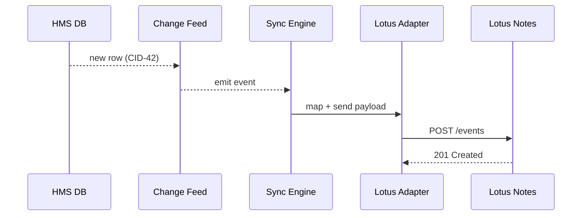

# Chapter 15: External System Synchronization
*A two-way mirror between HMS-EMR and “the rest of the world”*

[← Back to Chapter 14: Marketplace of Capabilities (HMS-MKT)](14_marketplace_of_capabilities__hms_mkt__.md)  

---

## 1 — Why bother syncing at all?

Picture the **Food and Nutrition Service (FNS)** running a new HMS-based appointment portal for the *WIC* program.  
Families now see open time-slots in a slick calendar widget—but field offices still live in a 20-year-old **Lotus Notes** calendar.  

If HMS overwrites a slot at 10 AM while Lotus shows it free, two moms will arrive with toddlers in tow.  
If Lotus adds a walk-in clinic and HMS doesn’t hear about it, families see “fully booked” and miss care.

**External System Synchronization (HMS-SYNC)** is the live translator that:

```
• Pushes HMS changes → legacy calendars, ERPs, CRMs
• Pulls remote changes  → HMS agents & widgets
• Resolves conflicts    → nobody double-books
```

Zero stale data; zero duplicated entry; happy citizens.

---

## 2 — Core Ideas (plain-English cheat-sheet)

| Term | What it really means | Quick analogy |
|------|----------------------|---------------|
| Sync Adapter | Small plug-in that knows 1 external API. | Universal power plug. |
| Change Feed  | Stream of “insert / update / delete” events. | Conveyor belt of sticky notes. |
| Outbound Push | HMS event → external system. | Clerk faxing updates. |
| Inbound Pull  | External event → HMS. | Clerk typing faxes back in. |
| Conflict Rule | How to pick a winner when both sides change the same record. | “First stamp wins” at DMV. |

Remember: **Adapter → Feeds → Rules**. That’s 90 % of SYNC.

---

## 3 — Hands-On: Sync one calendar slot in 18 lines

Goal: when HMS creates an appointment for citizen **CID-42**, Lotus Notes sees it within seconds.

```python
# demo_sync.py  (18 lines)
from hms_sync import on_change, push

LOTUS = "https://lotus.fns.gov/api/events"

@on_change("appointments")          # fires for any INSERT
def handle_new_appt(evt):
    payload = {
        "uid"     : evt["id"],
        "start"   : evt["start"],
        "end"     : evt["end"],
        "subject" : f"WIC – {evt['citizen_id']}"
    }
    # push() uses the Lotus Notes adapter under the hood
    push("lotus_notes", LOTUS, payload)

print("🔄  Sync layer armed. Create an HMS appointment to test!")
```

What will happen?

1. HMS inserts a row into `appointments`.  
2. `handle_new_appt()` fires automatically.  
3. `push()` posts JSON to Lotus Notes via its adapter.  
4. Lotus calendar shows the slot—no manual work.

---

## 4 — Under the hood: 5-actor dance



Five hops, sub-second in practice.

---

## 5 — Peek inside the Sync Engine  
*(all snippets ≤ 20 lines)*

### 5.1 Event subscription

```python
# hms_sync/events.py
SUBS = {}
def on_change(table):
    def wrap(fn):
        SUBS.setdefault(table, []).append(fn)
        return fn
    return wrap
```

Any function decorated with `@on_change("table")` is now a listener.

### 5.2 Polling the change feed

```python
# hms_sync/loop.py
import time, db, events
def poll():
    pos = db.last_lsn()
    while True:
        for evt in db.changes_since(pos):
            for fn in events.SUBS.get(evt.table, []):
                fn(evt)                  # call handlers
            pos = evt.lsn
        time.sleep(0.5)
```

Uses the database’s logical-replication LSN so nothing is missed.

### 5.3 Generic push helper

```python
# hms_sync/push.py
import adapters    # registry of adapters
def push(name, url, data):
    adapter = adapters.get(name)
    return adapter.push(url, data)       # adapter knows auth & mapping
```

Adapters live in `adapters/lotus_notes.py`, `adapters/salesforce.py`, etc.

### 5.4 Sample adapter (Lotus Notes, 12 lines)

```python
# adapters/lotus_notes.py
import requests, os, json
TOKEN = os.getenv("LOTUS_TOKEN")
def push(url, data):
    hdr = {"Authorization": "Bearer "+TOKEN}
    # map HMS → Lotus field names
    body = {
      "uid"   : data["uid"],
      "begin" : data["start"],
      "close" : data["end"],
      "title" : data["subject"]
    }
    r = requests.post(url, json=body, headers=hdr, timeout=3)
    return r.status_code
```

Small, readable, swappable.

---

## 6 — Conflict handling: pick a referee

Basic rule file (YAML, 8 lines):

```yaml
# conflicts/appointments.yml
table: appointments
key:   id
rules:
  - field: start
    winner: "earliest_change"
  - field: subject
    winner: "latest_change"
```

The engine loads this once; if HMS and Lotus race-update the same slot, the rule decides.  
Advanced patterns: “authority-based” (`if source == lotus_notes then overwrite`).

---

## 7 — How SYNC plugs into other HMS layers

* **Governance hooks** ([Security Module](12_security___compliance_module__hms_esq___governance_hooks__.md)) run on every outbound/inbound payload—PHI never leaks.  
* **Ops Suite** ([HMS-OPS](13_operations___monitoring_suite__hms_ops__.md)) exposes `sync_events_total`, `sync_conflicts_total` metrics.  
* **Agents** ([HMS-AGT](05_agent_framework__hms_agt__.md)) can subscribe to inbound events just like UI widgets.  
* **Marketplace** ([HMS-MKT](14_marketplace_of_capabilities__hms_mkt__.md)) may list extra adapters (e.g., SAP ERP) for one-click install.

---

## 8 — Frequently Asked Questions

**Q1: Is this real-time or batch?**  
Both. Default is **stream** (<1 s), but you can set `mode: batch` in an adapter to run every hour.

**Q2: What about 1970s COBOL mainframes?**  
Write a *file-drop adapter*—SYNC will SFTP a nightly CSV that the mainframe already ingests.

**Q3: Can I dry-run?**  
Yes: `hms-sync simulate --since "1h"` replays events without pushing, logging would-have-been calls.

**Q4: How do I add an adapter?**  
`hms-sync scaffold adapter "mysaas"` generates a 40-line template with TODOs for auth & field mapping.

---

## 9 — 3-minute exercise

1. Install the mini SDK:  
   ```bash
   pip install hms-sync-lite
   ```

2. Scaffold a *Google Calendar* adapter:  
   ```bash
   hms-sync scaffold adapter "gcal"
   ```

3. Implement the 10-line `push()` (use Google’s quick-add endpoint).  
4. Create an appointment in HMS; confirm it shows up in your real Google calendar within seconds.

---

## 10 — What you learned

* HMS-SYNC is a **two-way mirror** ensuring HMS and legacy systems never drift apart.  
* Three primitives—**Adapters, Change Feeds, Conflict Rules**—cover nearly every integration.  
* A <20-line handler plus a small adapter was enough to sync HMS with Lotus Notes in real time.  
* Governance, monitoring, and marketplace hooks are already wired in.

You now have the full toolkit—from governance to UI to external sync—to build human-centric, policy-compliant, inter-agency digital services that *actually stay in sync with reality*. 🌐👍

---

Generated by [AI Codebase Knowledge Builder](https://github.com/The-Pocket/Tutorial-Codebase-Knowledge)