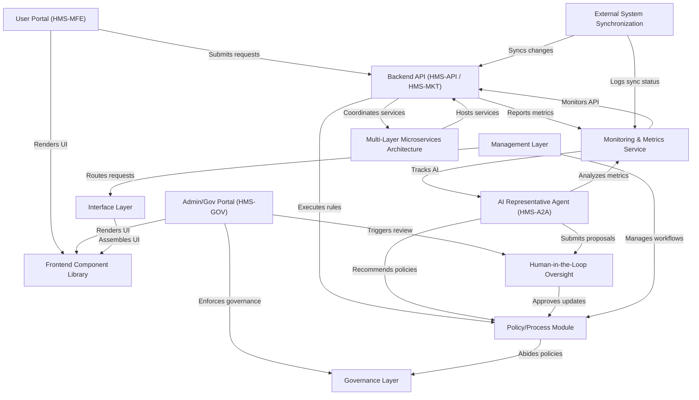

# Tutorial: HMS-EMR

**HMS-EMR** is an *AI-powered* platform that automates multi-party *government workflows*, from citizen service requests to policy management. It provides **secure portals** for users and administrators, a robust **backend API**, and *real-time* synchronization with external systems to ensure consistent, compliant operations across agencies. AI agents propose optimizations, humans review changes, and metrics drive continuous improvement in *public sector* programs.

**Source Repository:** [None](None)

## Chapters

1. [User Portal (HMS-MFE)
](01_user_portal__hms_mfe__.md)
2. [Admin/Gov Portal (HMS-GOV)
](02_admin_gov_portal__hms_gov__.md)
3. [Frontend Component Library
](03_frontend_component_library_.md)
4. [Interface Layer
](04_interface_layer_.md)
5. [Backend API (HMS-API / HMS-MKT)
](05_backend_api__hms_api___hms_mkt__.md)
6. [Multi-Layer Microservices Architecture
](06_multi_layer_microservices_architecture_.md)
7. [Policy/Process Module
](07_policy_process_module_.md)
8. [Governance Layer
](08_governance_layer_.md)
9. [Management Layer
](09_management_layer_.md)
10. [Monitoring & Metrics Service
](10_monitoring___metrics_service_.md)
11. [External System Synchronization
](11_external_system_synchronization_.md)
12. [AI Representative Agent (HMS-A2A)
](12_ai_representative_agent__hms_a2a__.md)
13. [Human-in-the-Loop Oversight
](13_human_in_the_loop_oversight_.md)

---

Generated by [AI Codebase Knowledge Builder](https://github.com/The-Pocket/Tutorial-Codebase-Knowledge)