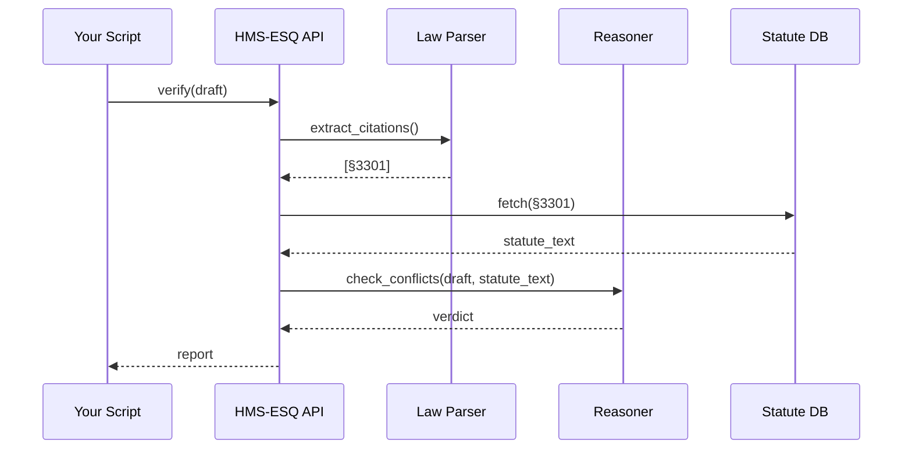

# Chapter 3: Legal Reasoning & Compliance Engine (HMS-ESQ)

*(Coming from [Codified Democracy Foundation Engine (HMS-CDF)](02_codified_democracy_foundation_engine__hms_cdf__.md))*  

> “Before we vote on this bill, are we **sure** it doesn’t clash with an existing statute?”  

That single question inspired HMS-ESQ—the platform’s virtual **General Counsel**.  
It shields agencies, AI agents, and developers from accidentally breaking the law.

---

## 1. Why Does HMS-ESQ Exist?

### A 60-Second Scenario

1. The **Department of Agriculture (USDA)** wants to shorten its *“Farm-to-Table Grant”* application from 40 pages to 10.  
2. A policy analyst drafts a new rule inside [HMS-CDF](02_codified_democracy_foundation_engine__hms_cdf__.md).  
3. Before the draft can move forward, an automated check shouts:  

   ```
   ⚠ Conflict: Proposed text violates 7 U.S.C. §2204(a) (public-comment period).
   ```

4. The analyst tweaks the draft, runs the check again—no more conflicts.  
5. The bill proceeds, confident it won’t be struck down in court.

Without HMS-ESQ, that conflict would have surfaced *months* later, after lawsuits and press headlines.

---

## 2. Key Concepts in Plain Words

| Concept | Think of It As | Why You Care |
|---------|----------------|--------------|
| Statute Library | A giant e-book of every federal law & regulation | Source of truth |
| Citation Graph | Google Maps for legal references | Finds hidden cross-links |
| Reasoner | A robot paralegal | Flags conflicts or missing citations |
| Compliance Query API | A search bar with legal brains | Lets devs/agents ask questions |
| Diff Alerts | “Track changes” for laws | Lawyers get emails when text changes |

---

## 3. Five-Minute Quick-Start

Let’s prove that a tiny Python script can keep you out of trouble.

```python
# check_procurement_rule.py
from hmsesq_sdk import ESQ

esq = ESQ()                                   # 1️⃣ connect
draft = """
Agencies may award contracts up to $250k
without competition per 41 U.S.C. §3301.
"""
report = esq.verify(draft)                    # 2️⃣ run legal check
print(report.summary())                       # 3️⃣ read results
```

Possible console output:

```
✅ No conflicts found.
📝 2 citations validated.
```

What happened?

1. `ESQ()` bootstraps a secure connection (OAuth + MFA).  
2. `verify` parses the text, pulls every citation, and reasons over conflicts.  
3. `summary()` gives a human-readable verdict.

---

## 4. Behind the Curtain — How the Magic Works



Only **five** moving parts; each one is replaceable or upgradable without breaking the flow.

---

## 5. Digging Deeper (But Still Friendly)

### 5.1 Citation Extraction (simplified)

```python
# hms_esq/parser.py
import re
CITE = re.compile(r"\b(\d+)\s+U\.S\.C\.\s+§\s*(\d+)\b")

def extract(text: str):
    return [f"{title} U.S.C. §{section}"
            for title, section in CITE.findall(text)]
```

• A single regex grabs “41 U.S.C. §3301” and friends.  
• In production we add edge-cases (public laws, CFR, agency memos).

### 5.2 Conflict Reasoning (toy example)

```python
# hms_esq/reasoner.py
def check_conflicts(draft: str, statute: str):
    if "without competition" in draft and "full and open" in statute:
        return "Conflict: Competition rules differ."
    return "No conflicts."
```

Real code uses NLP + logic rules, but the intent is identical—compare **intent** words, not just citations.

---

## 6. Daily Workflows

1. **Policy Writers** – Run `esq.verify()` in their IDE before submitting a pull-request in HMS-CDF.  
2. **AI Agents** – Call `/v1/esq/validate` before filing forms with an external agency, ensuring parameters match current law.  
3. **Attorneys** – Subscribe to *diff alerts*; a Slack ping appears whenever the Federal Register edits a section they monitor.  
4. **Auditors** – Open [HMS-GOV](01_governance_portal__hms_gov__.md) to view the **Compliance Dashboard** powered by ESQ stats.

---

## 7. Frequently Asked Beginner Questions

**Q: Does HMS-ESQ replace lawyers?**  
A: No. It handles *spotting* issues; humans decide the strategy.

**Q: How often is the Statute Library updated?**  
A: Nightly from GovInfo & Federal Register APIs; emergency patches can be pushed in minutes.

**Q: Can state or local laws be added?**  
A: Yes—upload a citation CSV or use the **Jurisdiction Import Wizard** in HMS-GOV.

---

## 8. Hands-On Exercise

1. Install the SDK: `pip install hmsesq-sdk`.  
2. Copy `check_procurement_rule.py` (above) and run it.  
3. Modify the draft text to *omit* the citation; see how ESQ warns:  
   ```
   ⚠ Missing citation for “competition requirement”.
   ```

---

## 9. How HMS-ESQ Connects to the Rest of HMS-NFO

• **Pre-flight Checks** for [AI Agent Framework (HMS-AGT)](06_ai_agent_framework__hms_agt___hms_agx__.md) actions.  
• **Legislative linting** for [HMS-CDF](02_codified_democracy_foundation_engine__hms_cdf__.md) bills.  
• **Public display** via [Micro-Frontend Interface Layer (HMS-MFE)](04_micro_frontend_interface_layer__hms_mfe__.md).  
• **Override & Appeals** route through [Human-in-the-Loop Oversight (HITL)](07_human_in_the_loop_oversight__hitl__.md).

---

## 10. Summary & What’s Next

You now know how HMS-ESQ:

1. Stores every statute, regulation, and policy memo.  
2. Parses drafts, validates citations, and spots conflicts in seconds.  
3. Exposes a dead-simple API to keep writers, developers, and AI agents compliant.

Up next, we’ll see how all these insights reach the public and agency staff through sleek web components in the [Micro-Frontend Interface Layer (HMS-MFE)](04_micro_frontend_interface_layer__hms_mfe__.md).

---

Generated by [AI Codebase Knowledge Builder](https://github.com/The-Pocket/Tutorial-Codebase-Knowledge)