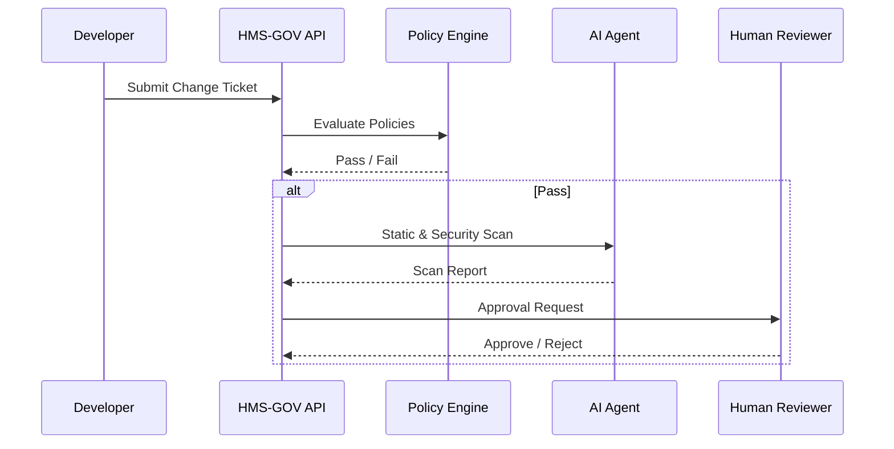

# Chapter 1: Governance Layer (HMS-GOV)


Welcome to HMS-ETL!  
Before we move any data or spin-up any micro-services, we need ground rules.  
HMS-GOV is the “cabinet office” of the whole platform—where policies are written, approvals happen, and risky changes are vetoed before they can hurt real citizens.

---

## 1. Why Do We Need a Governance Layer?

Imagine the U.S. Citizenship and Immigration Services (USCIS) rolling out a new online green-card form.  
One small logic error could delay thousands of applications and make headlines.  
HMS-GOV prevents this by ensuring that every change—whether a code update, an AI recommendation, or an ETL mapping—passes through:

1. Clearly defined compliance checkpoints  
2. Human and/or AI approvals  
3. Versioned, rollback-ready releases  

Without HMS-GOV, we would be like a federal agency shipping rules without OMB review—chaos!

---

## 2. Key Concepts (Plain-English)

| Concept | “Cabinet Office” Analogy | Why It Matters |
|---------|--------------------------|----------------|
| Policy | A published executive order | Sets expectations everyone must follow |
| Compliance Checkpoint | An Inspector General audit | Catches violations early |
| Approval Flow | President’s signature routing | Authorizes or vetoes changes |
| AI Agent Registry | List of certified advisors | Stops rogue bots from acting |
| Change Ticket | Official memo | Tracks who changed what and when |

---

## 3. A 5-Minute Walk-Through

### Use Case: Adding a New Tax-Form Field

You, a developer at the Bureau of the Fiscal Service, need to add a “Middle Initial” field to an e-filing form.

1. You create a **Change Ticket** in HMS-GOV.  
2. HMS-GOV checks existing **Policies** (e.g., “All PII must be masked in logs”).  
3. An **AI Agent** runs static analysis on your code.  
4. If the agent passes, the ticket moves to a **Human Approver**.  
5. On approval, the change is versioned and pushed downstream to [ETL & Data Pipeline (HMS-ETL)](09_etl___data_pipeline__hms_etl__.md).  

If any step fails, the ticket is rejected or revised—no surprise outages.

---

## 4. Hands-On: Creating Your First Policy

Below is a tiny example using a YAML-based policy file. In the real system this would live in `hms_gov/policies/`.

```yaml
# middle_initial_policy.yaml
id: PII_LOG_MASK
description: "Mask middle initial in all log outputs."
severity: HIGH
check:
  field: middle_initial
  must_be: "masked"
enforcement: "block_on_fail"
```

Explanation  
1. `id` – A unique policy code.  
2. `check` – What we validate (here, the `middle_initial` field).  
3. `enforcement` – “block_on_fail” means no deployment if the policy fails.

Upload this file through the HMS-GOV UI or API; it becomes active immediately.

---

## 5. Triggering a Compliance Check with Code

Here’s a minimal Python snippet (under 20 lines) that a service could call:

```python
# demo_call.py
import hms_gov

ticket = {
    "change_id": "TXF-42",
    "artifact": "tax_form_service",
    "version": "1.2.3",
}

result = hms_gov.run_checks(ticket)
print(result.status)     # "PASSED" or "BLOCKED"
```

What happens?  
• `run_checks` loads every relevant policy (like `PII_LOG_MASK`).  
• It executes validations, aggregates results, and returns a simple status.  
• If `BLOCKED`, the CI/CD pipeline halts automatically.

---

## 6. Under the Hood (Step-by-Step)



Only five moving parts—simple enough to reason about, yet powerful.

---

## 7. Peeking into the Policy Engine

File: `hms_gov/policy_engine.py` (trimmed)

```python
# policy_engine.py
class PolicyEngine:
    def __init__(self, repo):
        self.repo = repo          # directory with YAML policies

    def evaluate(self, ticket):
        violations = []
        for policy in self.repo.load_all():
            if not policy.check_compliance(ticket):
                violations.append(policy.id)
        return violations
```

Explanation  
• `repo.load_all()` reads each YAML file.  
• `check_compliance` is a short helper that inspects the incoming change metadata.  
• A non-empty `violations` list means the change is blocked.

---

## 8. How HMS-GOV Talks to Other Layers

HMS-GOV only decides “Go / No-Go.”  
Actual process orchestration happens in [Policy & Process Engine](02_policy___process_engine_.md), and data changes flow through [ETL & Data Pipeline (HMS-ETL)](09_etl___data_pipeline__hms_etl__.md).  
Think of HMS-GOV as the roundabout that controls traffic lights; the other layers are the roads.

---

## 9. Common Pitfalls (and How to Avoid Them)

1. Forgetting to register an AI Agent → Agent actions are auto-blocked.  
2. Writing vague policies → Use explicit `field` names and `must_be` criteria.  
3. Bypassing HMS-GOV in emergency → Always log a post-hoc ticket for audit.

---

## 10. Try It Yourself

1. Fork the repo.  
2. Create a simple “Hello, World” micro-service.  
3. Write a policy that forbids any print statement containing `"DEBUG"`.  
4. Run `hms_gov.run_checks`—watch it fail until you remove the debug line!

---

## 11. What You Learned

• Why governance is essential for public-sector software.  
• Core ideas: policies, checkpoints, approvals, and agent registry.  
• How to author a YAML policy and call HMS-GOV from code.  
• A peek under the hood to demystify the Policy Engine.

---

Ready to turn these policies into living, breathing workflows?  
Continue to [Policy & Process Engine](02_policy___process_engine_.md) to see how approvals and automated tasks are stitched together.

---

Generated by [AI Codebase Knowledge Builder](https://github.com/The-Pocket/Tutorial-Codebase-Knowledge)