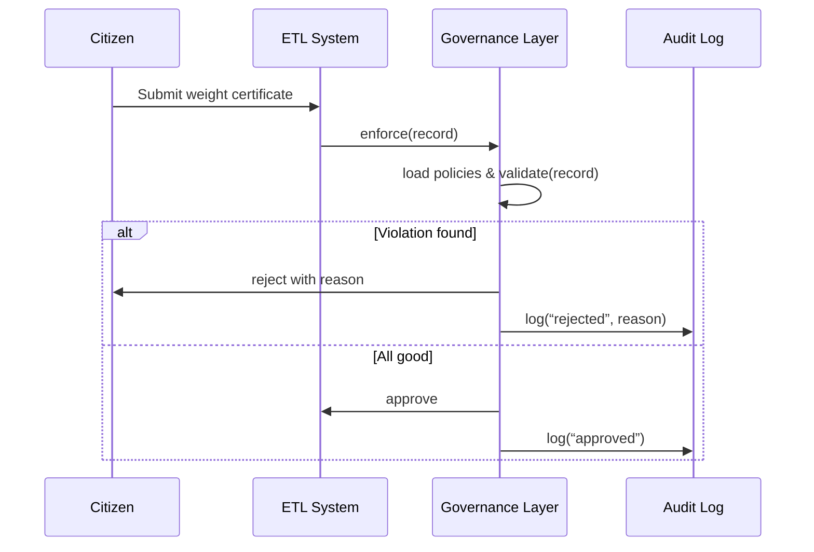

# Chapter 1: Governance Layer

Welcome to the first chapter of the HMS-ETL tutorial! In this chapter, we introduce the **Governance Layer**, the “city hall” of our platform. It sets rules, enforces compliance, and logs every action to ensure transparency and ethics—just like a federal agency’s regulatory division.

---

## 1. Why Do We Need a Governance Layer?

**Use Case**  
Imagine the Office of Weights and Measures (OWM) receives digital weight‐certificate submissions from manufacturers. Before any data enters downstream systems, we must ensure:

- The certificate matches legal formats.
- No sensitive fields are missing.
- Rules on measurement units are followed.

Without a governance layer, bad or non‐compliant data could slip through, causing fines or legal issues.

---

## 2. Key Concepts

1. **Policy Engine**  
   Stores compliance rules (e.g., “unit must be kilograms or pounds”).  
2. **Rule Repository**  
   A central library of all policies, versioned and auditable.  
3. **Audit Logger**  
   Records every decision (approve/reject) with timestamps for transparency.  
4. **Enforcement API**  
   A simple interface for other layers to hand over data and get back a decision.

---

## 3. How to Use the Governance Layer

### Defining a Simple Policy

Below is a minimal YAML policy for weight certificates:

```yaml
# policies/weight_certificate.yaml
policy_id: weight_cert_001
description: Ensure valid unit and non-null fields
rules:
  - field: unit
    allowed_values: ["kg", "lb"]
  - field: weight
    min: 0.1
    max: 10000
  - field: owner
    not_null: true
```

This file tells our engine which fields to check and the permitted values.

### Calling the Enforcement API

```python
from hms_etl.governance import GovernanceLayer

gov = GovernanceLayer(policy_dir="policies/")
record = {"unit": "kg", "weight": 250.5, "owner": "Acme Co."}

result = gov.enforce(record)
print(result)
# -> {"status": "approved", "policy_id": "weight_cert_001"}
```

*Explanation:* We load all policies from `policies/`, pass a record to `enforce()`, and get back an approval or rejection.

---

## 4. Under the Hood: Sequence Diagram

Here’s what happens step-by-step when you call `enforce()`:



---

## 5. Inside the GovernanceLayer (Code Walkthrough)

### 5.1 File: `hms_etl/governance.py`

```python
import yaml
from datetime import datetime

class GovernanceLayer:
    def __init__(self, policy_dir):
        self.policies = self._load_policies(policy_dir)

    def _load_policies(self, policy_dir):
        # Simplified: read each YAML file into a dict
        policies = {}
        for fname in ["weight_certificate.yaml"]:
            with open(f"{policy_dir}/{fname}") as f:
                data = yaml.safe_load(f)
                policies[data["policy_id"]] = data
        return policies

    def enforce(self, record):
        # Try each policy until one applies
        for pid, policy in self.policies.items():
            valid, reason = self._validate(record, policy)
            self._log(record, pid, valid, reason)
            if not valid:
                return {"status": "rejected", "policy_id": pid, "reason": reason}
        return {"status": "approved", "policy_id": pid}
```

*Explanation:*  
- `_load_policies` reads your YAML rules.  
- `enforce` cycles through all policies, calls `_validate`, logs the outcome, and returns a decision.

### 5.2 Validation and Logging Helpers

```python
    def _validate(self, record, policy):
        for rule in policy["rules"]:
            val = record.get(rule["field"])
            if rule.get("not_null") and val is None:
                return False, f"{rule['field']} cannot be null"
            if "allowed_values" in rule and val not in rule["allowed_values"]:
                return False, f"{rule['field']} invalid"
            if "min" in rule and val < rule["min"]:
                return False, f"{rule['field']} below minimum"
        return True, None

    def _log(self, record, policy_id, valid, reason):
        entry = {
            "timestamp": datetime.utcnow().isoformat(),
            "policy_id": policy_id,
            "status": "approved" if valid else "rejected",
            "reason": reason,
            "record": record
        }
        # Append to audit log (file, DB, etc.). Simplified here:
        print("AUDIT:", entry)
```

*Explanation:*  
- `_validate` checks each rule, returns a boolean and an optional reason.  
- `_log` builds an audit entry for every call.

---

## 6. Conclusion

You’ve learned:
- What the Governance Layer is and why it’s critical.
- How to define simple compliance policies.
- How to call `GovernanceLayer.enforce()` to approve or reject data.
- What happens under the hood, step by step.

Next up, we dive into the day-to-day orchestration of ETL tasks in the [Management Layer](02_management_layer_.md). Have fun!

---

Generated by [AI Codebase Knowledge Builder](https://github.com/The-Pocket/Tutorial-Codebase-Knowledge)