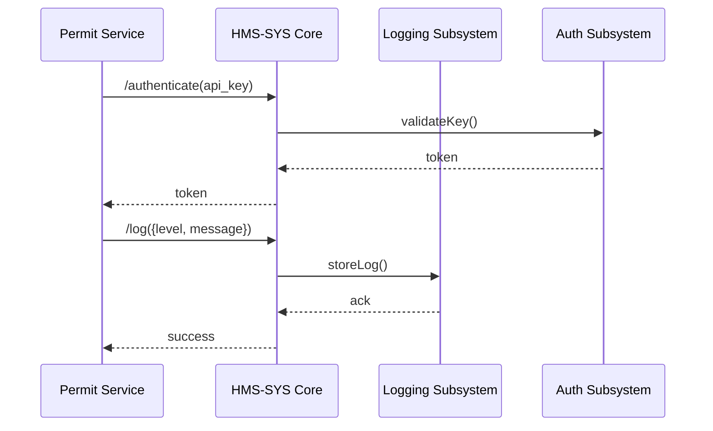

# Chapter 1: HMS-SYS Core Infrastructure

Welcome to the HMS-ETL tutorial! In this chapter we’ll introduce **HMS-SYS Core Infrastructure**, the shared “utilities grid” for all HMS microservices. You’ll learn why it exists, how to use it in a government-style scenario, and peek under the hood.

---

## 1. Motivation: Why a Core Infrastructure?

Imagine the Federal Motor Carrier Safety Administration (FMCSA) builds an online permit-application portal. Several small services must:

- Verify user credentials  
- Record every action for audits  
- Find each other’s network address  

Without a shared layer, each service writes its own auth code, its own logger, and its own discovery mechanism. This leads to:

- Inconsistent security  
- Hard-to-read logs  
- Fragile hard-coded URLs  

**HMS-SYS Core Infrastructure** solves this by offering:

- Centralized authentication  
- Standard logging format  
- Service discovery registry  

Just like a city’s electricity, water, and roads, every microservice “plugs in” to the same grid.

---

## 2. Key Concepts

1. **Authentication**  
   Issue and verify tokens so only authorized agencies (or users) access services.

2. **Logging**  
   Capture actions in a uniform, searchable way.

3. **Service Discovery**  
   Keep a live directory of “who’s running where” so services find each other dynamically.

---

## 3. Using HMS-SYS Core Infrastructure

Below is a short example showing how an FMCSA-style service might talk to HMS-SYS.

### 3.1 Initialize the Core Client
```python
# app.py
from hms_sys import CoreClient

# Point at our Core Infra endpoint
core = CoreClient(base_url="https://core.gov.example")

# Authenticate with agency credentials
token = core.authenticate(api_key="FMCSA_API_KEY")
print("Got token:", token)
```
*This gets you a bearer token for all HMS calls.*

### 3.2 Log an Event
```python
# anywhere in your code
core.log_event(
  service="permit-service",
  level="INFO",
  message="User 123 submitted permit form"
)
```
*All logs now flow into a central system for audits.*

### 3.3 Discover a Service
```python
# find the ETL service to push data
etl_info = core.discover_service("etl-pipeline")
print(etl_info.host, etl_info.port)
```
*No more hard-coding of URLs!*

---

## 4. Deep Dive: What Happens Under the Hood?

### 4.1 Sequence Flow (mermaid)

*Steps when you call `authenticate` and `log_event`.*

### 4.2 Internal Code Snippets

#### 4.2.1 Authentication (File: `hms_sys/auth.py`)
```python
# hms_sys/auth.py
def authenticate(api_key):
    # Check api_key in a secure store (DB, Vault...)
    if api_key == "FMCSA_API_KEY":
        return "eyJhbGci..."  # JWT token
    raise Exception("Invalid credentials")
```
*Very simple validation stub. Real code checks a DB or Vault.*

#### 4.2.2 Logging (File: `hms_sys/logging.py`)
```python
# hms_sys/logging.py
def log_event(service, level, message):
    entry = {
        "service": service,
        "level": level,
        "message": message
    }
    # Imagine sending to Elasticsearch or CloudWatch
    print("LOGGED:", entry)
```
*Formats logs uniformly and sends them to a central store.*

#### 4.2.3 Service Discovery (File: `hms_sys/discovery.py`)
```python
# hms_sys/discovery.py
SERVICE_REGISTRY = {
  "etl-pipeline": {"host": "etl.gov", "port": 8080}
}

def discover_service(name):
    return SERVICE_REGISTRY.get(name)
```
*A simple in-memory registry. Production might use Consul or Kubernetes DNS.*

---

## 5. Conclusion

You’ve seen how **HMS-SYS Core Infrastructure**:

- Centralizes authentication  
- Standardizes logging  
- Provides dynamic service discovery  

This sets the stage for building robust government-grade microservices.  
Next up, we’ll explore how individual services plug into this grid:

[Chapter 2: HMS-SVC Microservices](02_hms_svc_microservices_.md)

---

Generated by [AI Codebase Knowledge Builder](https://github.com/The-Pocket/Tutorial-Codebase-Knowledge)