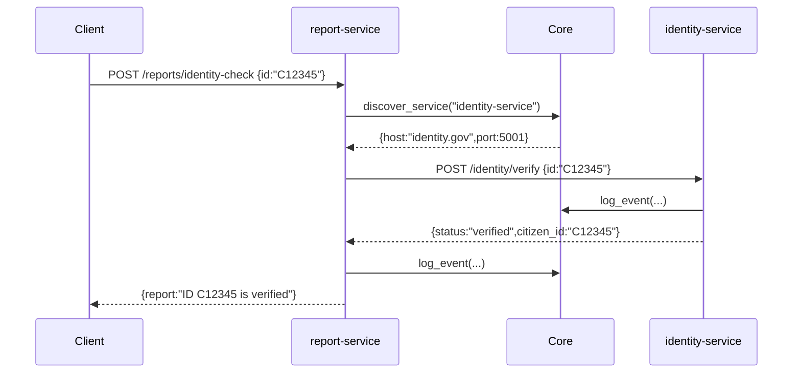

# Chapter 2: HMS-SVC Microservices

In [Chapter 1: HMS-SYS Core Infrastructure](01_hms_sys_core_infrastructure_.md) we saw how to plug into a shared grid for auth, logging, and discovery. Now we’ll build small, focused services—**microservices**—that each handle one specific task, just like specialized government offices.

---

## 1. Motivation: Why Microservices?

Imagine the Federal Housing Finance Agency (FHFA) running an online loan-application system. You need:

- A service to verify citizen identity  
- A service to validate income documents  
- A service to generate decision reports  

If all of that lived in one big program (a “monolith”), updating one piece could risk the others. Instead, think of each as its own “office”:

- Identity Office  
- Document Office  
- Report Office  

They run independently, can be updated or scaled on their own, yet talk over well-defined APIs.

---

## 2. Key Concepts

1. **Single Responsibility**  
   Each service does exactly one job (e.g. `identity-service`).  

2. **Independent Deployment**  
   You can build, test, and deploy one service without touching the rest.  

3. **API Contract**  
   Services communicate over HTTP/JSON (or gRPC) with clear request/response shapes.  

4. **Service Discovery**  
   Instead of hard-coding URLs, each service asks HMS-SYS Core “Where is X?”  

5. **Decentralized Data**  
   Each service owns its own database or storage—no shared tables.

Analogy: DMV doesn’t handle tax returns, and the IRS doesn’t issue driver’s licenses. They coordinate, but each office has its own building, staff, and phone lines.

---

## 3. Building and Running a Microservice

We’ll create two tiny services:

1. **identity-service**: verifies citizen IDs  
2. **report-service**: asks identity-service, then builds a report  

### 3.1 identity-service

File: `identity_service/app.py`
```python
from flask import Flask, request, jsonify
from hms_sys import CoreClient

app = Flask(__name__)
core = CoreClient(base_url="https://core.gov.example")
token = core.authenticate(api_key="FHFA_ID_KEY")

@app.route("/identity/verify", methods=["POST"])
def verify_identity():
    data = request.json  # { "id": "C12345" }
    # Pretend we check a database here...
    result = {"status": "verified", "citizen_id": data["id"]}
    core.log_event(
      service="identity-service",
      level="INFO",
      message=f"Verified ID {data['id']}"
    )
    return jsonify(result)

if __name__ == "__main__":
    core.register_service("identity-service", host="identity.gov", port=5001)
    app.run(port=5001)
```
This does three things on startup:
- Authenticates with HMS-SYS  
- Registers itself so others can discover it  
- Listens for HTTP requests on port 5001  

### 3.2 report-service

File: `report_service/app.py`
```python
from flask import Flask, request, jsonify
from hms_sys import CoreClient, http_post

app = Flask(__name__)
core = CoreClient(base_url="https://core.gov.example")
token = core.authenticate(api_key="FHFA_RP_KEY")

@app.route("/reports/identity-check", methods=["POST"])
def identity_report():
    payload = request.json  # { "id": "C12345" }
    info = core.discover_service("identity-service")
    resp = http_post(
      host=info["host"], port=info["port"],
      path="/identity/verify", body=payload, token=token
    )
    report = {"report": f"ID {payload['id']} is {resp['status']}"}
    core.log_event(
      service="report-service",
      level="INFO",
      message=f"Generated report for {payload['id']}"
    )
    return jsonify(report)

if __name__ == "__main__":
    core.register_service("report-service", host="report.gov", port=5002)
    app.run(port=5002)
```
Now you can start both:
```bash
# In one terminal
python identity_service/app.py

# In another
python report_service/app.py
```

---

## 4. How Two Services Talk

Here’s a simple flow when a client asks for an identity report:



1. **Report-service** asks **HMS-SYS Core** where identity-service lives.  
2. Core returns address.  
3. **Report-service** calls **identity-service**.  
4. Each logs events back to Core for audit trails.  
5. Final report flows back to the client.

---

## 5. Under the Hood

### 5.1 Service Registration & Discovery  
File: `hms_sys/discovery.py`
```python
SERVICE_REGISTRY = {}

def register_service(name, host, port):
    SERVICE_REGISTRY[name] = {"host": host, "port": port}

def discover_service(name):
    return SERVICE_REGISTRY.get(name)
```
A simple in-memory map. In production you might use Consul or Kubernetes.

### 5.2 HTTP Helper  
File: `hms_sys/http.py`
```python
import requests

def http_post(host, port, path, body, token):
    url = f"http://{host}:{port}{path}"
    headers = {"Authorization": f"Bearer {token}"}
    resp = requests.post(url, json=body, headers=headers)
    return resp.json()
```
This wraps every call with your auth token so services trust each other.

---

## 6. Conclusion

You’ve now built two cooperating microservices—**identity-service** and **report-service**—that:

- Register themselves with [HMS-SYS Core Infrastructure](01_hms_sys_core_infrastructure_.md)  
- Discover each other dynamically  
- Log every step for auditing  

Next up: building a unified external API layer for citizens and agencies to call all your services in one place:

[Chapter 3: HMS-API Backend API Layer](03_hms_api_backend_api_layer_.md)

---

Generated by [AI Codebase Knowledge Builder](https://github.com/The-Pocket/Tutorial-Codebase-Knowledge)