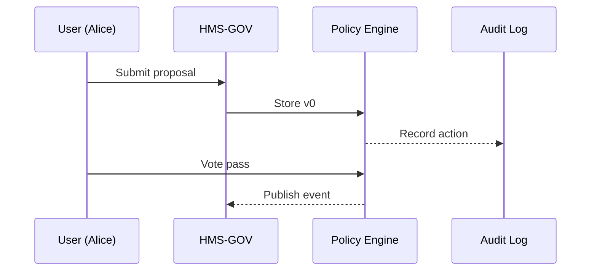

# Chapter 2: Legislative & Policy Engine (HMS-CDF)

*[Jump back to the previous chapter: Governance Layer (HMS-GOV)](01_governance_layer__hms_gov__.md)*  

---

## 1. Why Do We Need HMS-CDF?

Picture the **U.S. Department of Commerce**.  
An internal AI Agent writes this note:

> “Let’s **optimize business-license renewals** so companies only fill one form instead of five.”

Great idea—but who says that new rule is *legal*? Who signs off? How do we track changes six months from now?

Enter **HMS-CDF**—our digital **Capitol Building**.  

```
Plain-Language Idea ──▶ HMS-CDF ──▶ Version-Controlled Law/Policy
```

HMS-CDF turns messy text into a structured, reviewable, and enforceable object—at computer speed but with human-grade safeguards.

---

## 2. Key Concepts (Bite-Sized)

| Term | Everyday Analogy | Why It Matters |
|------|------------------|----------------|
| Proposal | Suggestion card in a city meeting | Raw idea written in English |
| Committee Stage | Small focus group | Experts refine or reject |
| Floor Vote | Hand-raising in town hall | Official “yay” or “nay” |
| Publication | City bulletin board | Everyone can see the final rule |
| Roll-Back | CTRL + Z | Auto-revert if conflicts arise |

---

## 3. 5-Minute Tour: Pass a Simple Policy

Below is a **toy script** using the imaginary `hms_cdf` SDK.

```python
from hms_cdf import Capitol

capitol = Capitol.login("alice@commerce.gov", "•••")

# 1️⃣ Draft a proposal
p = capitol.proposals.create(
    title="One-Stop Business License",
    text="Replace five renewal forms with a single digital form."
)

# 2️⃣ Send to committee
p.route(stage="committee", reviewers=["legal", "it"])

# 3️⃣ Committee approves
p.vote(stage="committee", outcome="pass")

# 4️⃣ Full vote & publish
p.vote(stage="floor", outcome="pass")
p.publish(effective="2024-10-01")

print(p.status)          # -> "Active"
```

What happened?

1. Alice drafted a proposal.  
2. HMS-CDF enforced that it **must** go through a committee first.  
3. Voting passed; the rule got an effective date.  
4. HMS-CDF now exposes a normalized, version-controlled object to every other service.

---

## 4. Under the Hood (Plain English Walkthrough)

1. User submits a proposal via [HMS-GOV](01_governance_layer__hms_gov__.md).  
2. HMS-CDF stores it as **version 0** with status “Draft.”  
3. A workflow engine pushes it to the **Committee** queue.  
4. Every vote or edit bumps the version (v1, v2…).  
5. On “Publish,” HMS-CDF:  
   • Writes to an immutable ledger  
   • Broadcasts `policy.published` over the event bus  
   • Activates automatic **conflict checks** (HMS-ESQ will handle that in the next chapter).

### Minimal Sequence Diagram



---

## 5. Digging Deeper: Tiny Code Peeks

### 5.1 State Machine

```python
# File: hms_cdf/states.py  (trimmed)

ALLOWED = {
    "Draft": ["Committee"],
    "Committee": ["Floor", "Draft"],
    "Floor": ["Published", "Draft"],
    "Published": []
}

def next_stage(current, target):
    if target not in ALLOWED[current]:
        raise ValueError("Illegal transition")
```

Explanation: Only certain jumps are legal (e.g., Draft → Committee). Anything else raises an error, preventing policy chaos.

### 5.2 Versioning Helper

```python
# File: hms_cdf/version.py

def bump(version_str):
    major, minor = map(int, version_str.split("."))
    return f"{major}.{minor+1}"
```

Every accepted edit calls `bump()`, so v1.3 becomes v1.4. Audit logs keep the full diff.

---

## 6. FAQ for Beginners

**Q: Do I need to understand parliamentary law?**  
A: No. HMS-CDF automates the procedure; you just trigger stages.

**Q: What if two rules contradict?**  
A: HMS-CDF flags the conflict and (in concert with [Compliance & Legal Reasoning (HMS-ESQ)](03_compliance___legal_reasoning__hms_esq__.md)) can automatically pause the later rule.

**Q: Can non-developers use it?**  
A: Yes—HMS-GOV offers a web UI; the SDK is for developers and AI agents.

---

## 7. Try It Yourself

1. Clone the sample notebook `examples/cdf_quickstart.ipynb`.  
2. Draft a policy titled `DigitalPassportRenewal`.  
3. Route it through committee, fail the vote, then revise and pass.  
4. List all versions to see the history.

---

## 8. What You Learned

* HMS-CDF is the **law-factory**: it turns ideas into version-controlled, enforceable policies.  
* It enforces stages (committee → vote → publication) automatically.  
* Roll-backs and conflict detection keep your government-grade systems safe.

Ready to see how those conflict checks work?  
Head to the next chapter:  
[Compliance & Legal Reasoning (HMS-ESQ)](03_compliance___legal_reasoning__hms_esq__.md)

---

Generated by [AI Codebase Knowledge Builder](https://github.com/The-Pocket/Tutorial-Codebase-Knowledge)