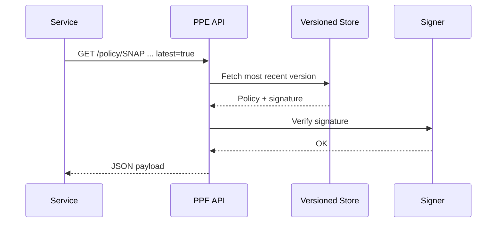

# Chapter 2: Policy & Process Engine  

*[Link back to Chapter 1: Governance Layer (HMS-GOV)](01_governance_layer__hms_gov__.md)*

---

## 1. Why Do We Need a “Policy Engine” After Governance?

Think of Chapter 1 as Congress: it **passes** the bill.  
The Policy & Process Engine (PPE) is the **Federal Register** publishing that bill, so every agency, citizen-facing form, and audit tool reads the *same* legal text.

Real-world pain point  
• A family in Maryland applies for food assistance (SNAP) online.  
• A case-worker in Arizona audits claims.  
• Both must use the *exact* eligibility formula or citizens get short-changed, and the state risks federal penalties.

The PPE guarantees that “one rule fits all,” no matter where or when it is executed.

---

## 2. Central Use Case (5 Lines)

“As a SNAP developer, I want to fetch the *current* income-eligibility formula so my calculator stays compliant—even after mid-year rule changes.”

We’ll walk through:  
1. Publishing a new rule.  
2. Services fetching that rule at runtime.  
3. Auditors verifying the same rule later.

---

## 3. Key Concepts (Plain English)

| Term | Everyday Analogy | TL;DR |
|------|------------------|-------|
| Policy | The *text* of a law | Declarative rule (“Income ≤ 130% FPL”) |
| Process | Flowchart in a gov office | Steps: check docs → calculate → approve |
| Version | Edition of a book | Immutable snapshot of policy & metadata |
| Signature | Notary stamp | Cryptographic proof rule wasn’t altered |
| Query API | Library counter | “Give me SNAP v2024-06-01” |

---

### 3.1 Visual Cheat-Sheet

```mermaid
graph LR
  A[Governance Layer<br>(passes change)] -->|publishes| B[PPE<br>Stores signed versions]
  C[Service in MD] -->|GET /policy/SNAP| B
  D[Auditor in AZ] -->|GET /policy/SNAP?v=2024-06-01| B
```

---

## 4. Hands-On: Publishing & Consuming a Policy

### 4.1 Author a Tiny Policy File

`policies/snap_income.yaml`

```yaml
id: SNAP_INCOME_130_FPL
version: 2024-06-01
description: "Household income must be ≤ 130% of Federal Poverty Level."
formula: "income <= 1.30 * fpl(household_size)"
signature: "AUTO_FILLED_BY_PPE"
```

*What’s that `signature`?*  
When you upload the YAML, PPE appends a cryptographic seal so no one can silently edit the rule later.

---

### 4.2 Publish via CLI (18 lines)

```bash
# install once: pip install hms-ppe-cli
$ ppe publish policies/snap_income.yaml
✔ Loaded policy     SNAP_INCOME_130_FPL
✔ Generated hash     8a6c...e1
✔ Signed             RSA2048
✔ Stored at version  v2024-06-01
```

Explanation  
1. CLI hashes the YAML.  
2. PPE signs the hash with the platform’s private key.  
3. Rule is stored—immutable from now on.

---

### 4.3 Fetch in Your Micro-Service (12 lines)

```python
import requests

resp = requests.get(
    "https://ppe.gov.example/policy/SNAP_INCOME_130_FPL",
    params={"latest": "true"},
    timeout=2,
)
rule = resp.json()          # → {'formula': 'income <= 1.30 * fpl(...)', ...}

# evaluate (pseudo-code)
is_eligible = eval_formula(rule["formula"], my_income, my_household_size)
```

What happens?  
• Service always asks for `latest=true`.  
• PPE returns the newest signed rule.  
• Your calculator runs it—no hard-coded constants!

---

## 5. Under the Hood—Step-By-Step



Only four internal hops—fast enough for real-time use.

---

## 6. Peek at the Source (Simplified)

`ppe/api.py` (≤ 20 lines)

```python
from fastapi import FastAPI, HTTPException
from ppe.store import PolicyStore
from ppe.crypto import verify

app = FastAPI()
store = PolicyStore("/var/policies")

@app.get("/policy/{policy_id}")
def get_policy(policy_id: str, version: str = "latest"):
    policy = store.load(policy_id, version)
    if not verify(policy["signature"], policy["hash"]):
        raise HTTPException(409, "Signature mismatch!")
    return policy
```

Explanation  
1. `PolicyStore.load` pulls YAML + metadata.  
2. `verify` ensures the file matches its signature.  
3. If anything looks fishy → HTTP 409 Conflict.

---

## 7. How Does PPE Talk to Other Layers?

• **Upstream**: HMS-GOV approves *what* may be published.  
• **Downstream**:  
  – Micro-services (see [Backend Service Mesh (HMS-API)](07_backend_service_mesh__hms_api__.md)) fetch rules.  
  – ETL jobs in [HMS-ETL](09_etl___data_pipeline__hms_etl__.md) use the same rules for data validation.  
• **Sidecars**: Observability hooks feed signed policies into [Observability & Audit Log](11_observability___audit_log_.md).

---

## 8. Common Pitfalls & Fixes

| Oops! | Why it Happens | Quick Fix |
|-------|----------------|-----------|
| Service caches rule for days | “It’s faster.” | Use short TTL (e.g., 5 min) or ETag headers. |
| Forgetting to bump version | YAML edited in place | PPE *blocks* overwrite; create new file. |
| Signature mismatch | Manual file edit | Re-publish through CLI so it gets re-signed. |

---

## 9. Mini-Lab: Verify a Rule Locally

1. Download a rule:  
   `ppe fetch SNAP_INCOME_130_FPL --version 2024-06-01 > rule.yaml`  
2. Run local verify:  
   `ppe verify rule.yaml` → “VALID”  
3. Add a space, save, run again → “INVALID (hash mismatch)”

You just proved tamper detection works!

---

## 10. What You Learned

✓ The difference between *policy* (rules) and *process* (steps).  
✓ How PPE stores signed, versioned rules everyone can trust.  
✓ Fetching and validating policies from any micro-service.  
✓ Internal flow: storage, signature, delivery.

Ready to see how we **rewind** if a bad rule sneaks through?  
Jump to [Versioning & Rollback Mechanism](03_versioning___rollback_mechanism_.md).

---

---

Generated by [AI Codebase Knowledge Builder](https://github.com/The-Pocket/Tutorial-Codebase-Knowledge)