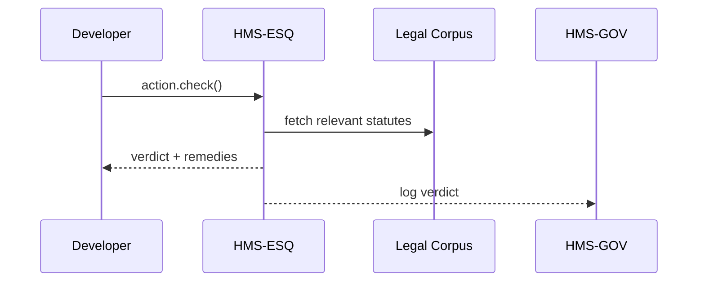

# Chapter 3: Compliance & Legal Reasoning (HMS-ESQ)

*[Jump back to the previous chapter: Legislative & Policy Engine (HMS-CDF)](02_legislative___policy_engine__hms_cdf__.md)*  

---

## 1. Why Do We Need HMS-ESQ?

Imagine you work at the **U.S. Department of Transportation (DOT)**.  
A product team wants to rebuild the public bus-schedule website using a flashy new JavaScript library.  
Great! But a paralegal in the corner quietly asks:

> “Does that library generate **accessible content**?  
> If not, we might violate **ADA Section 508** and face a lawsuit.”

Instead of emailing the overworked legal office, the team runs the change through **HMS-ESQ**—an automated *robot lawyer* that:

1. Reads the proposed action (“Replace website framework”).
2. Cross-checks it against statutes, case law, and agency rules.
3. Flags conflicts or approves the change in seconds.  

Result: **Speed for builders, safety for policymakers.**

---

## 2. Key Concepts (Plain English)

| Concept | Everyday Analogy | Why It Matters |
|---------|------------------|----------------|
| Legal Corpus | Giant bookshelf | Where ESQ stores statutes, regulations, case law. |
| Conflict Check | Smoke alarm | Rings when a proposal violates a rule. |
| Citation Graph | Footnotes network | Tracks *why* something is legal/illegal. |
| Remedy Suggestion | Grammar spell-check | Offers wording fixes to cure violations. |
| Human Override | Emergency brake | Lawyers can overrule ESQ when nuance is needed. |

---

## 3. 5-Minute Tour: “Is Our New Website Legal?”

Below is a **tiny script** using the imaginary `hms_esq` Python SDK.

```python
from hms_esq import Counsel

# 1️⃣  Log in
esq = Counsel.login("bob@dot.gov", "•••")

# 2️⃣  Describe the planned action
action = esq.actions.create(
    summary="Rebuild bus website with FancyJS",
    details="""
        - Replace all legacy HTML with FancyJS components.
        - Launch date: 2024-11-01
    """,
    tags=["web", "accessibility"]
)

# 3️⃣  Run compliance scan
report = action.check()

print(report.status)          # -> "BLOCKED"
print(report.conflicts)       # -> ["ADA Section 508 §1194.22"]
print(report.remedies[0])     # -> "Provide ARIA labels for dynamic widgets."
```

What happened?

1. Bob described **what** will change; no legalese required.  
2. `check()` invoked HMS-ESQ’s reasoning engine.  
3. ESQ answered: “BLOCKED” until ARIA labels are added.

---

## 4. Reading the Verdict

`report` has three main fields:

```text
status     : PASS | WARN | BLOCKED
conflicts  : List of violated citations
remedies   : Plain-language suggestions
```

Teams can wire these results into CI/CD pipelines—automatically stopping deployments that carry legal risk.

---

## 5. Under the Hood (No Jargon)

1. The **proposal** arrives from [HMS-CDF](02_legislative___policy_engine__hms_cdf__.md) or directly via SDK.  
2. ESQ converts plain text into a **fact vector** (topics, intent, affected population).  
3. It queries the **Legal Corpus** for relevant rules.  
4. A **reasoning engine** scores conflict likelihood.  
5. Results are returned + broadcast to [HMS-GOV](01_governance_layer__hms_gov__.md) for audit.

### Mini Sequence Diagram



Only four hops—easy to trace!

---

## 6. Peek Inside the Codebase

### 6.1 Tiny Rule Matcher

```python
# File: hms_esq/matcher.py   (simplified)

def match(action_text: str) -> list:
    """
    Return list of violated rule IDs.
    """
    violations = []
    # Pretend we loaded regexes from the DB
    RULES = {
        "ADA508_HTML": r"replace.*html.*",
    }
    for rule_id, pattern in RULES.items():
        if re.search(pattern, action_text, flags=re.I):
            violations.append(rule_id)
    return violations
```

Explanation:  
• Each rule is a simple regex for this demo.  
• Real implementation uses machine-learning + citation graphs, but beginners can grok regex first.

### 6.2 Counsel.check() Skeleton

```python
# File: hms_esq/counsel.py   (simplified)

class Counsel:
    def check(self, action):
        from .matcher import match
        hits = match(action.details)
        if hits:
            status = "BLOCKED"
            remedies = ["Provide ARIA labels..."]  # toy data
        else:
            status = "PASS"
            remedies = []
        return Report(status, hits, remedies)
```

Under 20 lines, yet it mirrors the real flow: match → verdict → report.

---

## 7. FAQ (Super Short)

**Q: Does ESQ replace human lawyers?**  
A: No. ESQ catches 80% of obvious issues; humans handle edge cases.

**Q: How often is the Legal Corpus updated?**  
A: Nightly jobs pull from the Federal Register and case-law APIs.

**Q: What if ESQ is wrong?**  
A: Use `report.override(reason="GC approved")`. The override is logged for auditors.

---

## 8. Try It Yourself

1. Clone `examples/esq_quickstart.ipynb`.  
2. Draft an action: “Send promotional emails to drivers.”  
3. Tag it `["marketing", "privacy"]`.  
4. See if ESQ flags the CAN-SPAM Act.  
5. Experiment by adding an unsubscribe link; rerun `check()`.

---

## 9. What You Learned

* HMS-ESQ is your **robot counsel**, instantly checking actions against laws.  
* It returns a clear status, citations, and suggested fixes.  
* Under the hood, it’s just matching rules and logging results—easy to extend.

Ready to build AI agents that *use* ESQ and other modules automatically?  
Head to the next chapter:  
[AI Agent Framework (HMS-AGT / HMS-AGX)](04_ai_agent_framework__hms_agt___hms_agx__.md)

---

Generated by [AI Codebase Knowledge Builder](https://github.com/The-Pocket/Tutorial-Codebase-Knowledge)