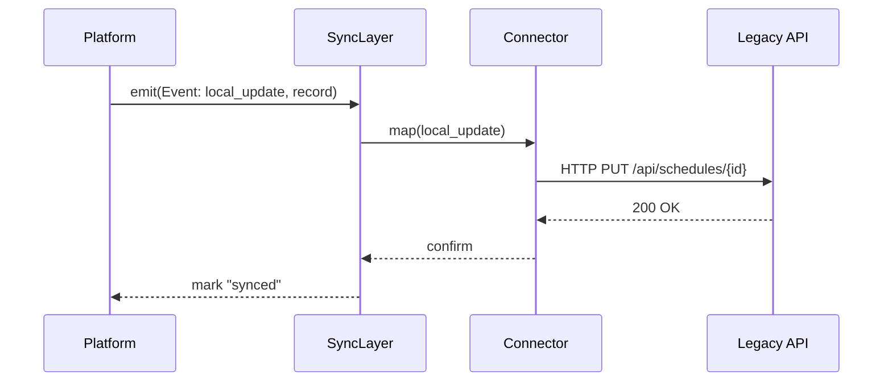
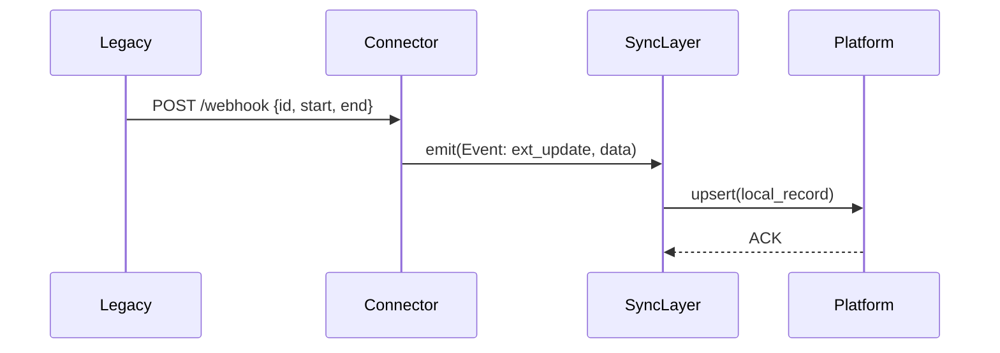

# Chapter 3: External System Synchronization

Welcome back! In [Chapter 2: Management Layer](02_management_layer_.md), we learned how HMS-ETL orchestrates ETL workflows. Now, let’s see how it stays in real-time sync with outside systems.

---

## 1. Why External System Synchronization?

Imagine the Federal Student Aid office maintains both an internal AI-driven scheduling tool and a legacy campus course calendar. When a new course section is approved:

- The platform needs to push that change to the legacy calendar.
- If a professor adjusts times in the legacy system, the AI tool must pick up that change.

Without bidirectional synchronization, staff would manually copy changes back and forth—slow and error-prone. Our **External System Synchronization** layer acts like a fleet of couriers delivering updates instantly, ensuring every calendar or database reflects the latest procedures without manual work.

---

## 2. Key Concepts

1. **Connector**  
   A lightweight client that knows how to talk to one external system (API, database, flat file).

2. **Event Listener**  
   Watches for changes on either side (platform or external) and emits “sync events.”

3. **Data Mapper**  
   Translates fields and formats between the platform’s model and the external schema.

4. **Sync Engine**  
   Coordinates connectors, listeners, and mappers. Applies conflict-resolution rules.

5. **Conflict Resolver**  
   Defines priorities (e.g., “platform wins” vs. “external wins”) when the same record changes on both sides.

---

## 3. Using the Sync Layer

Below is a minimal example that keeps course schedules in sync with a legacy REST API.

```python
from hms_etl.sync import SyncLayer, RESTConnector

# 1. Set up our sync engine
sync = SyncLayer()

# 2. Register a connector for the legacy scheduling API
connector = RESTConnector(
    name="campus_calendar",
    base_url="https://legacy.university.gov/api"
)
sync.register_connector(connector)

# 3. Define a simple field mapping
sync.set_mapping(
    connector_name="campus_calendar",
    local_to_ext={"course_id": "id", "start_time": "start", "end_time": "end"},
    ext_to_local={"id": "course_id", "start": "start_time", "end": "end_time"}
)

# 4. Start bidirectional sync
sync.start()
```

Explanation:
- We create a `SyncLayer` instance.
- We register a `RESTConnector` pointing to the legacy API.
- We define how platform fields map to the external API’s fields.
- Calling `sync.start()` begins listening and relaying changes both ways.

---

## 4. Under the Hood: Sequence Diagram

Here’s what happens when a course time is updated on the platform:



And vice-versa when the legacy API pushes a webhook:



---

## 5. Inside the SyncLayer (Code Walkthrough)

Let’s peek at a simplified implementation in `hms_etl/sync.py`.

### 5.1 Registering Connectors and Mappings

```python
# File: hms_etl/sync.py
class SyncLayer:
    def __init__(self):
        self.connectors = {}
        self.mappings = {}

    def register_connector(self, connector):
        self.connectors[connector.name] = connector
        connector.on_event(self._handle_external_change)

    def set_mapping(self, connector_name, local_to_ext, ext_to_local):
        self.mappings[connector_name] = (local_to_ext, ext_to_local)
```

Explanation:
- `connectors` holds each external system client.
- `mappings` stores field translations.
- When a connector sees an external event, it calls `_handle_external_change`.

### 5.2 Handling Changes

```python
    def start(self):
        # Begin watching local and external events
        self._listen_local()  
        for conn in self.connectors.values():
            conn.start_listening()

    def _listen_local(self):
        # Hook into our platform’s event bus (pseudo-code)
        EventBus.on("record_changed", self._handle_local_change)

    def _handle_local_change(self, record):
        for name, conn in self.connectors.items():
            lt, _ = self.mappings[name]
            payload = {ext: record[loc] for loc, ext in lt.items()}
            conn.push_update(payload)
```

Explanation:
- `start()` wires up local and external listeners.
- On a local change, we translate fields and call `push_update` on each connector.

---

## 6. Conclusion

You’ve learned how HMS-ETL keeps your platform and legacy or third-party systems in real time alignment:

- Why bidirectional sync is critical for government agencies.
- Core pieces: connectors, listeners, mappers, conflict resolution.
- A beginner-friendly example to register connectors and mappings.
- Under the hood: sequence flows and essential code.

Up next, we’ll secure and route all these calls through the [Backend API Gateway](04_backend_api_gateway_.md). Happy syncing!

---

Generated by [AI Codebase Knowledge Builder](https://github.com/The-Pocket/Tutorial-Codebase-Knowledge)