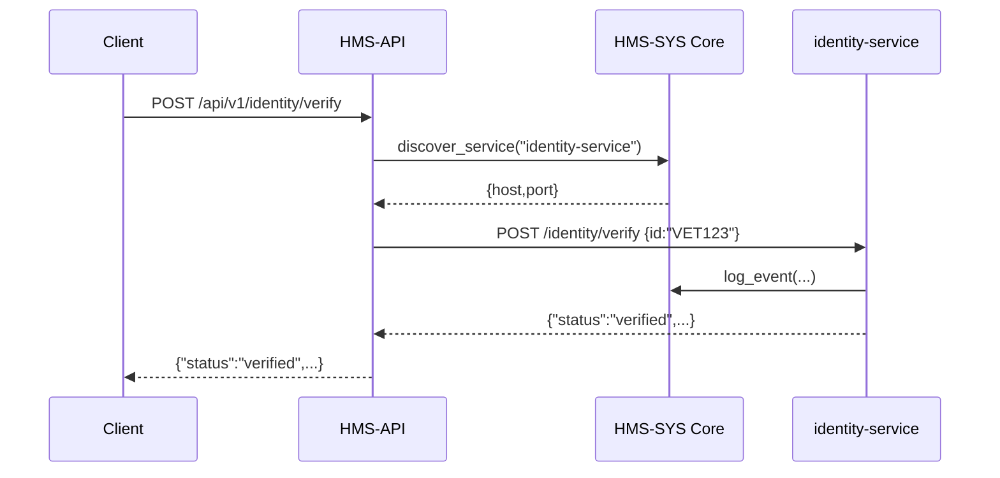

# Chapter 3: HMS-API Backend API Layer

In [Chapter 2: HMS-SVC Microservices](02_hms_svc_microservices_.md) we built small services—each its own “office.” Now we’ll create **HMS-API**, the unified reception desk that routes citizen and system requests to the right office.

---

## 1. Motivation: Why a Unified API Layer?

Imagine a veteran uses the VETS Portal to:

1. Verify identity  
2. Generate an employment report  
3. Submit data for analytics  

Without a gateway, the portal must know each microservice’s URL, auth details, and request shape. If any service moves or changes, the portal breaks.

**HMS-API** is like the front lobby of a government building. Visitors (requests) check in at one desk; the receptionist (HMS-API) directs them to the correct office (microservice). Benefits:

- Single URL for all clients  
- Centralized auth, logging, rate-limits  
- Easy versioning (e.g. `/api/v1/...`)  
- Aggregation of multiple calls into one response  

---

## 2. Key Concepts

1. **Entry Point**  
   One base path (e.g. `/api/v1`) for all endpoints.  

2. **Routing**  
   Map each path to a microservice by name and method.  

3. **Authentication & Authorization**  
   Check incoming tokens via [HMS-SYS Core Infrastructure](01_hms_sys_core_infrastructure_.md).  

4. **Rate Limiting**  
   Prevent abuse by limiting calls per client/IP.  

5. **Aggregation**  
   Optionally call multiple services, combine results, and return one response.

---

## 3. Using HMS-API to Solve Our Use Case

We’ll build a minimal Flask-based gateway. It will:

1. Accept `/api/v1/identity/verify`  
2. Forward to `identity-service`  
3. Return the verification result  

### 3.1 Initialize HMS-API Server

File: `hms_api/app.py`
```python
from flask import Flask
from hms_sys import CoreClient

app = Flask(__name__)
core = CoreClient(base_url="https://core.gov.example")
token = core.authenticate(api_key="GOV_API_KEY")  # gateway’s credentials
```
This sets up Flask and logs into HMS-SYS to get a token for discovery and internal calls.

### 3.2 Define a Route and Forward

```python
from flask import request, jsonify
from hms_sys.http import http_post

@app.route("/api/v1/identity/verify", methods=["POST"])
def api_verify_identity():
    # 1. Check client token (omitted for brevity)
    payload = request.json
    # 2. Find the identity-service
    svc = core.discover_service("identity-service")
    # 3. Forward request
    resp = http_post(host=svc["host"], port=svc["port"],
                     path="/identity/verify", body=payload, token=token)
    return jsonify(resp)
```
Here’s what happens on a POST:
1. We grab the JSON body  
2. Ask HMS-SYS where `identity-service` lives  
3. Proxy the call with our gateway token  
4. Return whatever the service sends back  

### 3.3 Try It Out

```bash
curl -X POST https://api.gov.example/api/v1/identity/verify \
  -H "Authorization: Bearer USER_TOKEN" \
  -d '{"id":"VET123"}'
# -> {"status":"verified","citizen_id":"VET123"}
```
Clients only ever talk to `/api/v1/...`, not individual service URLs.

---

## 4. Under the Hood: Request Flow

Below is a simplified flow when a client calls our gateway:



1. API looks up the service address  
2. API forwards the payload  
3. Service logs back to Core  
4. API returns service response  

---

## 5. Internal Implementation Details

### 5.1 Service Routing Configuration

File: `hms_api/routing.py`
```python
# A simple map: path → service name + internal path
ROUTES = {
  "/api/v1/identity/verify": {
    "service": "identity-service",
    "path": "/identity/verify"
  },
  # Add more routes here...
}
```
`ROUTES` tells HMS-API which service to call for each endpoint.

### 5.2 Core of the Proxy Handler

File: `hms_api/handler.py`
```python
from flask import request, jsonify
from hms_sys.http import http_post
from .routing import ROUTES
from .app import app, core, token

@app.before_request
def check_auth():
    # Validate client Bearer token (details skipped)
    pass

@app.route("/api/v1/<service>/<action>", methods=["POST"])
def proxy(service, action):
    key = f"/api/v1/{service}/{action}"
    cfg = ROUTES.get(key)
    if not cfg:
        return jsonify({"error":"Not found"}), 404
    svc = core.discover_service(cfg["service"])
    resp = http_post(host=svc["host"], port=svc["port"],
                     path=cfg["path"], body=request.json, token=token)
    return jsonify(resp)
```
- `check_auth`: ensures only valid clients proceed  
- `proxy`: looks up `ROUTES`, discovers the service, forwards the request, and returns its response  

---

## 6. Conclusion

You’ve learned how **HMS-API** acts as the receptionist desk for all microservices:

- One uniform URL space  
- Centralized auth and routing via [HMS-SYS Core Infrastructure](01_hms_sys_core_infrastructure_.md)  
- Transparent forwarding and response aggregation  

Next up, we’ll dive into building and orchestrating your data pipelines:

[Chapter 4: ETL Data Pipelines](04_etl_data_pipelines_.md)

---

Generated by [AI Codebase Knowledge Builder](https://github.com/The-Pocket/Tutorial-Codebase-Knowledge)