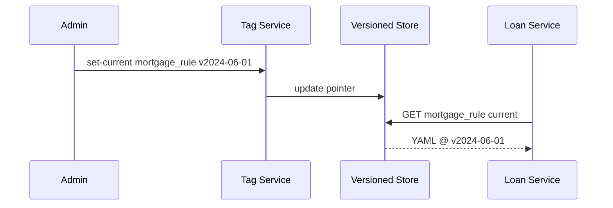

# Chapter 3: Versioning & Rollback Mechanism
*[Link back to Chapter&nbsp;2: Policy & Process Engine](02_policy___process_engine_.md)*  

---

## 1. Why Do We Need a “Time-Machine” for HMS?

Central Use Case (2 sentences)  
• The U.S. Department of Housing & Urban Development (HUD) publishes an updated mortgage-eligibility rule at 5 p.m.  
• By 8 p.m. loan approvals across the country slow to a crawl—HUD must flip the system back to the 9 a.m. state **in minutes**, not weeks.

Versioning & Rollback makes that magic button possible.

---

## 2. Key Concepts (Plain-English Cheat-Sheet)

| Term | Everyday Analogy | TL;DR |
|------|------------------|-------|
| Snapshot | Photo of your phone screen | Immutable copy of code/policies/data |
| Version Tag | Edition of the CFR book | Human-friendly name like “v2024-06-01” |
| Current Pointer | Sticky-note bookmark | Tells services which version to use |
| Rollback | Undo in MS Word | Move `current` pointer to an older snapshot |
| Changelog | Ship’s logbook | Who changed what, when, and why |

---

## 3. 3-Minute Walk-Through

### 3.1 Create a New Version (HUD Policy)

```bash
# 1. Publish mortgage rule through HMS-PPE CLI
$ ppe publish policies/mortgage_rule.yaml
✔ stored as v2024-06-15
# 2. Mark it as "current"
$ hms-tag set-current mortgage_rule v2024-06-15
```

Explanation  
1. `ppe publish` (see Chapter 2) saves an **immutable** file.  
2. `set-current` simply updates a pointer—fast, no heavy deployment.

### 3.2 Detect a Problem & Roll Back

```bash
# Mortgage approvals spike to 30 min → Roll back
$ hms-tag set-current mortgage_rule v2024-06-01
✔ rollback complete (took 1.2 s)
```

All live services now read the 6-01 version on their next API call.

---

## 4. How Does It Work Under the Hood?



Only the pointer changes—no files are copied or edited.  
Fast, safe, auditable.

---

## 5. Hands-On Code (≤ 20 lines each)

### 5.1 Tag Service — `tag_service.py`

```python
# miniature example
import json, time, pathlib

TAG_FILE = pathlib.Path("/var/hms/tags.json")

def set_current(artifact: str, version: str, user: str):
    tags = json.loads(TAG_FILE.read_text())
    tags[artifact] = {"version": version, "by": user, "ts": time.time()}
    TAG_FILE.write_text(json.dumps(tags, indent=2))
```

What it does  
• Loads a small JSON mapping (`artifact → version`).  
• Overwrites only that field—instant rollback capability.

### 5.2 Fetching “Current” in a Service

```python
import requests

def get_rule(artifact):
    resp = requests.get(f"https://store.gov/rule/{artifact}?v=current", timeout=2)
    return resp.json()   # always resolved to the pointer value
```

Services never need to know the exact version; they just ask for `v=current`.

---

## 6. Governance & Audit Integration

1. A rollback **must** open a Change Ticket in [Governance Layer](01_governance_layer__hms_gov__.md).  
2. The ticket is automatically linked to the pointer change in the **Changelog** table kept by Observability (see [Observability & Audit Log](11_observability___audit_log_.md)).  
3. Security rules (next chapter!) verify the old version is still compliant.

---

## 7. Common Pitfalls & Quick Fixes

| Oops! | Why It Happens | Fix |
|-------|---------------|-----|
| “Rollback feels slow” | Large binaries copied | Only move pointers; store artifacts immutably. |
| “Forgot why we rolled back” | No message attached | `set-current --msg "HUD latency issue"` |
| “Service cached old pointer” | Long in-memory cache | Respect ETag or TTL headers (≤ 5 min). |

---

## 8. Mini-Lab: Time-Travel Your ETL Job

1. Run an ETL that loads Department of Labor wage data using `v=current`.  
2. Publish a faulty rule that multiplies wages by 0.  
3. Observe ETL output → all zeros.  
4. Roll back pointer; re-run ETL → numbers fixed.  
5. Check the audit log; both runs are recorded with their rule version.

You just used Versioning & Rollback like a pro!

---

## 9. What You Learned

✓ Snapshots vs. pointers  
✓ How rollback is just a fast pointer move—no risky edits  
✓ Simple CLI & Python examples to publish, tag, and rewind  
✓ How the mechanism plugs into Governance, Audit, and Security

Ready to see how we keep those snapshots **secure and compliant**?  
Jump to [Chapter 4: Security & Compliance Framework](04_security___compliance_framework_.md).

---

Generated by [AI Codebase Knowledge Builder](https://github.com/The-Pocket/Tutorial-Codebase-Knowledge)