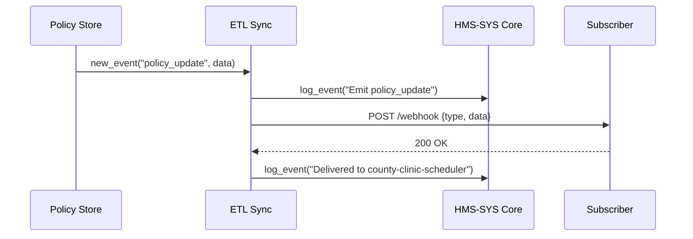

# Chapter 5: External System Synchronization

In [Chapter 4: ETL Data Pipelines](04_etl_data_pipelines_.md) we built the routines that extract, transform, and load data. Now we need to make sure that when something important changes—like a new vaccination policy—every external system (scheduling, reporting, registries) sees that update right away. That’s what **External System Synchronization** is for: a real-time “push” so nobody works on stale rules—just like synchronized clocks across government offices.

---

## 1. Motivation: Why Real-Time Sync?

Imagine the Federal Public Health Service updates vaccine-eligibility rules. Local clinic schedulers, pharmacies, and state registries must all enforce the new rules immediately:

- If a county scheduler still uses last week’s rules, it might book appointments for ineligible groups.  
- Citizens get confused, and staff must manually correct errors.  

With **External System Synchronization**, your ETL layer not only transforms data (Chapter 4) but also notifies downstream systems instantly whenever a policy or registry record changes. It’s like sending a “time-update” signal, so every office on the network resets its clock at once.

---

## 2. Key Concepts

1. **Publisher**  
   The component that emits an event when data or policy changes (e.g. HMS-ETL pipeline).  
2. **Subscriber**  
   Any external system that needs updates (clinic schedulers, state registries).  
3. **Event**  
   A message describing *what* changed (e.g. `"policy_update"`) and *data* (new policy rules).  
4. **Webhook / Push Channel**  
   HTTP callbacks where subscribers receive events in real time.  
5. **Reliability**  
   Logging, retries, and idempotency to guarantee every subscriber sees each event exactly once.

Analogy: think of a fire-alarm system. When one detector senses smoke (Publisher), it instantly rings bells (Events) at all exits (Subscribers).

---

## 3. Using External System Synchronization

Below is the minimal code to register subscribers and emit a policy-update event. We’ll pretend we’re notifying a chain of county clinic schedulers.

### 3.1 Register a Subscriber

File: `sync_setup.py`  
```python
from hms_etl.sync import SyncClient

# Point at our sync service
client = SyncClient(base_url="https://etl.gov.example")

# Register a clinic scheduler as a subscriber
client.register_subscriber(
  name="county-clinic-scheduler",
  url="https://clinic.example.gov/webhook"
)
```
This tells HMS-ETL: “Whenever there’s an event, POST it to this URL.”

### 3.2 Emit an Event

File: `publish_policy.py`  
```python
from hms_etl.sync import SyncClient

client = SyncClient(base_url="https://etl.gov.example")

# New vaccination policy arrives:
policy = {
  "policy_id": "VAX-2024-ELG",
  "description": "Age 18+ plus high-risk conditions"
}

client.emit_event("policy_update", policy)
print("All subscribers have been notified.")
```
Running this code will:
1. Log the event in [HMS-SYS Core](01_hms_sys_core_infrastructure_.md) for auditing.  
2. Push the policy data via HTTP POST to every registered subscriber.  

---

## 4. Under the Hood: Step-by-Step Flow

When you call `emit_event`, here’s what happens:



1. **Policy Store** (your code) triggers an event.  
2. **Sync Service** logs it centrally via [HMS-SYS Core](01_hms_sys_core_infrastructure_.md).  
3. It then loops through subscribers, sending each an HTTP POST.  
4. Each subscriber ACKs with `200 OK`.  
5. Sync logs the delivery status for audits and retries failures.

---

## 5. Internal Implementation

Here’s a simplified look at the core Sync code in `hms_etl/sync.py`.

### 5.1 Subscriber Registry

```python
# hms_etl/sync.py
SUBSCRIBERS = []

def register_subscriber(name, url):
    # Keep a simple in-memory list
    SUBSCRIBERS.append({"name": name, "url": url})
```
This lets you add new endpoints on the fly.

### 5.2 Event Emitter

```python
import requests
from hms_sys import CoreClient

core = CoreClient(base_url="https://core.gov.example")
token = core.authenticate(api_key="ETL_SYNC_KEY")

def emit_event(event_type, payload):
    # 1. Log the emit action
    core.log_event(service="sync-service", level="INFO",
                   message=f"Emit {event_type}")
    # 2. Notify each subscriber
    for sub in SUBSCRIBERS:
        resp = requests.post(
          sub["url"],
          json={"type": event_type, "data": payload},
          headers={"Authorization": f"Bearer {token}"}
        )
        core.log_event(
          service="sync-service", level="INFO",
          message=f"Delivered to {sub['name']} -> {resp.status_code}"
        )
```
- We authenticate once with [HMS-SYS Core](01_hms_sys_core_infrastructure_.md).  
- We log both the emission and each delivery.  
- In production, you’d add retries, timeouts, and idempotency checks.

---

## 6. Conclusion

You now know how **External System Synchronization** lets your ETL pipelines push real-time updates—policy changes, registry updates, or new process rules—to downstream systems without manual polling. You learned:

- How to register subscribers (webhooks)  
- How to emit and log events via [HMS-SYS Core Infrastructure](01_hms_sys_core_infrastructure_.md)  
- A peek at the simple in-memory implementation and request flow  

Next up, we’ll build dashboards and alerts so you can monitor these flows in real time:

[Chapter 6: Monitoring & Metrics Dashboard](06_monitoring___metrics_dashboard_.md)

---

Generated by [AI Codebase Knowledge Builder](https://github.com/The-Pocket/Tutorial-Codebase-Knowledge)