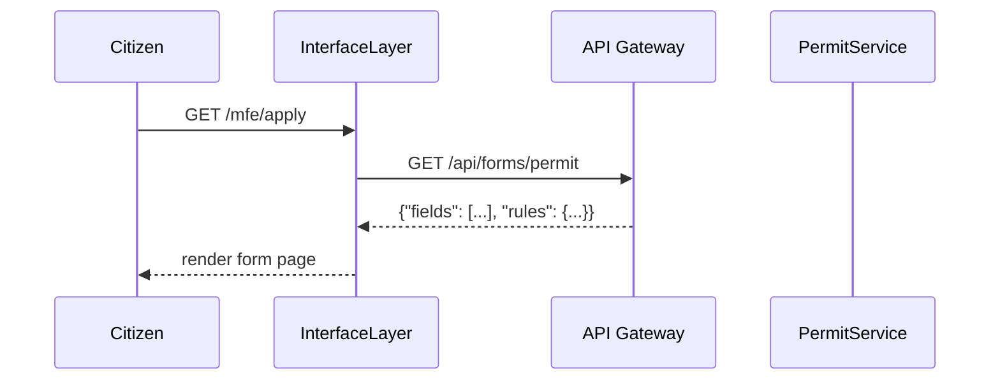

# Chapter 5: Interface Layer

Welcome back! In [Chapter 4: Backend API Gateway](04_backend_api_gateway_.md), we saw how HMS-ETL secures and routes every API call. Now it’s time to build the **Interface Layer**—the “front desk” where citizens and administrators actually see and interact with the system.

---

## 1. Why an Interface Layer?

Imagine walking into your local public works office:

- As a citizen, you fill out a **building permit form** at the counter.
- As an official, you review the queue of applications on your dashboard.

The **Interface Layer** provides those portals and dashboards:

- **HMS-MFE** is the citizen portal: friendly forms and guided journeys.
- **HMS-GOV** is the administrator portal: reports, approval panels, and outcome views.

Without this layer, you’d have to call raw APIs or read CSV files—far from user-friendly!

---

## 2. Key Concepts

1. **Portals**  
   Separate entry points for different user types (citizen vs. admin).  
2. **Page Routes**  
   URL paths that map to functions which return page definitions (forms, tables).  
3. **Forms & Guided Journeys**  
   Sequences of steps (e.g., fill out, review, submit).  
4. **Reports & Dashboards**  
   Summaries of data (pending items, statistics, charts).

---

## 3. Using the Interface Layer

Below is a minimal example showing how to register two portals and define one page in each.

```python
from hms_etl.interface import InterfaceLayer

ui = InterfaceLayer()

# 1. Register two portals
ui.register_portal(name="HMS-MFE", base_url="/mfe")
ui.register_portal(name="HMS-GOV", base_url="/gov")

# 2. Citizen form: building permit application
@ui.route(portal="HMS-MFE", path="/apply")
def permit_form(request):
    return {
        "title": "Building Permit Application",
        "fields": ["applicant_name", "site_address", "project_description"]
    }

# 3. Admin dashboard: review queue
@ui.route(portal="HMS-GOV", path="/dashboard")
def review_queue(request):
    items = fetch_pending_applications()  # Calls backend via API Gateway
    return {"title": "Pending Applications", "rows": items}

# 4. Start the interface server on port 3000
ui.start(port=3000)
```

Explanation:

1. We create an `InterfaceLayer` instance.  
2. We register **HMS-MFE** under `/mfe` and **HMS-GOV** under `/gov`.  
3. We define a citizen‐facing form at `/mfe/apply`.  
4. We define an admin dashboard at `/gov/dashboard`.  
5. `ui.start()` spins up a web server that serves both portals.

---

## 4. Under the Hood: Request Flow

Here’s what happens when a citizen navigates to the permit form:



1. **UI** identifies the portal and path.  
2. It calls the **Backend API Gateway** to fetch any dynamic data.  
3. The gateway routes to the proper microservice (e.g., `PermitService`).  
4. The UI layer merges the schema and data and sends back HTML/JSON for rendering.

---

## 5. Inside the Interface Layer

Let’s peek at a simplified implementation in `hms_etl/interface.py`.

### 5.1 Registering Portals & Routes

```python
class InterfaceLayer:
    def __init__(self):
        self.portals = {}     # name -> base_url
        self.routes = {}      # (portal, path) -> handler

    def register_portal(self, name, base_url):
        self.portals[name] = base_url

    def route(self, portal, path):
        def decorator(func):
            self.routes[(portal, path)] = func
            return func
        return decorator
```

- `portals` maps portal names to base URLs.  
- `route` stores a handler for each `(portal, path)` combination.

### 5.2 Handling Incoming Requests

```python
    def start(self, port):
        print(f"Interface listening on port {port}")
        # Hook into a real web server in production

    def handle_request(self, portal, path, request):
        handler = self.routes.get((portal, path))
        if not handler:
            return {"status": 404, "body": "Not Found"}
        page_def = handler(request)
        return {"status": 200, "body": page_def}
```

- `start()` would wire up an HTTP server.  
- `handle_request()` finds your handler, calls it, and returns the page definition.

---

## 6. Conclusion

In this chapter, you learned how the **Interface Layer**:

- Provides separate portals for citizens (`HMS-MFE`) and administrators (`HMS-GOV`).  
- Lets you define friendly forms, guided journeys, dashboards, and reports.  
- Works hand-in-hand with the [Backend API Gateway](04_backend_api_gateway_.md) to fetch dynamic data.  

Next up, we’ll explore how to build reusable UI building blocks in the [Frontend Component Library](06_frontend_component_library_.md).

---

Generated by [AI Codebase Knowledge Builder](https://github.com/The-Pocket/Tutorial-Codebase-Knowledge)