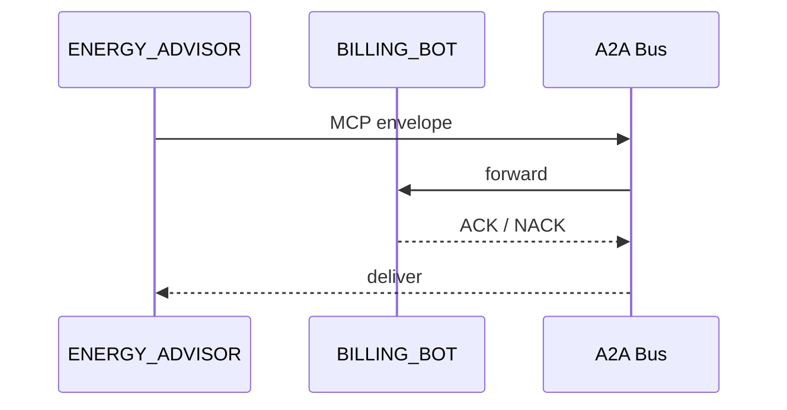

# Chapter 5: Model Context Protocol (HMS-MCP)

*[Jump back to the previous chapter: AI Agent Framework (HMS-AGT / HMS-AGX)](04_ai_agent_framework__hms_agt___hms_agx__.md)*  

---

## 1. Why Do We Need Yet Another “Protocol”?

Picture the **Bonneville Power Administration (BPA)**.  
They just “hired” two AI agents:

* **BILLING_BOT** – calculates monthly invoices for city utilities.  
* **ENERGY_ADVISOR** – chats with citizens about lowering their power bill.

One afternoon, ENERGY_ADVISOR wants to *reuse* BILLING_BOT’s tax-calculator skill.  
Sadly, their message formats look like this:

```
# ENERGY_ADVISOR (uses snake_case)
{
  "kwh_used": 420,
  "zip_code": "97201"
}

# BILLING_BOT (expects camelCase)
{
  "kWhUsed": 420,
  "zipCode": "97201"
}
```

No common contract ➜ custom glue code ➜ wasted hours.  
**HMS-MCP** fixes this by acting like **USB for AI components**.  
Plug any compliant tool into any compliant agent—no rewiring.

---

## 2. The One-Minute Definition

“**Model Context Protocol (MCP)** is a tiny, opinionated JSON envelope that every HMS agent and tool MUST understand for:

1. Invoking a tool  
2. Passing *context* (who, what, why)  
3. Returning results or errors  

If two sides speak MCP, they can talk—full stop.”

---

## 3. Key Concepts (Gently Explained)

| MCP Term | Everyday Analogy | Plain-English Meaning |
|----------|------------------|-----------------------|
| Envelope | Mailing package | Outer wrapper with metadata (version, sender, receiver). |
| Context | Cover letter | The state an agent/tool needs (user id, policy id, etc.). |
| Payload | Actual gift | The specific instruction (e.g., “compute tax”). |
| ACK / NACK | Thumbs up / thumbs down | Success vs. error reply. |
| Capability Manifest | User manual | Declares which payloads a tool can understand. |

---

## 4. Quick-Start: Calling a Tool With MCP

Goal: **ENERGY_ADVISOR** asks **BILLING_BOT** to compute tax.  
(Assume both were “hired” in [Chapter 4](04_ai_agent_framework__hms_agt___hms_agx__.md).)

```python
from hms_mcp import call         # ❶ single helper

payload = {                      # ❷ tool-specific intent
    "action": "compute_tax",
    "kWhUsed": 420,
    "zipCode": "97201"
}

result = call(                   # ❸ fire-and-forget
    tool_id   = "BILLING_BOT",
    payload   = payload,
    context   = {
        "session":  "citizen-123",
        "locale":   "en-US"
    }
)

print(result.data)               # {'tax': 7.14, 'currency': 'USD'}
```

Explanation (all <20 lines):

1. `call` automatically wraps your `payload` in an MCP **envelope**.  
2. The envelope is sent over the [Inter-Agency Bus](08_inter_agency_communication_bus__hms_a2a__.md).  
3. On success, you get an **ACK** with `.data`; errors raise `MCPError`.

---

## 5. What’s Inside the Envelope?

```
{
  "mcp_version": "1.0",
  "sender":  "ENERGY_ADVISOR",
  "receiver":"BILLING_BOT",
  "timestamp": "2024-06-01T12:00:00Z",
  "context": {
      "session": "citizen-123",
      "locale":  "en-US"
  },
  "payload": {
      "action":  "compute_tax",
      "kWhUsed": 420,
      "zipCode": "97201"
  }
}
```

Every field is required except `context` (optional but encouraged).

---

## 6. Under the Hood (Step-By-Step)

1. `call()` builds the envelope and serializes it as **canonical JSON** (sorted keys + UTF-8).  
2. Envelope travels through the **A2A Bus**.  
3. Recipient tool validates:  
   • `mcp_version` supported?  
   • `payload.action` listed in its **Capability Manifest**?  
4. Tool executes the request.  
5. Tool replies with either  
   • **ACK** `{ "status":"ok",   "data":{…} }` or  
   • **NACK** `{ "status":"err", "reason":"…"} `.  
6. Caller unpackages; library converts **NACK** into an exception.

### Tiny Sequence Diagram



Only three hops—predictable and easy to debug.

---

## 7. Minimal Implementation Peek

### 7.1 Envelope Builder (`hms_mcp/core.py`)

```python
import json, time, uuid

def _envelope(sender, receiver, context, payload):
    return {
        "mcp_version": "1.0",
        "id":       str(uuid.uuid4()),
        "sender":   sender,
        "receiver": receiver,
        "timestamp": time.strftime("%Y-%m-%dT%H:%M:%SZ", time.gmtime()),
        "context":  context or {},
        "payload":  payload,
    }
```

Under 15 lines—just assembling a dict.

### 7.2 Public Helper (`hms_mcp/__init__.py`)

```python
from .core import _envelope
from hms_a2a import bus        # thin wrapper around Chapter 8

def call(tool_id, payload, context=None):
    env = _envelope("self", tool_id, context, payload)
    raw = bus.send(env)        # round-trip as JSON string
    reply = json.loads(raw)

    if reply.get("status") == "err":
        raise Exception(reply["reason"])
    return reply               # status == "ok"
```

• If you know HTTP you can read this.  
• Real code adds retries & tracing, but the idea stays this simple.

---

## 8. Registering Capabilities (Tools-Side)

Every tool publishes a **Capability Manifest** at startup:

```json
{
  "tool":    "BILLING_BOT",
  "version": "2.1.0",
  "actions": ["compute_tax", "project_bill", "explain_charge"]
}
```

HMS-MCP stores manifests in the **Agent Registry** (see [Chapter 4](04_ai_agent_framework__hms_agt___hms_agx__.md)) so any caller can discover what to invoke.

---

## 9. Common Pitfalls & FAQs

**Q: Do I need to memorize field names?**  
No. Use the `hms_mcp` library—just pass `payload` & `context`.

**Q: Binary data?**  
Base64-encode it and put inside `payload.file`. Large blobs should be uploaded via [External System Sync](09_external_system_synchronization_layer_.md) and referenced by URL.

**Q: Version upgrades?**  
MCP is versioned. When `mcp_version` bumps, tools can still advertise `"accepts":["1.x","2.x"]` in their manifest.

---

## 10. Mini Exercise

1. Spin up two dummy tools `TOOL_A` and `TOOL_B` (see `examples/mcp_pair.py`).  
2. Register `action:"echo"` in both manifests.  
3. Have `TOOL_A` call `TOOL_B` with `"message":"Hello MCP!"`.  
4. Intentionally misspell `action` and watch the **NACK** response.

---

## 11. What You Learned

* HMS-MCP is the **common language** every HMS agent & tool speaks.  
* A tiny JSON envelope carries *who*, *why*, and *what*—no snowflake APIs.  
* With MCP, you can swap a health-care dosage calculator into a finance workflow with zero glue code changes.

Time to see how humans can pause or override these autonomous conversations:  
[Human-in-the-Loop (HITL) Oversight](06_human_in_the_loop__hitl__oversight_.md)

---

---

Generated by [AI Codebase Knowledge Builder](https://github.com/The-Pocket/Tutorial-Codebase-Knowledge)