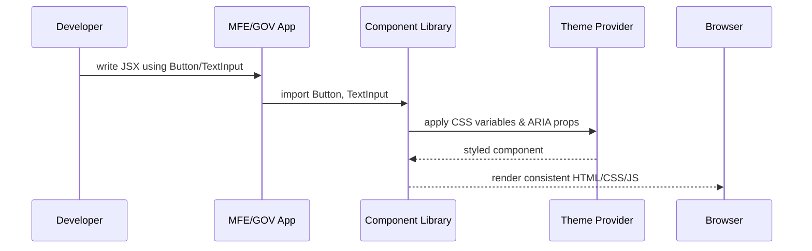

# Chapter 6: Frontend Component Library

Welcome back! In [Chapter 5: Interface Layer](05_interface_layer_.md) we built citizen and admin portals. Now we’ll create a shared **Frontend Component Library**—a branded toolkit of UI widgets, forms, and styles for both **HMS-MFE** and **HMS-GOV**. This ensures every button, input, and layout looks, feels, and behaves the same way across all interfaces.

---

## 1. Why a Component Library?

**Use Case**  
The U.S. Forest Service launches a new wildfire-reporting form in the citizen portal and a matching incident-review panel in the admin portal. Without a component library, each team builds its own buttons, form fields, and colors—leading to inconsistent branding, duplicated work, and bugs.  

With a shared library you get:  
- Consistent “Apply” and “Approve” buttons across portals  
- A single source for colors, typography, and spacing  
- Built-in accessibility (ARIA roles, keyboard support)  
- Faster feature development—just pick components!

---

## 2. Key Concepts

1. **Components**  
   Reusable UI pieces (Button, TextInput, Select, Modal).  
2. **Theme & Styles**  
   Centralized color palette, fonts, spacing variables.  
3. **Accessibility**  
   All components support ARIA attributes, focus outlines, screen readers.  
4. **Storybook (Optional)**  
   A visual playground to preview and test each component in isolation.  
5. **Package Distribution**  
   Published as an NPM package (`@hms-etl/components`) that both portals install.

---

## 3. Using the Component Library

Here’s how a citizen form for “Wildfire Damage Report” might look:

```jsx
// File: wildfire-report.jsx
import React from 'react'
import {
  Form,
  TextInput,
  TextArea,
  Select,
  Button
} from '@hms-etl/components'

export function WildfireReportForm() {
  return (
    <Form>
      <TextInput label="Reporter Name" name="name" />
      <Select
        label="Affected Region"
        name="region"
        options={['North', 'South', 'East', 'West']}
      />
      <TextArea
        label="Description of Damage"
        name="description"
      />
      <Button type="submit">Submit Report</Button>
    </Form>
  )
}
```

Explanation:  
- We import components from `@hms-etl/components`.  
- Each component already has styling, validation hooks, and accessibility baked in.  
- The form renders consistently in both portals.

---

## 4. Under the Hood: Rendering Flow



1. **Developer** uses components in the portal code.  
2. App imports from the **Library**.  
3. Each component pulls in **Theme** variables and accessibility props.  
4. Browser renders a uniform interface.

---

## 5. Inside the Library (Code Walkthrough)

Below is a minimal structure. Every file is under `packages/components/`.

```
components/
├── Button.js
├── TextInput.js
├── theme.js
└── index.js
```

### 5.1 theme.js

```js
// File: packages/components/theme.js
export const theme = {
  colors: {
    primary: '#0071bc',
    secondary: '#004b87',
    text: '#212121'
  },
  spacing: { small: '4px', medium: '8px', large: '16px' },
  fontSize: '16px'
}
```

*Explanation:* Central color, spacing, and font definitions.

### 5.2 Button.js

```jsx
// File: packages/components/Button.js
import React from 'react'
import { theme } from './theme'

export function Button({ children, ...props }) {
  return (
    <button
      style={{
        backgroundColor: theme.colors.primary,
        color: '#fff',
        padding: theme.spacing.medium
      }}
      {...props}
    >
      {children}
    </button>
  )
}
```

*Explanation:* A simple styled button using our theme.

### 5.3 TextInput.js

```jsx
// File: packages/components/TextInput.js
import React from 'react'
import { theme } from './theme'

export function TextInput({ label, ...props }) {
  return (
    <label style={{ display: 'block', marginBottom: theme.spacing.small }}>
      <span>{label}</span>
      <input
        style={{
          width: '100%',
          padding: theme.spacing.small,
          marginTop: theme.spacing.small
        }}
        {...props}
      />
    </label>
  )
}
```

*Explanation:* A labeled input that enforces spacing and full width.

### 5.4 index.js

```js
// File: packages/components/index.js
export * from './Button'
export * from './TextInput'
// ...export Form, Select, TextArea, etc.
export * from './theme'
```

*Explanation:* Single entry point so portals import from `@hms-etl/components`.

---

## 6. Conclusion

You now have a branded **Frontend Component Library** that:

- Provides consistent UI across **HMS-MFE** and **HMS-GOV**  
- Enforces accessibility and design guidelines  
- Speeds up development of new citizen forms and admin panels  

Up next, we’ll wire these components into flows based on user intent in [Intent-Driven Navigation](07_intent_driven_navigation_.md). Enjoy building!

---

Generated by [AI Codebase Knowledge Builder](https://github.com/The-Pocket/Tutorial-Codebase-Knowledge)