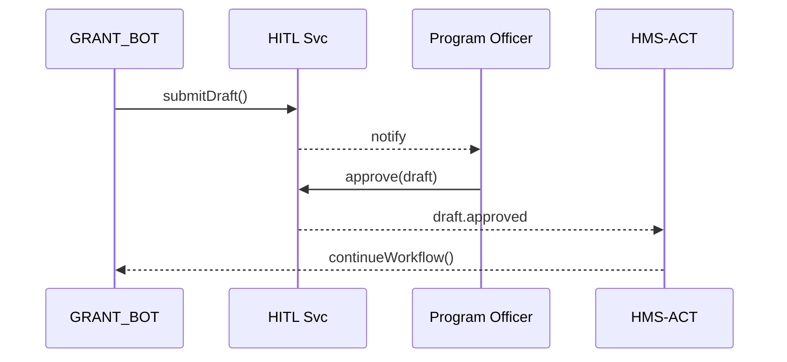

# Chapter 6: Human-in-the-Loop (HITL) Oversight  
*[Jump back to the previous chapter: Model Context Protocol (HMS-MCP)](05_model_context_protocol__hms_mcp__.md)*  

---

## 1. Why Do We Need a “Human Brake Pedal”?

Imagine the **National Science Foundation (NSF)** runs an AI pipeline that:

1. Reads 5,000 grant proposals.  
2. Ranks them with a large language model.  
3. Sends funding recommendations to Treasury.

Great for speed—terrible for democracy if the model slips up.  
HITL Oversight inserts a **human checkpoint** so a real *Program Officer* can:

* Review the AI’s ranked list.  
* Tweak a weight or two (e.g., “give rural schools +5 pts”).  
* Approve, re-rank, or veto before public money moves.  

In short: **AI accelerates, humans decide.**

---

## 2. Key Concepts (Bite-Sized)

| Term | Friendly Analogy | Purpose |
|------|------------------|---------|
| Checkpoint | Toll booth | AI must stop here until a human waves it through. |
| Oversight Console | Spell-check dialog | Where the human sees AI output and can edit it. |
| Parameter Tweak | Volume knob | Fine-tune model weights without new code. |
| Approve / Veto | “Send” vs “Delete” button | Final go/no-go on the change. |
| Audit Stamp | Notary seal | Records *who* decided *what*, *when*. |

---

## 3. 5-Minute Tour: Approving AI-Ranked Grants

Below is a **toy script** (<20 lines) using an imaginary `hms_hitl` SDK.  
Our AI agent `GRANT_BOT` sends its recommendations to the human queue.

```python
from hms_hitl import Oversight
from hms_agt  import HR      # from Chapter 4
from hms_mcp import call     # from Chapter 5

# 1️⃣  Log in
hitl = Oversight.login("officer@nsf.gov", "•••")

# 2️⃣  Agent pushes its draft ranking
draft_id = call(
    tool_id="GRANT_BOT",
    payload={"action": "rank_proposals"}
)["draft_id"]

# 3️⃣  Human reviews & tweaks
draft = hitl.open(draft_id)
draft.weights["rural_bonus"] = +5     # parameter tweak
draft.comment("Added rural incentive per policy 123-B.")

# 4️⃣  Final decision
draft.approve()    # or draft.veto("Reason…")

print("✅  Sent to Treasury!")
```

What happened?

1. `GRANT_BOT` generated a draft and parked it in a **Checkpoint**.  
2. The Program Officer opened it via the **Oversight Console**.  
3. She tweaked a parameter and clicked **Approve**.  
4. An **Audit Stamp** auto-logged everything to [Governance Layer](01_governance_layer__hms_gov__.md).

---

## 4. Life Cycle of a HITL Checkpoint (No Jargon)

1. **Agent** finishes a task but cannot commit.  
2. It sends a *Draft* to HITL with context (who, what, why).  
3. **Oversight Service** stores it and notifies the assigned human.  
4. Human acts: *approve*, *edit & approve*, or *veto*.  
5. HITL emits an event (`draft.approved` or `draft.vetoed`) that  
   [Agent Orchestration & Workflow (HMS-ACT)](07_agent_orchestration___workflow__hms_act__.md) listens to.  

### Sequence Diagram



Five actors, one loop—easy to trace.

---

## 5. Peek Into the Codebase

### 5.1 Agent-Side Helper  
*File: `hms_hitl/agent.py` (simplified, 15 lines)*

```python
def checkpoint(agent_id: str, payload: dict) -> str:
    """
    Store a draft & return its ID.
    """
    draft = {
        "agent_id": agent_id,
        "payload":  payload,
        "status":   "PENDING",
        "timestamp": time.time()
    }
    draft_id = db.insert("drafts", draft)
    bus.emit("draft.created", {"id": draft_id})
    return draft_id
```

Key points:  
• Writes one row to `drafts` table.  
• Broadcasts an event so humans get an email/Slack/Teams ping.

### 5.2 Human-Side API  
*File: `hms_hitl/oversight.py` (excerpt, 17 lines)*

```python
class Draft:
    def approve(self):
        self.status = "APPROVED"
        db.update("drafts", self.id, {"status": self.status})
        bus.emit("draft.approved", {"id": self.id, "by": self.user})
    
    def veto(self, reason: str):
        self.status = "VETOED"
        db.update("drafts", self.id, {
            "status": self.status,
            "reason": reason
        })
        bus.emit("draft.vetoed", {"id": self.id, "by": self.user})
```

Both methods:

1. Flip a status flag.  
2. Record the human’s ID + timestamp.  
3. Emit an event for downstream workflows—no mystery magic.

---

## 6. Frequently Asked Questions

**Q: Does every AI action need a checkpoint?**  
No. You configure *which* actions require humans in [Governance Layer](01_governance_layer__hms_gov__.md) policy settings.

**Q: Can multiple reviewers collaborate?**  
Yes—`hitl.open()` returns a Draft object that supports `.assign(["alice","bob"])`.

**Q: What if the human never responds?**  
Set an SLA timer; HITL can auto-escalate or auto-veto after N hours.

---

## 7. Try It Yourself

1. Clone `examples/hitl_quickstart.ipynb`.  
2. Simulate `BENEFITS_BOT` drafting 3 citizen eligibility letters.  
3. Approve one, edit one, veto one.  
4. Query the audit log to see all three actions recorded.

---

## 8. What You Learned

* Human-in-the-Loop Oversight places a **speed bump** in automated flows.  
* Program Officers can inspect, tweak, and ultimately **own** final decisions.  
* Each action is auditable, satisfying accountability and democratic legitimacy.  

Ready to see how these checkpoints fit into larger **multi-step workflows**?  
Head over to the next chapter:  
[Agent Orchestration & Workflow (HMS-ACT)](07_agent_orchestration___workflow__hms_act__.md)

---

Generated by [AI Codebase Knowledge Builder](https://github.com/The-Pocket/Tutorial-Codebase-Knowledge)