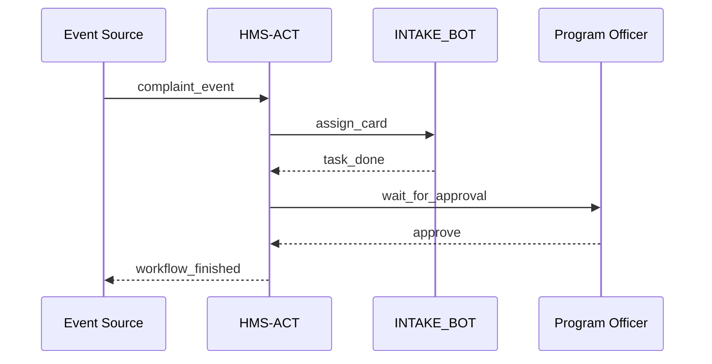

# Chapter 7: Agent Orchestration & Workflow (HMS-ACT)

*[Jump back to the previous chapter: Human-in-the-Loop (HITL) Oversight](06_human_in_the_loop__hitl__oversight_.md)*  

---

## 1. Why Do We Need a “Project-Manager” for AI Agents?

Imagine the **Office of Child Support Enforcement (OCSE)** receives a citizen complaint:

> “My online application has been stuck in *Review* for two weeks!”

Behind the curtain, three AI agents are supposed to help:

* `INTAKE_BOT` – parses the PDF application  
* `LEGAL_BOT`  – calls [Compliance & Legal Reasoning (HMS-ESQ)](03_compliance___legal_reasoning__hms_esq__.md)  
* `NOTIFY_BOT` – emails the applicant  

But nobody (human or AI) is **tracking** which agent owns which step, how long it’s taking, or where the evidence is stored. Result: delays, finger-pointing, and angry citizens.

**HMS-ACT** fixes this by doing what a *project manager* does in any office:

1. Listen for events (new complaint filed, deadline missed).  
2. Place **cards** on a Kanban-style board.  
3. Assign each card to the right agent.  
4. Move cards automatically as agents finish tasks.  
5. Record *who, what, when* on every move for audits.

If [HMS-AGT / HMS-AGX](04_ai_agent_framework__hms_agt___hms_agx__.md) are the **employees**, HMS-ACT is their **scrum master**.

---

## 2. Key Concepts (Zero-Jargon Cheatsheet)

| Term | Friendly Analogy | Why It Matters |
|------|------------------|----------------|
| Board | Kanban wall | Visual snapshot of every task & status. |
| Card | Sticky note | A single piece of work (e.g., “Check ADA compliance”). |
| Lane | Column on board | States like `TODO`, `IN_PROGRESS`, `DONE`, `BLOCKED_HITL`. |
| Rule | Traffic light | “If card sits in TODO > 1 day, raise alert.” |
| Audit Trail | Black box recorder | Inspect exactly who moved a card, when, & why. |

---

## 3. 5-Minute Tour: From Complaint to Resolution

Below is a **toy script** (19 lines) using an imaginary `hms_act` SDK.

```python
from hms_act import Board
from hms_mcp import call         # for agent calls (Ch. 5)

# 1️⃣  Open (or create) a workflow board
board = Board.open("ocse_complaints")

# 2️⃣  New citizen complaint arrives
card = board.add_card(
    title="Complaint #2024-1887",
    payload={"citizen_id": "C-99", "doc": "form.pdf"}
)

# 3️⃣  Auto-assign first task to INTAKE_BOT
card.assign("INTAKE_BOT")
call("INTAKE_BOT", {"action": "parse_pdf", "card": card.id})

# 4️⃣  Move to ‘Legal Review’ lane when done
card.move("LEGAL_REVIEW")        # triggers LEGAL_BOT under the hood

# 5️⃣  Mark done & notify citizen
card.move("COMPLETED")
call("NOTIFY_BOT", {"action": "email_done", "card": card.id})

print("🎉 Complaint resolved with full audit trail!")
```

What you just saw:

1. A **board** (`ocse_complaints`) stores every card.  
2. Rules inside HMS-ACT *automatically* changed lanes and woke up the right agents.  
3. Each `move()` writes an immutable snapshot to the audit log.

---

## 4. How Does HMS-ACT Fit Into the Bigger Picture?

```
Events (forms, deadlines, errors)
        │
        ▼
     HMS-ACT
  (Board & Rules)
        │
        ├─▶ Calls agents via MCP  (Ch. 5)
        ├─▶ Pauses at HITL lanes  (Ch. 6)
        └─▶ Emits events on A2A Bus (Ch. 8)
```

HMS-ACT **owns** the timeline; everyone else plugs into it.

---

## 5. Step-by-Step Walkthrough (No Code)

1. **Event Ingest**  
   A new complaint arrives over the [Inter-Agency Bus](08_inter_agency_communication_bus__hms_a2a__.md).  
2. **Card Creation**  
   HMS-ACT creates a card in the `TODO` lane.  
3. **Rule Engine** checks:  
   “Card type = ‘complaint’ ➜ assign INTAKE_BOT.”  
4. **Agent Execution**  
   When INTAKE_BOT finishes, it emits `card.update(payload=…)`.  
5. **Lane Transition**  
   Rule says: “If INTAKE payload valid ➜ move card to `LEGAL_REVIEW`.”  
6. **Human Gate**  
   If `LEGAL_REVIEW` is configured as a HITL lane, card **pauses** until a Program Officer approves.  
7. **Completion**  
   Card moves to `COMPLETED`; HMS-ACT emits `workflow.finished`.

### Mini Sequence Diagram



Five participants, one smooth loop!

---

## 6. Peek Inside the Codebase

### 6.1 Board & Card Skeleton  
*File: `hms_act/board.py` (18 lines)*

```python
class Card:
    def __init__(self, id, lane, payload):
        self.id, self.lane, self.payload = id, lane, payload
    
    def assign(self, agent_id):
        bus.emit("card.assigned", {"card": self.id, "agent": agent_id})
    
    def move(self, lane):
        self.lane = lane
        bus.emit("card.moved", {"card": self.id, "lane": lane})

class Board:
    @classmethod
    def open(cls, name):
        return cls(name)
    
    def __init__(self, name):
        self.name = name
    
    def add_card(self, title, payload):
        cid = db.insert("cards", {"title": title, "lane": "TODO"})
        return Card(cid, "TODO", payload)
```

Takeaways:  
*Under 20 lines* but captures the essence—add card → assign → move → emit events.

### 6.2 Rule Engine Snippet  
*File: `hms_act/rules.py` (15 lines)*

```python
RULES = [
    # When a card is added
    {
        "on":  "card.created",
        "if":  lambda c: "complaint" in c["title"].lower(),
        "do":  lambda c: Card(c["id"], "", {}).assign("INTAKE_BOT")
    },
    # Auto-escalate if stuck > 1 day
    {
        "on":  "card.timer.24h",
        "if":  lambda c: c["lane"] == "TODO",
        "do":  lambda c: bus.emit("alert.sla_missed", {"card": c["id"]})
    }
]
```

Plain dictionary rules; beginners can tweak these like Excel formulas.

---

## 7. Common Questions

**Q: Do I need to write rules in Python?**  
No. HMS-ACT offers a low-code web UI (drag-and-drop) and YAML import/export.

**Q: How does it talk to agents?**  
Via the [Model Context Protocol (HMS-MCP)](05_model_context_protocol__hms_mcp__.md). `assign()` simply emits an MCP call.

**Q: Can humans manually move cards?**  
Absolutely—via the board UI or `card.move("BLOCKED_HITL")` API.

---

## 8. Try It Yourself

1. Clone `examples/act_quickstart.ipynb`.  
2. Create a board `permit_apps`.  
3. Add a card “Food-Truck Permit #42”.  
4. Write a rule: after `LEGAL_BOT` passes, auto-notify the applicant.  
5. Run the notebook and watch lanes update in real time.

---

## 9. What You Learned

* HMS-ACT is the **traffic cop** that routes work between agents, humans, and systems.  
* Boards, cards, lanes, and rules keep everything visible and auditable.  
* Under the hood, it’s mostly event emitters and simple state moves—easy to extend.

Ready to look at the **wire** that carries all those events? Jump to  
[Inter-Agency Communication Bus (HMS-A2A)](08_inter_agency_communication_bus__hms_a2a__.md).

---

---

Generated by [AI Codebase Knowledge Builder](https://github.com/The-Pocket/Tutorial-Codebase-Knowledge)