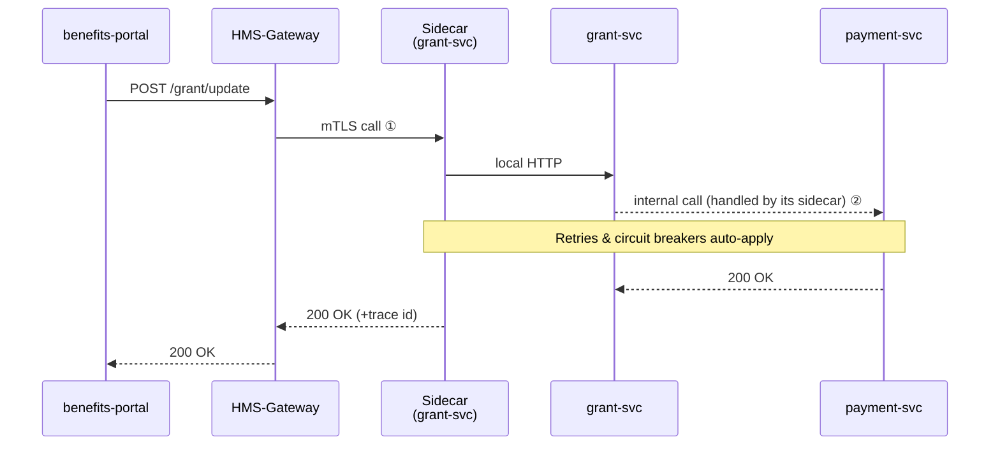

# Chapter 7: Backend Service Mesh (HMS-API)
*[Link back to Chapter 6: Multi-Layered Microservice Architecture](06_multi_layered_microservice_architecture_.md)*  

---

## 1. Why Do We Need a “Postal Network” for APIs?

Central use-case  
• A **veteran** logs in to `benefits.gov` to request a *housing grant update*.  
• The front-end call must hop through 4 internal services:

1. `benefits-portal` – UI  
2. `grant-svc` – business logic  
3. `payment-svc` – Treasury rails  
4. `audit-svc` – Inspector General logs  

If *any* hop is slow or insecure, the veteran sees a spinner or, worse, a data leak.  
The **Backend Service Mesh (HMS-API)** is our **postal network**:

• Looks at the envelope (URL) ➜ finds the right mailbox (micro-service).  
• Adds stamps: **Zero-Trust auth**, **rate-limit**, **retries**, **metrics**.  
• Delivers parcels even when one road is closed (automatic circuit breakers).

No code change is required in the services themselves; the mesh handles the plumbing.

---

## 2. Key Concepts (Plain-English Cheat-Sheet)

| Postal Analogy | Mesh Term | TL;DR for Beginners |
|----------------|-----------|---------------------|
| Street Address Book | Service Discovery | Auto-updated list: `grant-svc → 10.0.1.5` |
| Mail Carrier | Sidecar Proxy | Tiny container that escorts every request |
| Red Stamp “Return to Sender” | Circuit Breaker | Fast failure if a service looks sick |
| Priority Stamp | Retry & Timeout | Try again 2× before giving up |
| Locked Mailbox | mTLS / Zero-Trust | Every hop is encrypted & identity-checked |
| Post Office Counter | API Gateway | Single entry point for outside callers |
| Tracking Number | Distributed Trace | See the parcel’s journey in Grafana |

Keep this table open while you read—the rest of the chapter is just these ideas in action!

---

## 3. 3-Minute Walk-Through (from Click to Response)


① Gateway authenticates the JWT with [Access & Identity Management](05_access___identity_management_.md).  
② Each internal hop also passes through sidecars, so Zero-Trust is **end-to-end**.

---

## 4. Hands-On: Your First Mesh-Protected Request

We’ll stand up **two toy services** behind HMS-API on your laptop.

### 4.1 Create the Services (≤15 lines each)

`hello_svc/app.py`
```python
from fastapi import FastAPI
app = FastAPI()

@app.get("/hello")
def hi():
    return {"msg": "Hello from HMS!"}
```

`calc_svc/app.py`
```python
from fastapi import FastAPI
app = FastAPI()

@app.get("/sum/{a}/{b}")
def add(a:int, b:int):
    return {"sum": a + b}
```

### 4.2 Describe Them to the Mesh

`hello_svc/route.yaml`
```yaml
service: hello-svc
routes:
  - GET /hello
```

`calc_svc/route.yaml`
```yaml
service: calc-svc
routes:
  - GET /sum/{a}/{b}
rate_limit: "20 req/min"
```

Upload with one CLI command each:

```bash
hms-api register hello_svc/route.yaml
hms-api register calc_svc/route.yaml
```

### 4.3 Make a Call Through the Gateway

```bash
curl -H "Authorization: Bearer $JWT" \
  https://gateway.local/sum/2/3
```

Output:

```json
{"sum": 5, "x-trace-id": "7f23ab"}
```

What just happened?  
1. Gateway validated your JWT (Zero-Trust ✅).  
2. It found `calc-svc` via Service Discovery.  
3. Your request passed the **Sidecar**, which added a trace id & applied rate limits.  
4. Response came back the same path—now traceable in Grafana.

---

## 5. How Does It Work Under the Hood?

### 5.1 Life of a Packet (Step-By-Step)

1. **Gateway** receives HTTPS, checks the certificate + JWT.  
2. Looks up route in its *Routing Table* (auto-filled from `route.yaml`).  
3. Opens mTLS to the **destination sidecar** indicated by service name.  
4. **Sidecar** forwards to the local container on `localhost:PORT`.  
5. Sidecar records latency, retries once on 5xx, and reports metrics.  
6. Reverse path returns, adding **x-trace-id** header at each hop.

### 5.2 Minimal Control-Plane Code (≤ 18 lines)

`hms_api/control_plane.py`
```python
import json, os, pathlib
ROUTES = pathlib.Path("/var/hms/routes.json")

def register(route_file: str):
    spec = json.load(open(route_file))
    table = json.loads(ROUTES.read_text() or "{}")
    table[spec["service"]] = spec
    ROUTES.write_text(json.dumps(table, indent=2))
    print(f"✓ registered {spec['service']}")
```
Explanation  
• Keeps a simple JSON file that every Gateway periodically polls.  
• Real system uses etcd/Consul, but concept is identical.

### 5.3 Sidecar Proxy (Super-Tiny)

`hms_api/sidecar.py`
```python
from fastapi import FastAPI, Request
import httpx, os

app = FastAPI()
TARGET = os.getenv("SERVICE_PORT", 7000)

@app.middleware("http")
async def proxy(req: Request, call_next):
    try:
        url = f"http://127.0.0.1:{TARGET}{req.url.path}"
        async with httpx.AsyncClient() as c:
            r = await c.request(req.method, url)
        return r
    except httpx.HTTPError:
        # Circuit breaker: fast fail after 3 errors (skipped)
        return JSONResponse({"error": "upstream down"}, status_code=503)
```
Explanation  
• Reads the target port from env.  
• Forwards request, catching failures for the circuit breaker.  
• Adds zero extra lines in your business code—**transparent**!

---

## 6. Built-In “Stamps” You Get for Free

| Stamp | Mesh Behavior | Where Configured |
|-------|---------------|------------------|
| **mTLS** | Auto-issued certs per pod | cluster bootstrap |
| **JWT Validation** | Sidecar calls PDP (Chapter 5) | gateway.yaml |
| **Rate Limit** | Token bucket per route | `route.yaml` field |
| **Retry (2×)** | 500 or timeout triggers replay | sidecar defaults |
| **Tracing** | x-trace-id header + Jaeger | mesh-config.yaml |

All of these can be flipped on/off without touching service code—**policy not plumbing**.

---

## 7. Common Pitfalls & Quick Fixes

| Oops! | Cause | Fast Fix |
|-------|-------|----------|
| “Why is my request 0.5 s slower now?” | sidecar TLS handshake | Enable connection reuse (`keep_alive: true`) |
| Sudden **429 Too Many Requests** | Hit rate limit | Increase `rate_limit` or batch calls |
| Trace id missing downstream | Service strips headers | Whitelist `x-trace-id` in your framework’s “forwarded headers” setting |

---

## 8. Mini-Lab: Flip On a Circuit Breaker

1. Stop `calc-svc` container (`docker stop calc-svc`).  
2. Curl the same endpoint 3×; notice the 3rd call instantly returns `503` (breaker open).  
3. Restart the service; after ~30 s the breaker closes and traffic flows again.  

You just watched **self-healing** in action—no pager duty!

---

## 9. What You Learned

• A service mesh is a **postal network** that transparently routes, secures, and monitors every API call.  
• Core pieces: **Gateway, Sidecar, Service Discovery, Circuit Breaker, Tracing**.  
• How to register two tiny services and hit them through the mesh.  
• Peeked under the hood at the control plane and sidecar code (< 20 lines).  
• Got built-in stamps: mTLS, retries, rate limits, traces—without touching service code.

Ready to see how asynchronous **events** move through the platform with similar magic?  
Continue to [Event Bus & Streaming Layer](08_event_bus___streaming_layer_.md).

---

Generated by [AI Codebase Knowledge Builder](https://github.com/The-Pocket/Tutorial-Codebase-Knowledge)