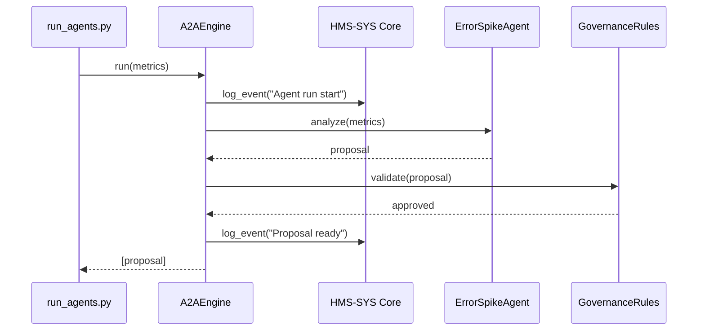

# Chapter 7: HMS-A2A AI Agent Framework

In [Chapter 6: Monitoring & Metrics Dashboard](06_monitoring___metrics_dashboard_.md) we learned how to collect and visualize metrics. Now we’ll build **HMS-A2A**, the “engine room” that runs AI agents—think of them as a team of policy advisors who read usage data, draft new guidelines, and flag issues automatically, all under safety and ethics rules.

---

## 1. Motivation: Why an AI Agent Framework?

Imagine the Department of Veterans Affairs (VA) wants to speed up and improve its benefits-application process. Rather than have managers scan logs and guess where delays happen, we can deploy AI agents that:

1. Read throughput and error‐rate metrics  
2. Spot unusual spikes in form validation errors  
3. Draft process-improvement proposals  
4. Flag potential policy conflicts for human review  

This is like having a squad of junior policy advisors who constantly scan data and suggest small rule changes—letting your experts focus on final approvals.

---

## 2. Key Concepts

1. **A2A Engine**  
   The core orchestrator that loads data, runs agents, and collects their proposals.

2. **Agent**  
   A piece of code with a single focus, e.g. “ErrorSpikeAgent” that watches error-rate trends.

3. **Data Feed**  
   Input to agents: metrics, logs, or ETL outputs from [Chapter 4](04_etl_data_pipelines_.md) and [Chapter 6](06_monitoring___metrics_dashboard_.md).

4. **Policy Proposal**  
   A structured suggestion from an agent, like “Limit form resubmissions to 3 attempts within 24hrs.”

5. **Governance Rules**  
   Constraints applied before proposals are sent to humans. Ensures safety, privacy, and ethics.

---

## 3. Using HMS-A2A to Propose Process Guidelines

Below is a minimal example showing how to set up one agent that watches a metric and suggests a new rule.

### 3.1 Initialize the Engine

File: `run_agents.py`
```python
from hms_a2a.engine import A2AEngine

# Point to our Core infra for logging and governance
engine = A2AEngine(core_url="https://core.gov.example", api_key="VA_AGENT_KEY")
```
This logs into HMS-SYS for secure logging and governance checks.

### 3.2 Register an Agent

```python
from hms_a2a.agents import ErrorSpikeAgent

# Add agents to the engine
engine.register_agent(ErrorSpikeAgent(name="error_spike"))
```
`ErrorSpikeAgent` will later scan error counters for sudden jumps.

### 3.3 Run Agents on Live Data

```python
# Suppose we fetched metrics from our dashboard
metrics = {"etl.errors": 0, "form.errors": 42}

# Run all agents, collect proposals
proposals = engine.run(metrics)
for p in proposals:
    print(p.title, "-", p.detail)
```
Output might be:
```
Limit resubmissions - "Form errors jumped 200% in last hour. Suggest max 3 retries."
```

---

## 4. Under the Hood: Step-by-Step Flow



1. **Engine** starts an agent run and logs it.  
2. **ErrorSpikeAgent** analyzes metrics and returns a proposal.  
3. Proposal passes through **GovernanceRules** for safety checks.  
4. Approved proposals are logged and returned.

---

## 5. Internal Implementation Details

### 5.1 A2A Engine (File: `hms_a2a/engine.py`)
```python
from hms_sys import CoreClient
from hms_a2a.governance import GovernanceRules

class A2AEngine:
    def __init__(self, core_url, api_key):
        self.core = CoreClient(base_url=core_url)
        self.token = self.core.authenticate(api_key=api_key)
        self.agents = []
        self.gov = GovernanceRules()

    def register_agent(self, agent):
        self.agents.append(agent)

    def run(self, metrics):
        self.core.log_event("a2a-engine", "INFO", "Agent run start")
        proposals = []
        for agent in self.agents:
            p = agent.analyze(metrics)
            if self.gov.validate(p):
                proposals.append(p)
        self.core.log_event("a2a-engine", "INFO", f"{len(proposals)} proposals ready")
        return proposals
```
- Authenticates to HMS-SYS Core for logging.  
- Keeps a list of agents and governance rules.  
- Runs each agent, validates its proposal, then logs and returns approved proposals.

### 5.2 Agent Base & Example (File: `hms_a2a/agents.py`)
```python
class Proposal:
    def __init__(self, title, detail):
        self.title = title
        self.detail = detail

class BaseAgent:
    def __init__(self, name):
        self.name = name

    def analyze(self, metrics):
        raise NotImplementedError

class ErrorSpikeAgent(BaseAgent):
    def analyze(self, metrics):
        errors = metrics.get("form.errors", 0)
        if errors > 30:
            return Proposal(
              title="Limit resubmissions",
              detail="Form errors jumped above 30. Suggest max 3 retries."
            )
        return None
```
- `ErrorSpikeAgent` checks one metric and returns a `Proposal` if a threshold is exceeded.  
- Real agents can be more sophisticated, calling government-trained models or policy databases.

---

## 6. Conclusion

You’ve seen how **HMS-A2A AI Agent Framework** lets you:

- Register small, focused AI agents  
- Feed them live metrics from [Chapter 6](06_monitoring___metrics_dashboard_.md)  
- Automatically generate and govern policy proposals  

Next up we’ll dive deeper into the rules and oversight that keep these agents safe and ethical:

[Chapter 8: AI Governance & Compliance](08_ai_governance___compliance_.md)

---

Generated by [AI Codebase Knowledge Builder](https://github.com/The-Pocket/Tutorial-Codebase-Knowledge)