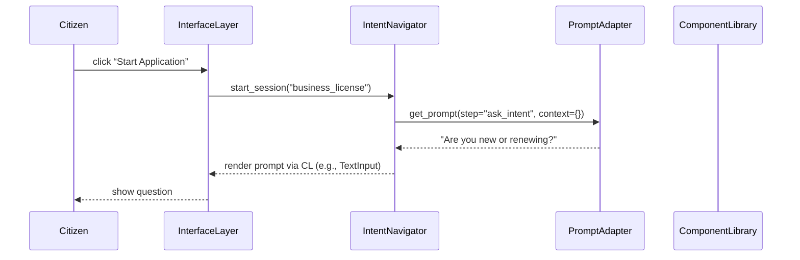

# Chapter 7: Intent-Driven Navigation

In [Chapter 6: Frontend Component Library](06_frontend_component_library_.md) we built reusable UI widgets for both citizen and admin portals. Now we’re going to add a digital concierge that guides each user step-by-step, adapting forms and screens based on their goals and past answers. This is **Intent-Driven Navigation**.

---

## 1. Why Intent-Driven Navigation?

Use Case  
Imagine the Census Bureau offers an online “business license” application. Some users:

- Just need a quick renewal.  
- Others are brand-new applicants with questions about fees.  

Rather than dumping everyone on one long form, our system acts like a clerk in a government office:

1. Greets visitors with “What brings you here today?”  
2. Adapts questions: skips renewal fields if you already have a license.  
3. Remembers past answers—so you never repeat yourself.  

This makes the process smoother for citizens and reduces help-desk calls for officials.

---

## 2. Key Concepts

1. Intent Recognizer  
   Detects the user’s goal (e.g., “new application” vs. “renewal”).  

2. Flow Definition  
   A sequence of “steps” (questions or pages) tailored to each intent.  

3. Prompt Adapter  
   Chooses the right text or form fields based on context.  

4. Session Tracker  
   Remembers answers and past behavior to skip or revisit steps.

---

## 3. How to Use Intent-Driven Navigation

Below is a minimal example of defining an intent and walking through its steps.

```python
from hms_etl.navigation import IntentNavigator

# 1. Create the navigator
nav = IntentNavigator()

# 2. Define a "business_license" intent with three steps
nav.register_intent(
    "business_license",
    steps=["ask_intent", "ask_business_name", "review_and_submit"]
)

# 3. Start a new session when a citizen begins
session = nav.start_session("business_license")

# 4. Get the first prompt
prompt = session.next_step(user_input=None)
print(prompt)
# -> "Welcome! Are you applying for a new license or renewing?"

# 5. Citizen answers
prompt = session.next_step(user_input="renewal")
print(prompt)
# -> "Great, what's your existing license number?"
```

Explanation  
1. `IntentNavigator` holds all flows.  
2. `register_intent()` names the flow and lists its steps.  
3. `start_session()` begins tracking for one user.  
4. `next_step()` returns the right prompt, feeding in any `user_input`.

---

## 4. Under the Hood: Step-by-Step Flow



1. **Citizen** clicks “Start.”  
2. **Interface Layer** ([Chapter 5](05_interface_layer_.md)) calls `IntentNavigator`.  
3. **PromptAdapter** returns the right text for the current step.  
4. **ComponentLibrary** ([Chapter 6](06_frontend_component_library_.md)) renders it as a form field.

---

## 5. Inside the Code

Let’s peek at a simplified version of `hms_etl/navigation.py`.

### 5.1 IntentNavigator and Session

```python
# File: hms_etl/navigation.py

class IntentNavigator:
    def __init__(self):
        self.intents = {}       # name -> list of step keys

    def register_intent(self, name, steps):
        self.intents[name] = steps

    def start_session(self, name):
        steps = self.intents.get(name, [])
        return NavigationSession(steps)
```

Explanation  
- `intents` stores each flow’s step list.  
- `start_session` begins a fresh `NavigationSession`.

### 5.2 NavigationSession and Prompts

```python
class NavigationSession:
    def __init__(self, steps):
        self.steps = steps      # ["ask_intent", ...]
        self.index = 0
        self.context = {}

    def next_step(self, user_input):
        # Save answer to previous step
        if user_input is not None:
            prev = self.steps[self.index-1]
            self.context[prev] = user_input
        # Get current step key
        key = self.steps[self.index]
        self.index += 1
        return prompt_for(key, self.context)

def prompt_for(step_key, ctx):
    questions = {
      "ask_intent": "Are you applying for a new license or renewing?",
      "ask_business_name": "What's your business name?",
      "review_and_submit": f"Review details {ctx}. Ready to submit?"
    }
    return questions.get(step_key, "Done!")
```

Explanation  
- `NavigationSession` tracks which step we’re on and stores answers in `context`.  
- `prompt_for()` picks the right question and can adapt based on previous inputs.

---

## 6. Conclusion

In this chapter, you learned how **Intent-Driven Navigation**:

- Acts like a digital concierge to adapt flows based on user goals.  
- Defines intents as sequences of steps.  
- Uses a session tracker and prompt adapter to guide each user.  

Next, we’ll see how to measure success and monitor flows in [Chapter 8: Metrics & Outcome Monitoring](08_metrics___outcome_monitoring_.md).  

Happy navigating!

---

Generated by [AI Codebase Knowledge Builder](https://github.com/The-Pocket/Tutorial-Codebase-Knowledge)