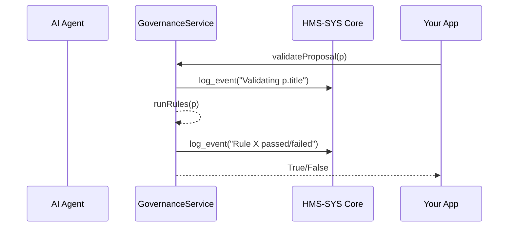

# Chapter 8: AI Governance & Compliance

In [Chapter 7: HMS-A2A AI Agent Framework](07_hms_a2a_ai_agent_framework_.md) we saw how AI agents propose policy or process changes automatically. In this chapter we’ll add the “ombudsmen and inspectors” layer—**AI Governance & Compliance**—to ensure every proposal is transparent, ethical, and legally sound before it’s enacted.

---

## 1. Motivation: Why Governance & Compliance?

Imagine the Department of Labor uses an AI agent to suggest updates to unemployment-benefit rules. Without oversight, the agent might:
- Introduce hidden bias against certain age groups  
- Leak sensitive personal data in its proposals  
- Violate federal or state regulations  

**AI Governance & Compliance** puts guardrails in place:
- Enforce transparency (audit logs of every decision)  
- Check ethics (no unfair bias)  
- Protect privacy (no unauthorized data sharing)  
- Verify adherence to laws and regulations  

Just like a legislative committee reviews and approves new laws before they take effect, our governance layer reviews AI recommendations.

---

## 2. Key Concepts

1. **Transparency**  
   Every decision is logged with who, what, and when—so auditors can trace it.

2. **Ethics**  
   Rules to detect and prevent unfair bias (e.g., against age, race, disability).

3. **Privacy**  
   Ensure sensitive fields (SSNs, health data) aren’t exposed in proposals.

4. **Compliance Rules**  
   Encoded checks against laws, regulations, or internal policies.

5. **Auditability**  
   Full history of checks and outcomes for inspectors and ombudsmen.

Analogy: An AI proposal passes through a chain of committees, each checking one aspect—legal, ethical, privacy—before final approval.

---

## 3. Using Governance in HMS-ETL

We’ll build a minimal `GovernanceClient` to register rules and validate AI proposals.

### 3.1 Initialize the Governance Client

File: `governance_setup.py`
```python
from hms_etl.governance import GovernanceClient

# Point at Core Infra for logging
gov = GovernanceClient(core_url="https://core.gov.example",
                       api_key="GOV_COMPLIANCE_KEY")
```
This logs into [HMS-SYS Core Infrastructure](01_hms_sys_core_infrastructure_.md) so every compliance check is recorded.

### 3.2 Register Compliance Rules

```python
# A simple rule: no personal SSNs in proposal text
def no_ssn_leak(proposal):
    return "ssn" not in proposal.detail.lower()

gov.add_rule(no_ssn_leak, name="no_ssn_leak")
```
Each rule is a Python function that returns `True` if the proposal is compliant.

### 3.3 Validate an AI Proposal

```python
from hms_a2a.agents import Proposal

p = Proposal(
  title="Expand Job Search Radius",
  detail="Allow 50→100 miles. No personal SSN or private data shared."
)

if gov.validate(p):
    print("✅ Proposal approved")
else:
    print("❌ Proposal rejected")
```
- `gov.validate(p)` runs every rule, logs each step, and returns a boolean.

---

## 4. Under the Hood: Workflow



1. Your code calls `GovernanceService.validateProposal`.  
2. GovernanceService logs the start.  
3. It applies each rule in turn.  
4. After each rule it logs pass or fail.  
5. It returns approval status to your application.

---

## 5. Internal Implementation Details

### 5.1 Non-Code Walkthrough

1. **Authenticate** with HMS-SYS for secure audit logs.  
2. **Load rules** into memory.  
3. On `validate`, **log** the request.  
4. **Loop** through rules, executing each.  
5. **Log** each rule’s outcome.  
6. Return overall **approval** or **rejection**.

### 5.2 Core Code: `hms_etl/governance.py`

```python
# hms_etl/governance.py
from hms_sys import CoreClient

class GovernanceClient:
    def __init__(self, core_url, api_key):
        self.core = CoreClient(base_url=core_url)
        self.token = self.core.authenticate(api_key=api_key)
        self.rules = []

    def add_rule(self, fn, name):
        self.rules.append((name, fn))

    def validate(self, proposal):
        self.core.log_event("governance", "INFO",
            f"Start validating '{proposal.title}'")
        for name, rule in self.rules:
            if not rule(proposal):
                self.core.log_event("governance", "WARN",
                    f"Rule '{name}' failed on '{proposal.title}'")
                return False
        self.core.log_event("governance", "INFO",
            f"All rules passed for '{proposal.title}'")
        return True
```

- We reuse **HMS-SYS Core** for all logging, ensuring an immutable audit trail.  
- `add_rule` registers a `(name, fn)` pair.  
- `validate` applies each function, logging passes and failures.

---

## 6. Conclusion

You’ve learned how **AI Governance & Compliance** in HMS-ETL:
- Registers and applies compliance rules  
- Logs every check via [HMS-SYS Core Infrastructure](01_hms_sys_core_infrastructure_.md)  
- Ensures AI proposals are transparent, ethical, and legal  

Next up, we’ll let humans jump in when needed—combining AI with manual review in:

[Chapter 9: Human-in-the-Loop (HITL) Workflow](09_human_in_the_loop__hitl__workflow_.md)

---

Generated by [AI Codebase Knowledge Builder](https://github.com/The-Pocket/Tutorial-Codebase-Knowledge)