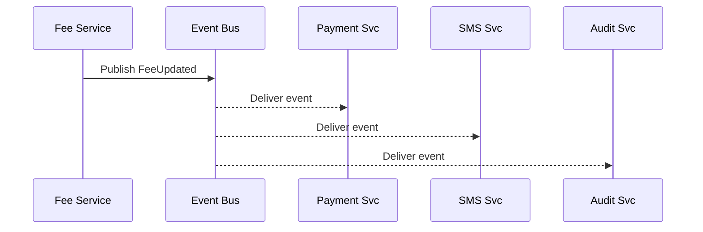

# Chapter 8: Event Bus & Streaming Layer  
*[Link back to Chapter 7: Backend Service Mesh (HMS-API)](07_backend_service_mesh__hms_api__.md)*  

---

## 1. Why Do We Need a “Pneumatic-Tube” for Software?

Central use-case  
• The **Federal Motor Carrier Safety Administration (FMCSA)** raises the annual *truck-permit* fee from **\$120 → \$135** at 2 p.m.  
• Within **seconds**:  
  1. The **payment** service charges the new amount.  
  2. The **SMS** service texts carriers: “Your permit fee changed.”  
  3. The **audit** service records the rule change for Inspectors General.  

If any module had to *poll* a database every 5 minutes, drivers might pay the wrong fee before the system notices.  
The **Event Bus & Streaming Layer** is our **Capitol Hill pneumatic tube**—messages (“events”) zip instantly between services, keeping everyone in sync and eliminating duplicate work.

---

## 2. Key Concepts (Plain-English Cheat-Sheet)

| Pneumatic-Tube Analogy | Bus / Stream Term | One-Sentence Beginner Take |
|------------------------|-------------------|----------------------------|
| Capsule | Event | A tiny JSON document that says “FeeUpdated to \$135.” |
| Tube Label | Topic | A named channel like `FeeUpdated`. |
| Mail Clerk | Producer | The service that *publishes* an event. |
| Clerk’s Inbox | Consumer | Service that *receives* events. |
| Continuous Tube | Stream | An ordered, append-only log of events. |
| Bookmark | Offset | “Give me events starting at #42.” |

Put this table next to your keyboard—the rest of the chapter is just these six ideas in action!

---

## 3. A 3-Minute Walk-Through

### 3.1 Publish the Event (Producer)

```python
# fee_service/update_fee.py  (≤ 15 lines)
from hms_bus import publish
import datetime as dt

def update_fee(new_amount: int):
    # 1. Store the new amount in DB (skipped)
    # 2. Publish event
    publish(
        topic="FeeUpdated",
        payload={
            "amount": new_amount,
            "effective": dt.datetime.utcnow().isoformat()
        },
    )
```

What happens?  
• `publish` hands the JSON to the Event Bus.  
• The call returns instantly (fire-and-forget) so the web API stays snappy.

---

### 3.2 React to the Event (Consumers)

```python
# sms_service/worker.py  (≤ 15 lines)
from hms_bus import subscribe, ack
from gov_sms import send_text   # fictional helper

@subscribe("FeeUpdated")
def on_fee_updated(event):
    amt = event.payload["amount"]
    send_text(f"Permit fee is now ${amt}.")
    ack(event)   # tell the bus we are done
```

Explanation  
1. `subscribe` registers a callback for the `FeeUpdated` topic.  
2. `ack()` marks the event as processed so it won’t be redelivered.

---

### 3.3 Stream Processing (Bonus)

Need to *compute* something from a flow of events? Use the streaming API:

```python
# audit_service/stream.py  (≤ 12 lines)
from hms_bus import stream

for evt in stream("FeeUpdated", offset="earliest"):
    log(evt)   # store in immutable audit table
```

The loop continuously reads the **stream** from the beginning—perfect for audits or analytics.

---

## 4. Under the Hood—Step-By-Step



Only **5 participants**—easy to reason about!

---

## 5. Peek Behind the Curtain (≤ 20 Lines Each)

### 5.1 The Tiny Broker (Very Simplified)

```python
# hms_bus/broker.py
from collections import defaultdict, deque

TOPICS = defaultdict(deque)     # topic → queue of events
SUBS   = defaultdict(list)      # topic → list of callbacks

def publish(topic, payload):
    evt = {"payload": payload, "offset": len(TOPICS[topic])}
    TOPICS[topic].append(evt)
    for cb in SUBS[topic]:
        cb(evt)

def subscribe(topic):
    def decorator(cb):
        SUBS[topic].append(cb)
        return cb
    return decorator

def stream(topic, offset=0):
    q = TOPICS[topic]
    while True:
        if offset < len(q):
            yield q[offset]
            offset += 1
```

Beginner take-aways  
• **No magic**: events are just appended to a Python `deque`.  
• Real HMS uses Kafka/NATS, but the logic is the same.

---

### 5.2 Safety Rails from Previous Chapters

| Concern | How It’s Applied to the Bus |
|---------|-----------------------------|
| Governance (Ch 1) | Topics must be approved via Change Ticket. |
| Security Seals (Ch 4) | Broker image carries a Seal ID. |
| IAM (Ch 5) | Producers/Consumers need a JWT with `scope:publish:FeeUpdated` etc. |
| Service Mesh (Ch 7) | Sidecar establishes mTLS to the broker. |

You already know these tools—they carry over automatically!

---

## 6. Common Pitfalls & Quick Fixes

| “Oops!” | Root Cause | Quick Fix |
|---------|------------|-----------|
| Duplicate SMS texts | Consumer forgets to `ack` | Always call `ack(event)` *after* success. |
| Events processed out of order | Multiple partitions | Stick to *one partition* per topic until you need extreme scale. |
| Silent data loss | Broker disk full | Enable retention alerts in Observability (Ch 11). |

---

## 7. Mini-Lab: Replay History in 5 Steps

1. Start the demo broker: `python -m hms_bus.demo`.  
2. Publish three fees:  
   ```bash
   hms_bus pub FeeUpdated '{"amount":120}'
   hms_bus pub FeeUpdated '{"amount":125}'
   hms_bus pub FeeUpdated '{"amount":135}'
   ```  
3. Launch the audit stream script (Section 3.3).  
4. Watch it print **all three** events—history is never lost.  
5. Change `offset="latest"` and run again—you now only watch *new* events.  

You just mastered *time-travel* debugging!

---

## 8. What You Learned

✓ Events vs. streams, producers vs. consumers.  
✓ How to publish, subscribe, and replay with < 20 lines of code.  
✓ Step-by-step journey of an event across services.  
✓ How governance, security, and IAM automatically wrap the bus.  

Ready to see how these fast-moving events end up in structured, queryable **datasets**?  
Continue to [ETL & Data Pipeline (HMS-ETL)](09_etl___data_pipeline__hms_etl__.md).

---

Generated by [AI Codebase Knowledge Builder](https://github.com/The-Pocket/Tutorial-Codebase-Knowledge)