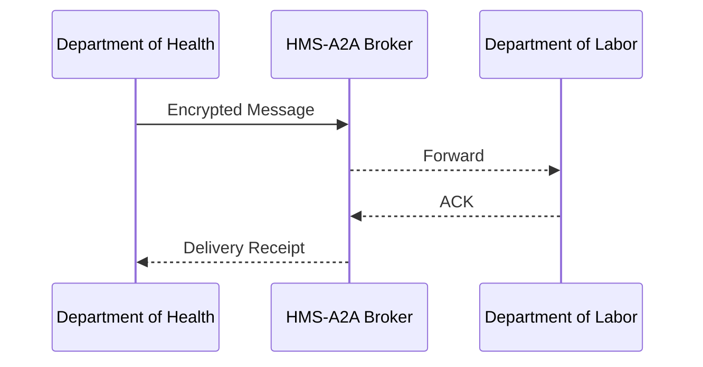

# Chapter 8: Inter-Agency Communication Bus (HMS-A2A)

*[Jump back to the previous chapter: Agent Orchestration & Workflow (HMS-ACT)](07_agent_orchestration___workflow__hms_act__.md)*  

---

## 1. Why Do We Need an “Inter-Agency Bus”?

Picture a **Department of Health (DoH)** inspector who revokes a restaurant license because of a rat infestation.  
Within minutes the **Department of Labor (DoL)** must:

1. Freeze the restaurant’s wage-subsidy account.  
2. Notify unemployed workers about benefits.  

If DoH emails a PDF and DoL re-types the data, the delay hurts both workers and auditors.  
**HMS-A2A** is the **secure postal service** that moves structured, tamper-proof messages between agencies in *real time*.

```
DoH Decision ──▶ HMS-A2A ──▶ DoL Payroll System
```

No one peeks, no one edits, everything is logged.

---

## 2. Key Concepts (bite-sized & friendly)

| Term        | Everyday Analogy            | Why It Matters                                       |
|-------------|-----------------------------|------------------------------------------------------|
| Bus         | City subway line            | Every agency can hop on/off; one shared track.       |
| Channel     | Train car                   | Groups related messages (e.g., **health.enforcement**)|
| Message     | Sealed envelope             | Holds a JSON payload + headers.                      |
| Publisher   | Person dropping a letter    | Sends a message to a channel.                        |
| Subscriber  | Mailbox                     | Receives only the channels it asked for.             |
| Signature   | Wax seal                    | Detects tampering end-to-end.                        |
| Encryption  | Opaque envelope             | Prevents eavesdropping in transit.                   |

---

## 3. 5-Minute Tour: Freezing the Wage-Subsidy Account

Goal: DoH tells DoL that “Taco Fiesta” lost its license.

```python
# File: doh_freeze.py    (17 lines)

from hms_a2a import Bus, Message

bus = Bus.connect("DoH")                 # 1️⃣ join the subway

payload = {
    "restaurant_id": "TX-445",
    "status":       "LICENSE_REVOKED",
    "reason":       "rodent infestation",
    "effective":    "2024-06-01"
}

msg = Message(
    channel="health.enforcement",
    payload=payload
)

bus.publish(msg)                         # 2️⃣ drop the letter
print("✅ Notice sent securely!")
```

What happened?

1. DoH opened a **Bus** connection with its agency badge.  
2. It created a **Message** for channel `health.enforcement`.  
3. `publish()` automatically encrypted & signed the envelope; DoL will receive it within seconds.

---

### DoL listens and reacts

```python
# File: dol_listener.py   (19 lines)

from hms_a2a import Bus

def on_message(msg):
    if msg.payload["status"] == "LICENSE_REVOKED":
        rid = msg.payload["restaurant_id"]
        print("⚠️  Freezing wage subsidies for", rid)
        # ...call Finance API...
        msg.ack()                       # confirm handled

bus = Bus.connect("DoL")
bus.subscribe(
    channel="health.enforcement",
    handler=on_message
)

bus.start()      # blocking loop
```

When DoL’s handler calls `ack()`, HMS-A2A records a proof-of-receipt for auditors.

---

## 4. Under the Hood (plain English)

1. `publish()` builds an **MCP envelope** (see [Model Context Protocol](05_model_context_protocol__hms_mcp__.md)).  
2. HMS-A2A encrypts the envelope with the receiver’s public key.  
3. The message hops through redundant broker nodes.  
4. A subscriber decrypts, verifies the signature, and calls the user’s handler.  
5. The subscriber sends an **ACK**; the broker updates the delivery log.

### Tiny Sequence Diagram



Only three hops—easy to reason about and debug.

---

## 5. Peeking Inside the Codebase

### 5.1 `publish()` helper  
*File: `hms_a2a/bus.py` (≤18 lines)*

```python
def publish(self, msg):
    # 1. Wrap in MCP envelope
    env = mcp._envelope(
        sender   = self.agency,
        receiver = "*",               # broadcast
        context  = {},
        payload  = msg.payload
    )

    # 2. Encrypt & sign
    sealed = crypto.seal(env, keyring.get_public("*"))
    signed = crypto.sign(sealed, keyring.get_private(self.agency))

    # 3. Send to broker
    broker.send(msg.channel, signed)
```

Explanation: three micro-steps—envelope, crypto, send. No rabbit holes for a beginner.

### 5.2 `subscribe()` skeleton  
*File: `hms_a2a/bus.py` (≤16 lines)*

```python
def subscribe(self, channel, handler):
    def _internal(raw):
        # Decrypt + verify
        sealed = crypto.verify(raw)
        env    = crypto.unseal(sealed)
        handler(Message(channel, env["payload"]))

    broker.register(channel, _internal, agency=self.agency)
```

Nothing fancy: unwrap, hand to your callback.

---

## 6. Security & Governance Highlights

1. **End-to-End Encryption** – Only intended agencies hold the keys.  
2. **Immutable Logs** – Every hop stores a hash in *Compliance Ledger*; auditors can replay the trail.  
3. **Role-Based Queues** – `health.enforcement` can be subscribed to only by whitelisted agencies set in [Governance Layer](01_governance_layer__hms_gov__.md).  
4. **Back-Pressure** – If DoL goes dark, messages stay in the broker until TTL expires; nothing is lost silently.  

---

## 7. Common Pitfalls & FAQs

• *“I published but nobody received!”*  
  → Check that the receiving agency called `subscribe()` **before** `start()`, and that the channel names match exactly.

• *“DoH sent sensitive PII—how do we redact?”*  
  → Use **channel filters**: Governance policy can auto-strip fields before delivery.

• *“Can a private contractor listen?”*  
  → Only if Governance grants a signed certificate. Otherwise, broker rejects the TLS handshake.

---

## 8. Hands-On Mini Exercise

1. Run `dol_listener.py` in one terminal.  
2. In another terminal, run `doh_freeze.py` **twice**.  
3. Observe that the second publish is *deduplicated* (same `restaurant_id`), thanks to HMS-A2A’s idempotency check.  
4. Inspect `logs/a2a_audit.json` to see the encrypted hashes and receipts.

---

## 9. What You Learned

* HMS-A2A is the **secure subway** for data traveling between agencies.  
* Publishers drop JSON envelopes; subscribers pick only the cars (channels) they care about.  
* Encryption, signatures, and audit trails are baked in—no extra code from you.  
* Other HMS layers (Agents, Workflows, HITL) simply treat A2A as their **default mailbox**.

Next, we’ll see how to bridge this internal bus with *outside* services like state databases and legacy mainframes in  
[External System Synchronization Layer](09_external_system_synchronization_layer_.md).

---

Generated by [AI Codebase Knowledge Builder](https://github.com/The-Pocket/Tutorial-Codebase-Knowledge)