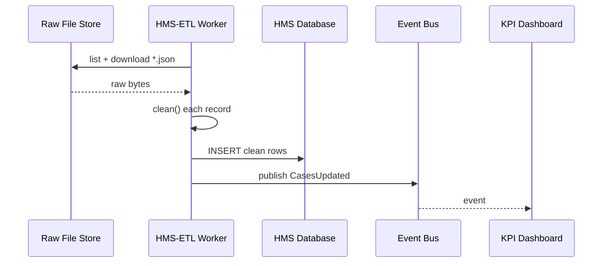

# Chapter 9: ETL & Data Pipeline (HMS-ETL)
*[Link back to Chapter 8: Event Bus & Streaming Layer](08_event_bus___streaming_layer_.md)*  

---

## 1. Why Do We Need an “ETL Census Bureau”?

Central use-case (3 sentences)  
• The **Office of Special Counsel (OSC)** receives raw whistle-blower forms, free-text emails, and event logs from 50 states.  
• Policy-makers want a tidy dashboard that shows “How many retaliation cases were filed this week?” while an AI model flags high-risk cases in real time.  
• HMS-ETL is the **Census Bureau**: it *collects* messy data, *cleans & classifies* it, then *publishes* one trusted, query-ready dataset for every dashboard, ML job, and auditor.

Without ETL you would have 30 versions of “State = MD, Md, Maryland, 24”—chaos!  

---

## 2. Key Concepts (Plain-English Cheat-Sheet)

| Everyday Analogy | ETL Term | TL;DR |
|------------------|----------|-------|
| Mail truck picking up envelopes | **Extract** | Pull raw data from sources (APIs, CSVs, events) |
| Sorting & correcting ZIP codes | **Transform** | Clean, enrich, and validate each record |
| Shelving files in the National Archives | **Load** | Write standardized data into the “truth” tables |
| Receiving dock | **Staging Area** | Temporary bucket for raw files |
| Dewey Decimal label | **Data Catalog** | Metadata so anyone can discover & trust a table |
| CCTV in the Archives | **Lineage** | Track “record 42 came from file X on 2024-06-01” |
| Clock on the wall | **Schedule / Trigger** | When does the pipeline run: hourly? on new event? |

Keep this table open—you’ll see these words 20 × in the next pages.

---

## 3. A 5-Minute Walk-Through

### Scenario: Clean Whistle-Blower Forms Every Hour

1. **Extract** raw JSON files dropped into an S3 bucket by state portals.  
2. **Transform**:  
   - Standardize state codes (`"Maryland" → "MD"`).  
   - Mask PII (`ssn → XXX-XX-1234`).  
   - Validate mandatory fields (`case_id`, `timestamp`).  
3. **Load** into a Postgres table `osc_cases_clean`.  
4. Publish a **“CasesUpdated”** event so dashboards & ML jobs refresh.

Let’s build it—under 20 lines per file!

---

### 3.1 Define the Pipeline in YAML (9 lines)

`pipelines/osc_cases.yaml`
```yaml
id: OSC_CASES_HOURLY
schedule: "0 * * * *"          # every hour
extract:
  from: "s3://state-uploads/osc/*.json"
transform: "transform.osc_cases.clean"
load:
  to: "postgres://hms-db/osc_cases_clean"
events:
  after_load: ["CasesUpdated"]
```

**Explanation**  
• The file is just a recipe—no code yet.  
• `schedule` uses cron syntax; `events.after_load` tells HMS-ETL to publish when done.

---

### 3.2 Write the Transform Function (15 lines)

`transform/osc_cases.py`
```python
import json, re

STATE_FIX = {"Maryland": "MD", "Md": "MD", "24": "MD"}

def clean(raw_bytes: bytes) -> dict:
    rec = json.loads(raw_bytes)

    # 1. Standardize state
    rec["state"] = STATE_FIX.get(rec["state"], rec["state"])

    # 2. Mask SSN
    if "ssn" in rec:
        rec["ssn"] = "XXX-XX-" + rec["ssn"][-4:]

    # 3. Basic validation
    need = ["case_id", "timestamp", "state"]
    assert all(k in rec for k in need), "Missing field!"

    return rec
```

**Beginner notes**  
• Function takes raw bytes → returns a clean Python dict.  
• Any `assert` that fails will stop the load and raise an alert.

---

### 3.3 Kick Off the Pipeline via CLI (single line)

```bash
hms-etl run OSC_CASES_HOURLY --once
```

Output (truncated):

```
✔ Extracted 112 files
✔ Transformed 112 records   (0 errors)
✔ Loaded 112 rows → osc_cases_clean
✔ Published event: CasesUpdated
```

Dashboard auto-refreshes, the AI model pulls new rows, auditors see lineage. Done!

---

## 4. What Happens Under the Hood?



Only five hops—easy to debug and monitor.

---

## 5. Peek at the Core Engine (≤ 20 Lines Each)

### 5.1 Scheduler & Runner — `hms_etl/runner.py`
```python
import yaml, importlib, glob, json, psycopg2, os

def run(pipeline_id):
    spec = yaml.safe_load(open(f"pipelines/{pipeline_id}.yaml"))
    files = glob.glob(spec["extract"]["from"].replace("s3://", "/tmp/"))
    mod, fn = spec["transform"].rsplit(".", 1)
    clean = getattr(importlib.import_module(mod), fn)
    rows = [clean(open(f, "rb").read()) for f in files]
    pg = psycopg2.connect("dbname=hms user=hms")
    cur = pg.cursor()
    for r in rows:
        cur.execute("INSERT INTO osc_cases_clean (data) VALUES (%s)", [json.dumps(r)])
    pg.commit()
    publish_event(spec["events"]["after_load"][0])
```

*Super-condensed* but you can see: **read → clean → insert → publish**.

### 5.2 Event Helper — `hms_etl/events.py`
```python
import requests, os, json
def publish_event(topic):
    broker = os.getenv("EVENT_BUS", "http://bus:8080")
    requests.post(f"{broker}/pub/{topic}", json={"ts": time.time()})
```

Works exactly like `publish()` from [Event Bus & Streaming Layer](08_event_bus___streaming_layer_.md).

---

## 6. Safety Rails You Already Know

| Concern | How HMS-ETL Handles It |
|---------|------------------------|
| Governance (Ch 1) | Pipeline YAML must be approved via Change Ticket before deploy. |
| Policies (Ch 2) | PPE rules validate that PII fields are masked in `transform/`. |
| Versioning (Ch 3) | Each run records the code & YAML hash; rollback re-points to prior version. |
| Security (Ch 4) | Runner container image carries a Seal ID; S3 & DB creds are injected via vault. |
| IAM (Ch 5) | Worker JWT must include `scope:s3.read` and `scope:db.write`. |
| Observability (Ch 11) | Each step logs duration & row counts for auditors. |

You get all these for free—HMS magic!

---

## 7. Common Pitfalls & Quick Fixes

| Oops! | Root Cause | Fast Fix |
|-------|------------|----------|
| “Row with blank `case_id` broke the run.” | `assert` triggered | Add `try/except` around clean() to *quarantine* bad rows. |
| “Pipeline ran twice.” | Overlapping schedule | Enable `lock: true` in YAML so only one worker holds the slot. |
| “AI model saw old data.” | Forgot `after_load` event | Always declare `events.after_load`; downstream services listen to it. |

---

## 8. Mini-Lab: Build & Inspect Lineage

1. Add to YAML:  
   ```yaml
   lineage: true
   ```  
2. Re-run the pipeline.  
3. Query lineage table:  
   ```sql
   SELECT file, row_hash, loaded_at
   FROM hms_lineage
   WHERE file LIKE '%osc/2024-06-01%';
   ```  
   Output shows exactly which file and record the dashboard is displaying—auditors love this!

---

## 9. What You Learned

✓ ETL ≈ Census Bureau: Extract → Transform → Load.  
✓ How to declare a pipeline in 9 lines, write a 15-line clean function, and run it.  
✓ Internal flow & tiny source code of the runner and event publisher.  
✓ Safety nets: governance, policy checks, security seals, IAM, lineage.  
✓ Hands-on lab to trace data lineage.

Ready to see how HMS keeps external vendor systems (e.g., state portals, federal data.gov) **in sync** with this clean dataset?  
Jump to [External System Synchronization Adapter](10_external_system_synchronization_adapter_.md).

---

Generated by [AI Codebase Knowledge Builder](https://github.com/The-Pocket/Tutorial-Codebase-Knowledge)