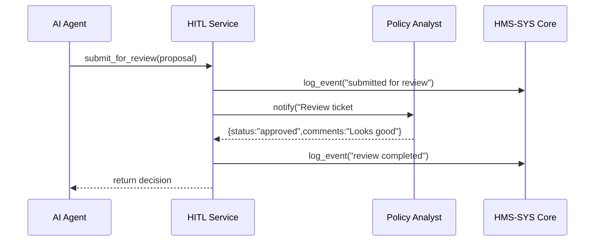

# Chapter 9: Human-in-the-Loop (HITL) Workflow

In [Chapter 8: AI Governance & Compliance](08_ai_governance___compliance_.md) we added guardrails to filter AI proposals. Now it’s time to let real people step in—**Human-in-the-Loop (HITL)**—so critical decisions get a trusted human review, like a safety brake on an automated assembly line.

---

## 1. Motivation: Why Human-in-the-Loop?

Imagine the Consumer Financial Protection Bureau (CFPB) uses an AI agent to draft updates to small-business loan rules. An AI might:
- Miss a nuance in federal statute  
- Propose unfair terms  
- Omit a required disclosure  

Before any change goes live, a credit-policy analyst must review and refine the AI’s draft. **HITL** ensures:
- A human can override or tweak AI suggestions  
- No proposal slips through without explicit sign-off  
- Every decision is logged for audits  

This checkpoint balances automation speed with human judgment in sensitive federal processes.

---

## 2. Key Concepts

1. **Review Ticket**  
   A record you submit for human evaluation (like a help-desk ticket).  

2. **Decision Status**  
   The outcome: `approved`, `rejected`, or `needs_changes`.  

3. **Refinement Feedback**  
   Comments from the reviewer instructing the AI how to improve.  

4. **Audit Trail**  
   A full log of who reviewed what, when, and how they decided.  

5. **Integration Endpoint**  
   The simple API your code uses to send proposals and fetch decisions.

---

## 3. Using the HITL Workflow

Below is a minimal example showing how to submit an AI proposal for human review, then retrieve the decision.

### 3.1 Initialize the HITL Client

File: `submit_review.py`
```python
from hms_etl.hitl import HitlClient

# Connect to the HITL service via our Core Infrastructure
client = HitlClient(core_url="https://core.gov.example",
                    api_key="CFPB_HITL_KEY")
```
*We authenticate through [HMS-SYS Core](01_hms_sys_core_infrastructure_.md) so all actions are logged.*

### 3.2 Submit a Proposal for Review

```python
proposal = {
  "title": "Expand loan term to 7 years",
  "detail": "Increase maximum term from 5→7 years for small-business loans."
}
ticket = client.submit_for_review(proposal)
print("Review ticket ID:", ticket["id"])
```
*This creates a review ticket and notifies the policy analyst.*

### 3.3 Poll for the Review Decision

File: `check_decision.py`
```python
result = client.get_decision(ticket_id=ticket["id"])
if result["status"] == "approved":
    print("✅ Approved:", result["comments"])
elif result["status"] == "needs_changes":
    print("✏️ Feedback:", result["comments"])
else:
    print("❌ Rejected")
```
*Your application can pause, poll periodically, or subscribe to a webhook for updates.*

---

## 4. Under the Hood: Step-by-Step Flow



1. **AI Agent** calls `submit_for_review`.  
2. **HITL Service** logs the submission via [HMS-SYS Core](01_hms_sys_core_infrastructure_.md).  
3. It notifies a **Policy Analyst** (email, dashboard, etc.).  
4. Analyst makes a decision and adds comments.  
5. HITL logs the outcome and returns it to the caller.

---

## 5. Internal Implementation Details

### 5.1 The HITL Client (`hms_etl/hitl.py`)
```python
# hms_etl/hitl.py
import time, requests
from hms_sys import CoreClient

class HitlClient:
    def __init__(self, core_url, api_key):
        core = CoreClient(base_url=core_url)
        self.token = core.authenticate(api_key=api_key)
        self.core = core
        self.base = core_url + "/hitl"

    def submit_for_review(self, proposal):
        self.core.log_event("hitl-service","INFO","Submitting for review")
        resp = requests.post(
          f"{self.base}/tickets",
          json=proposal,
          headers={"Authorization":f"Bearer {self.token}"}
        )
        return resp.json()

    def get_decision(self, ticket_id):
        self.core.log_event("hitl-service","INFO",f"Checking ticket {ticket_id}")
        resp = requests.get(
          f"{self.base}/tickets/{ticket_id}",
          headers={"Authorization":f"Bearer {self.token}"}
        )
        return resp.json()
```
- **`submit_for_review`** creates a ticket and logs the event.  
- **`get_decision`** fetches the reviewer’s outcome, also logged.

### 5.2 Simple In-Memory Service (for Local Testing)
```python
# pseudo-code: only for demo, not production!
TICKETS = {}

def create_ticket(data):
    id = str(int(time.time()))
    TICKETS[id] = {"status":"pending","comments":None,"data":data}
    return {"id":id}

def review_ticket(id, status, comments):
    TICKETS[id].update({"status":status,"comments":comments})
```
*In a real setup you’d back this with a database and real notification channels.*

---

## 6. Conclusion

You’ve learned how to add a **Human-in-the-Loop** checkpoint to your AI workflows:

- Submit AI proposals for human review  
- Retrieve decisions and comments  
- Log every step in [HMS-SYS Core Infrastructure](01_hms_sys_core_infrastructure_.md)  

This ensures critical policy changes get the trusted human judgment they require.  

Next up, we’ll build a shared UI component library so your analysts have a slick, consistent interface for reviewing tickets:

[Chapter 10: HMS-MFE Frontend Interface Library](10_hms_mfe_frontend_interface_library_.md)

---

Generated by [AI Codebase Knowledge Builder](https://github.com/The-Pocket/Tutorial-Codebase-Knowledge)