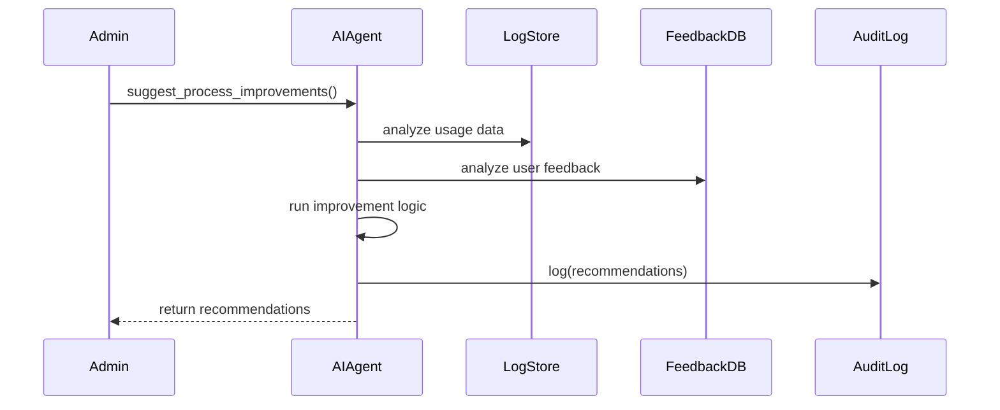

# Chapter 10: AI Representative Agent

In [Chapter 9: Process Optimization Engine](09_process_optimization_engine_.md) we learned how to model workflows and run “what-if” simulations. Now we’ll add an autonomous **AI Representative Agent**—a digital consultant that studies real usage data, user feedback, and system metrics to propose concrete process improvements.

---

## 1. Why an AI Representative Agent?

Imagine the U.S. Patent Office is drowning in a growing backlog. Clerks struggle to keep up, inventors complain about delays, and average review times spike. What if you had a software advisor that:

1. Analyzes historical application data (e.g., time in each review step)  
2. Reads citizen feedback (e.g., “status updates are too slow”)  
3. Examines system metrics (e.g., server wait times, queue lengths)  
4. Then recommends new workflows or policies (e.g., “batch similar cases,” “add a fast-track lane”)

That’s the **AI Representative Agent**—it acts like a senior consultant in your ETL platform, continuously scanning for bottlenecks and suggesting improvements.

---

## 2. Key Concepts

1. **Data Analyzer**  
   Ingests and summarizes usage logs, system metrics, and user feedback.

2. **Improvement Engine**  
   Runs simple analyses or machine-learning models to spot patterns (e.g., long waits in step 3).

3. **Policy Recommender**  
   Outputs human-readable suggestions, like new handoffs or staffing changes.

4. **Suggestion API**  
   A clean interface (`suggest_process_improvements()`) that returns a list of recommendations.

---

## 3. How to Use the Agent

Below is a minimal example for a patent-office scenario:

```python
from hms_etl.agent import AIRepresentativeAgent

# 1. Create the digital consultant
agent = AIRepresentativeAgent()

# 2. Feed it real data
agent.ingest_usage_logs("data/patent_logs.csv")
agent.ingest_user_feedback("data/feedback.csv")
agent.ingest_system_metrics({"avg_wait": 3.4, "queue_size": 120})

# 3. Ask for suggestions
recommendations = agent.suggest_process_improvements()

print(recommendations)
# -> [{"recommendation": "Open a fast-track review lane for low-complexity claims"}]
```
Explanation:  
- We load usage logs, user complaints, and key metrics.  
- We call `suggest_process_improvements()`, which returns a list of recommendation dictionaries.

---

## 4. Under the Hood: Sequence Diagram

Here’s what happens when you ask the agent for advice:



1. The admin calls `suggest_process_improvements()`.  
2. The agent pulls data from logs and feedback stores.  
3. It runs its internal “advisor” logic.  
4. Recommendations are logged for transparency and sent back.

---

## 5. Inside the Code

Below is a simplified look at how `AIRepresentativeAgent` works.

### 5.1 Class Definition and Data Ingestion

File: `hms_etl/agent.py`
```python
class AIRepresentativeAgent:
    def __init__(self):
        self.usage = []        # raw log lines
        self.feedback = []     # user comments
        self.metrics = {}      # key system stats

    def ingest_usage_logs(self, path):
        with open(path) as f:
            self.usage = f.readlines()

    def ingest_user_feedback(self, path):
        with open(path) as f:
            self.feedback = f.readlines()

    def ingest_system_metrics(self, metrics):
        self.metrics = metrics
```
Explanation:  
- The agent stores three data sources in memory.  
- In real life, you’d parse CSVs or call APIs—here it’s boiled down to simple file reads.

### 5.2 Generating Recommendations

```python
    def suggest_process_improvements(self):
        # Simple counts for demo purposes
        backlog = len([l for l in self.usage if "pending" in l])
        complaints = len(self.feedback)
        queue = self.metrics.get("queue_size", 0)

        recs = []
        if backlog > 100:
            recs.append({"recommendation":
                "Add a fast-track lane for low-complexity applications"})
        if complaints > 10:
            recs.append({"recommendation":
                "Send weekly status updates to applicants"})
        if queue > 200:
            recs.append({"recommendation":
                "Scale up review capacity by 15%"})

        return recs or [{"recommendation": "Current process is optimal"}]
```
Explanation:  
- We count pending cases, complaints, and queue size.  
- If thresholds are exceeded, we append human-readable suggestions.  
- In a full system, replace this with statistical models or AI libraries.

---

## 6. Conclusion

You’ve seen how the **AI Representative Agent** provides an automated, data-driven “consultant” that:

- Ingests usage logs, user feedback, and system metrics  
- Runs simple improvement logic to detect bottlenecks  
- Recommends actionable policy or workflow changes  

Next up, we’ll add a human review step in [Chapter 11: Human-in-the-Loop (HITL) Override](11_human_in_the_loop__hitl__override_.md), so your team can vet AI suggestions before they go live.  

Happy advising!

---

Generated by [AI Codebase Knowledge Builder](https://github.com/The-Pocket/Tutorial-Codebase-Knowledge)