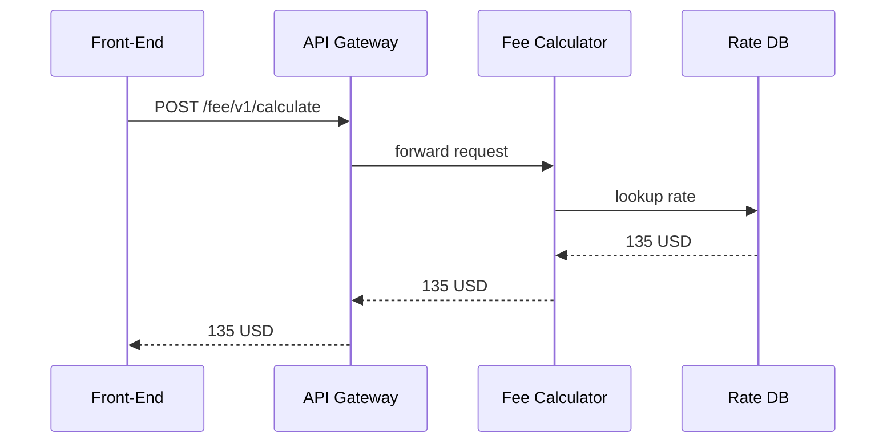

# Chapter 10: Core Backend Services (HMS-SVC)

*Previously: we learned how legacy data is kept in sync through the  
[External System Synchronization Layer](09_external_system_synchronization_layer_.md).*  

---

## 1. Why Does HMS-SVC Exist?

Picture the **Small Business Administration (SBA)** launch of a new online permit:

1. A café owner opens a web form and enters her zip code.  
2. The UI must show the *exact* filing fee, late-penalty rules, and eligibility checklist.  
3. When she clicks **Submit**, the application should be validated, scored, and stored—**instantly**.

Every flashy screen, AI agent, or external partner will *eventually* need an authoritative place to **run business logic**.  
That place is **HMS-SVC**—a civil-service–sized pool of tiny, task-focused micro-services.

```
UI / Bots / Partners  ──▶  HMS-SVC  ──▶  Database, Payments, Logs
```

No matter how many optimizations, sync jobs, or agent workflows you add, progress is real only after an HMS-SVC endpoint says “✅ Done.”

---

## 2. Core Ideas in Plain English

| Concept           | Everyday Analogy                | Why It Matters                       |
|-------------------|---------------------------------|--------------------------------------|
| Service Catalog   | Phone directory                 | Find which endpoint calculates fees. |
| Stateless Worker  | Fast-food cashier               | Handles one order, forgets it, moves on. |
| Validation Layer  | DMV clerk checking forms        | Blocks bad data early.               |
| Business Module   | Specialized counter window      | “Fee Calculator”, “Eligibility Checker”, etc. |
| API Gateway       | Reception desk                  | Single URL that routes to the right clerk. |

Keep these five ideas in mind; they cover 90 % of daily HMS-SVC usage.

---

## 3. 5-Minute Tour: Submit a Café Permit

Goal: the front-end calls HMS-SVC to (a) calculate the filing fee and (b) file the permit.

### 3.1 Request the Fee

```python
import requests, json

payload = {"permitType": "Cafe", "zip": "97201"}

r = requests.post(
    "https://svc.api.gov/fee/v1/calculate",
    json=payload,
    headers={"Authorization": "Bearer •••"}
)
print(r.json())     # ➜ {'feeUSD': 135.00, 'latePenaltyUSD': 0.0}
```

Explanation (≤15 lines):

1. POST to `/fee/v1/calculate`.  
2. HMS-SVC returns a JSON object with costs.  
3. No UI math, no guessing—official numbers only.

### 3.2 File the Application

```python
app = {
    "businessName": "Morning Brew",
    "owner":        "Alice Garcia",
    "zip":          "97201",
    "paidUSD":      135.00
}

resp = requests.post(
    "https://svc.api.gov/permits/v1/applications",
    json=app,
    headers={"Authorization": "Bearer •••"}
)
print(resp.status_code)   # 201 CREATED
```

Behind the scenes HMS-SVC:

* **Validates** each field (zip, payment).  
* **Stores** the record.  
* Emits `permit.submitted` on the [Inter-Agency Bus](08_inter_agency_communication_bus__hms_a2a__.md) so downstream services (e.g., [Human-in-the-Loop Oversight](06_human_in_the_loop__hitl__oversight_.md)) know a review is pending.

---

## 4. What Happens Under the Hood?

1. **API Gateway** receives the HTTPS call.  
2. It checks the OAuth token with **Guardrails** (see [Security & Privacy Guardrails](15_security___privacy_guardrails__cross_cutting__.md)).  
3. Request is routed to the **Fee Calculator** micro-service.  
4. Service queries its **Rate Table** in the database.  
5. Response travels back to the caller and is **logged** in the Audit Ledger.

### Minimal Sequence Diagram



Five hops—easy to reason about and debug.

---

## 5. Peek at the Code (Super Small)

### 5.1 Fee Calculator Endpoint  
*File: `fee_service.py` (18 lines)*

```python
from flask import Flask, request, jsonify
app = Flask(__name__)

RATE_TABLE = {("Cafe", "97201"): 135.00}

@app.post("/fee/v1/calculate")
def calc():
    data = request.get_json()
    key  = (data["permitType"], data["zip"])
    fee  = RATE_TABLE.get(key, 0.0)
    return jsonify({"feeUSD": fee, "latePenaltyUSD": 0.0}), 200
```

What to notice:

* Stateless: no global session.  
* Looks up a dictionary; a real build would hit Postgres or Redis.  
* Returns simple JSON—no mystery.

### 5.2 Validation Middleware  
*File: `middleware.py` (≤15 lines)*

```python
def validate_json(keys):
    def _inner(fn):
        def wrapper():
            incoming = request.get_json()
            for k in keys:
                if k not in incoming:
                    return {"error": f"Missing {k}"}, 422
            return fn()
        return wrapper
    return _inner
```

Attach it with `@validate_json(["permitType","zip"])`.  
Blocks bad data before business logic runs.

---

## 6. Discovering Services

HMS-SVC publishes an **OpenAPI Catalog** at:

```
GET https://svc.api.gov/discovery
```

Sample snippet:

```json
{
  "/fee/v1/calculate"  : "POST",
  "/permits/v1/applications" : "POST",
  "/forms/v1/validate" : "POST"
}
```

Agents from [AI Agent Framework](04_ai_agent_framework__hms_agt___hms_agx__.md) parse this list to self-configure—no hard-coding URLs all over your code.

---

## 7. How HMS-SVC Plays with Other Layers

* Receives **events** from [External System Sync](09_external_system_synchronization_layer_.md) to update reference tables.  
* Triggers **payments** in the upcoming [Finance & Clearinghouse Services](11_finance___clearinghouse_services__hms_ach__.md).  
* Pauses for **human approval** if policy requires a checkpoint (HITL).  
* Surfaces metrics to [Operations & DevOps](14_operations__monitoring___devops__hms_ops__.md).

---

## 8. Common Pitfalls & FAQs

| Question | Quick Answer |
|----------|--------------|
| “Can I call HMS-SVC directly from a citizen’s browser?” | Usually **no**. Route through your back-end or a secure proxy to avoid exposing tokens. |
| “How do I version an endpoint?” | Add URI version (`/v2/…`) and list both in the discovery doc. |
| “What if two services need the same table?” | Make it **another service** or use a shared library—keep workers single-purpose. |

---

## 9. Mini Exercise

1. Clone `examples/svc_quickstart.py`.  
2. Add a new endpoint `/fee/v1/calculateLate` that adds a 10 % penalty.  
3. Update the **OpenAPI Catalog**.  
4. Call it from a simple `curl` and confirm the JSON result.

---

## 10. What You Learned

* HMS-SVC is the **official clerk counter**—all real business logic lives here.  
* It exposes clean REST/GraphQL endpoints, validated and logged.  
* Front-ends, AI agents, and even other HMS layers rely on these services to turn *intent* into *state*.  

Next, let’s follow the money once a permit is accepted in  
[Finance & Clearinghouse Services (HMS-ACH)](11_finance___clearinghouse_services__hms_ach__.md).

---

Generated by [AI Codebase Knowledge Builder](https://github.com/The-Pocket/Tutorial-Codebase-Knowledge)