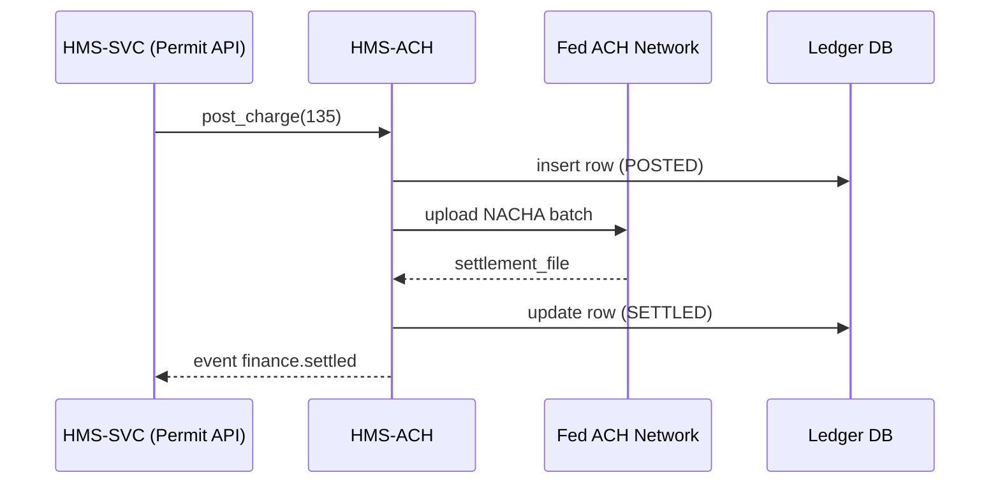

# Chapter 11: Finance & Clearinghouse Services (HMS-ACH)

*Coming from [Core Backend Services (HMS-SVC)](10_core_backend_services__hms_svc__.md)*  

---

## 1. Why Does HMS-ACH Exist?

Imagine the **Small Business Administration (SBA)** just *approved* our Café permit from Chapter 10.  
Great—but two money matters still linger:

1. **Collect** the \$135 filing fee from the owner’s bank.  
2. **Credit** that money to the federal *“Small-Biz Revenue”* ledger.  

If an intern had to download spreadsheets, write a bank file, and match deposits by hand, errors and late nights would explode.

**HMS-ACH** is the government’s **digital treasury clerk**.  
It automatically:

* Posts charges,
* Executes ACH (Automated Clearing House) transfers,
* Reconciles ledgers,
* Enforces banking rules like **NACHA**,
* Emits events so the rest of HMS knows “💰 money arrived!”

---

## 2. Key Concepts (Snack-Sized)

| Concept | Friendly Analogy | Why It Matters |
|---------|------------------|----------------|
| Charge Post | Writing an IOU on the corkboard | Reserves money before real cash moves. |
| NACHA File  | Envelope of bank instructions | Banks only accept this strict format. |
| Batch Window | Mail pickup time | All charges before 3 PM ship together. |
| Settlement  | Check clears | The moment funds are truly in the treasury. |
| Ledger      | Checkbook | One row per money movement—immutable. |
| Reconciliation | Balancing checkbook | Catches mismatches between bank & system. |

---

## 3. 5-Minute Tour: Collect the Café Filing Fee

Below is **one 18-line script** that a backend or agent can run.

```python
# File: collect_fee.py
from hms_ach import Clerk
from hms_mcp import call      # Chapter 5 helper

# 1️⃣  Log in as the SBA finance clerk (token from Guardrails)
clerk = Clerk.login("finance@sba.gov", "•••")

# 2️⃣  Create a charge for the permit fee
charge = clerk.post_charge(
    payer    = "bank:987654321",   # owner’s bank acct
    amount   = 135.00,
    currency = "USD",
    memo     = "Cafe Permit #42"
)

# 3️⃣  Trigger ACH collection immediately
result = charge.collect()

print(result.status)     # -> "PENDING_SETTLEMENT"
print(result.nacha_id)   # -> "20240601-00017"
```

**What happened?**

1. `post_charge()` wrote an IOU row in the **Ledger**.  
2. `collect()` bundled that IOU into today’s **NACHA file**.  
3. Status is **PENDING_SETTLEMENT** until the bank settles tomorrow morning; HMS-ACH will update it automatically.

---

## 4. Under the Hood (Step-by-Step)

1. `post_charge()` inserts a row in table `ledger` (`type="DEBIT"`, `status="POSTED"`).  
2. If called with `.collect()`, HMS-ACH appends a line to the current day’s **NACHA batch**.  
3. At the **Batch Window** (e.g., 3 PM EST) HMS-ACH uploads the NACHA file to the Federal Reserve.  
4. Bank settles; ACH returns a **settlement report**.  
5. HMS-ACH marks ledger rows as `SETTLED` or `FAILED`.  
6. It then broadcasts `finance.settled` or `finance.failed` on the [A2A Bus](08_inter_agency_communication_bus__hms_a2a__.md).

### Mini Sequence Diagram



Five actors—easy to debug and audit.

---

## 5. Peek Inside the Code (Tiny & Friendly)

### 5.1 Charge Object  
*File: `hms_ach/charge.py`*  (≤ 16 lines)

```python
class Charge:
    def __init__(self, id, row):
        self.id, self.row = id, row      # row is dict from DB

    def collect(self):
        # 1. Append to today's NACHA batch file
        nacha_id = batch.append(self.row)
        # 2. Mark ledger row
        db.update("ledger", self.id, {
            "status": "PENDING_SETTLEMENT",
            "nacha_id": nacha_id
        })
        # 3. Emit event
        bus.emit("finance.charge.posted", {"id": self.id})
        return self                       # enable chaining
```

Key takeaways:

* Only **three** real steps—append, flag, emit.  
* All heavy NACHA formatting sits inside `batch.append()`; beginners never touch it.

### 5.2 Reconciliation Job (nightly)  
*File: `hms_ach/reconcile.py`*  (≤ 18 lines)

```python
def reconcile(report):
    """
    report = parsed settlement file from the Fed.
    """
    for row in report:
        ledger_row = db.get("ledger", row["ledger_id"])
        if row["status"] == "SETTLED":
            ledger_row.status = "SETTLED"
        else:
            ledger_row.status = "FAILED"
        db.save(ledger_row)

    bus.emit("finance.reconcile.finished", {"count": len(report)})
```

Adds or fixes statuses, then shouts one simple event.

---

## 6. How HMS-ACH Plays with Other Layers

* **Receives** charge requests from [HMS-SVC](10_core_backend_services__hms_svc__.md).  
* **Publishes** settlement events on the [A2A Bus](08_inter_agency_communication_bus__hms_a2a__.md).  
* **Triggers** human review (HITL) if a large refund is detected.  
* **Logs** every row to **Data & Analytics** (Chapter 13) for dashboards.  
* **Relies** on **Security & Privacy Guardrails** (Chapter 15) for PCI compliance.

---

## 7. Common Questions

| Question | Quick Answer |
|----------|--------------|
| “Can I skip the `post_charge()` and directly `collect()`?” | No— every money move must have a ledger row first for audit compliance. |
| “How do refunds work?” | Call `clerk.refund(charge_id, amount)`. HMS-ACH creates a new *CREDIT* row and reverses through ACH. |
| “What if the bank rejects a charge?” | `settlement_file` marks it `FAILED`; HMS-ACH emits `finance.failed` so SVC can notify the citizen. |
| “Is PCI DSS handled?” | Card info never touches HMS-ACH; it only sees bank routing numbers + tokens, validated by [Guardrails](15_security___privacy_guardrails__cross_cutting__.md). |

---

## 8. Try It Yourself

1. Clone `examples/ach_quickstart.ipynb`.  
2. Post **two** charges, but only collect one (simulate partial payments).  
3. Manually trigger `reconcile.py` with `sample_settlement.json`.  
4. Query the `ledger` table to see statuses change.

---

## 9. What You Learned

* HMS-ACH is the **automatic treasury clerk**: posts charges, builds NACHA files, settles, and reconciles.  
* Every money event is logged and broadcast, keeping agencies, auditors, and citizens in sync.  
* You only need a few lines of code (`post_charge()` → `collect()`) to move real dollars securely.

Up next, we’ll connect these financial abilities to **health-care payments and reimbursements** in  
[Universal Health Care Integration (HMS-UHC & HMS-MED)](12_universal_health_care_integration__hms_uhc___hms_med__.md).

---

Generated by [AI Codebase Knowledge Builder](https://github.com/The-Pocket/Tutorial-Codebase-Knowledge)