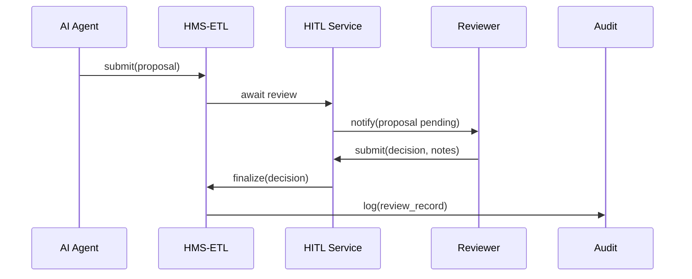

# Chapter 11: Human-in-the-Loop (HITL) Override

In [Chapter 10: AI Representative Agent](10_ai_representative_agent_.md), we added a digital consultant that analyzes data and proposes process improvements. Now, before those AI-generated recommendations go live, we need a trusted human to review and sign off. That’s our **Human-in-the-Loop (HITL) Override**.

---

## 1. Why HITL Override?

Use Case  
Imagine the Department of Transportation’s AI agent recommends fast-tracking certain permit renewals to clear backlogs. Before changing a nationwide policy, a senior official—like a Deputy Secretary—must review, adjust, and approve that proposal. The HITL Override is our built-in checkpoint, just like a senior official signing off on a deputy’s memo.

This mechanism ensures:
- Accountability: every AI suggestion is human-approved.  
- Flexibility: the reviewer can tweak or reject proposals.  
- Safety: sensitive decisions (e.g., environmental permits) get proper oversight.

---

## 2. Key Concepts

1. Checkpoint  
   A pause in the automated flow where AI proposals await review.  

2. Reviewer  
   A real decision-maker (e.g., agency official) who inspects the AI’s recommendation.  

3. Override Action  
   The reviewer can **approve**, **modify**, or **reject** the proposal.  

4. Audit Trail  
   A tamper-proof log of who reviewed what, when, and why.

---

## 3. How to Use HITL Override

Below is a minimal example showing how to invoke a HITL review for an AI suggestion:

```python
# File: example_hitl.py
from hms_etl.hitl import HITLOverride

# 1. Create the HITL service
hitl = HITLOverride()

# 2. AI agent produces a proposal
proposal = {
    "id": "prop-42",
    "text": "Fast-track low-complexity permit renewals"
}

# 3. A human reviewer reviews and decides
decision = hitl.review(
    proposal,
    reviewer="DeputySecretary",
    action="modify",
    notes="Limit to permits under $1,000 fees"
)

print(decision)
# -> {
#      "proposal_id": "prop-42",
#      "status": "approved_with_modifications",
#      "reviewer": "DeputySecretary",
#      "notes": "Limit to permits under $1,000 fees"
#    }
```

Explanation  
1. We instantiate `HITLOverride`.  
2. The AI agent passes its `proposal` into `hitl.review()`.  
3. The reviewer chooses an `action` (`approve`, `modify`, `reject`) and adds `notes`.  
4. We get back a decision record with status and audit info.

---

## 4. Under the Hood: Sequence Diagram

Here’s what happens step-by-step when an AI proposal enters the HITL:



1. AI agent submits a proposal.  
2. HMS-ETL calls the HITL service and waits.  
3. Reviewer gets a task (e.g., email or UI alert).  
4. After review, decision flows back into HMS-ETL.  
5. Audit logger records the review.

---

## 5. Inside the Implementation

Let’s peek at a simplified `hms_etl/hitl.py`:

```python
# File: hms_etl/hitl.py
from datetime import datetime

class HITLOverride:
    def __init__(self):
        self.audit_log = []  # In real life, write to DB

    def review(self, proposal, reviewer, action, notes=""):
        record = {
            "proposal_id": proposal["id"],
            "status": self._map_action(action),
            "reviewer": reviewer,
            "notes": notes,
            "timestamp": datetime.utcnow().isoformat()
        }
        self._log(record)
        return record

    def _map_action(self, action):
        mapping = {
            "approve": "approved",
            "modify": "approved_with_modifications",
            "reject": "rejected"
        }
        return mapping.get(action, "pending")
```

Explanation  
- `review()` builds a decision record with `status`, `reviewer`, and timestamp.  
- `_map_action()` turns the reviewer’s verb into a standardized status.  
- `_log()` (omitted) appends the record to `self.audit_log` or a real audit store.

---

## 6. Conclusion

You’ve learned how to:

- Pause an AI-driven workflow for human review.  
- Let a senior official approve, tweak, or reject AI proposals.  
- Capture a full audit trail for accountability.

Next up, we’ll set up rules for when to escalate decisions to higher authorities in [Chapter 12: Escalation Workflow](12_escalation_workflow_.md).

---

Generated by [AI Codebase Knowledge Builder](https://github.com/The-Pocket/Tutorial-Codebase-Knowledge)