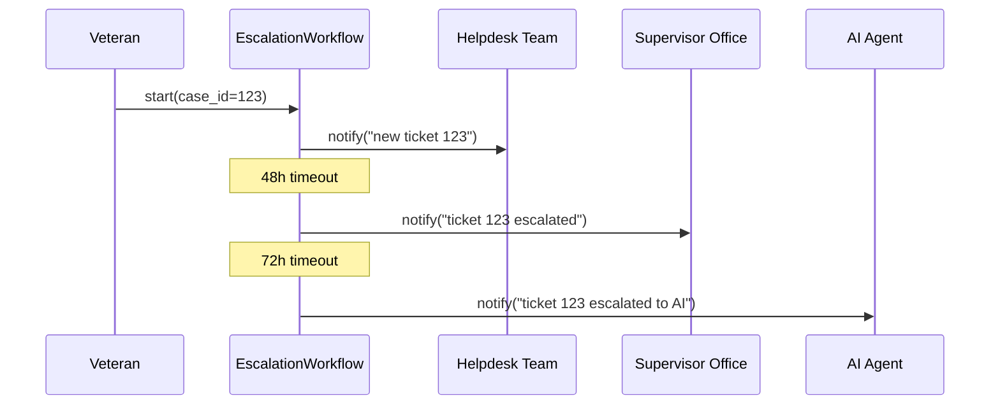

# Chapter 12: Escalation Workflow

Welcome back! In [Chapter 11: Human-in-the-Loop (HITL) Override](11_human_in_the_loop__hitl__override_.md), we saw how a senior official reviews AI proposals before they go live. Now we’ll set up an **Escalation Workflow**—a triage system that routes citizen complaints from helpdesk staff, up to supervisors, and finally to our AI Agent if human channels stall.

---

## 1. Why Do We Need an Escalation Workflow?

**Use Case**  
Imagine the Department of Veterans Affairs receives a benefits‐delay complaint:

1. A veteran submits a ticket online.  
2. If the helpdesk can’t resolve it in 48 hours, it escalates to a supervisor.  
3. If the supervisor still hasn’t responded in 72 hours, it falls back to our AI Representative Agent ([Chapter 10: AI Representative Agent](10_ai_representative_agent_.md)) for an automated recommendation.

Without an escalation path, complaints can fall through the cracks. The escalation workflow ensures every request gets timely attention—first by people, then by AI.

---

## 2. Key Concepts

1. **Stage**  
   A level in the escalation path (e.g., “helpdesk”, “supervisor”, “AI Agent”).

2. **Handler**  
   The team or system responsible for a stage (e.g., phone line, email inbox, AI service).

3. **Timeout**  
   How long the workflow waits before moving to the next stage.

4. **Case**  
   A specific complaint or ticket being processed.

5. **Notification**  
   Alerts sent to handlers when a case arrives or escalates.

---

## 3. How to Use EscalationWorkflow

Below is a minimal example that defines a three‐stage escalation for veterans’ benefit tickets.

```python
# File: example_escalation.py
from hms_etl.escalation import EscalationWorkflow

# 1. Create the workflow
wf = EscalationWorkflow()

# 2. Define each stage with handler name and timeout (in hours)
wf.add_stage("helpdesk", handler="helpdesk_team", timeout=48)
wf.add_stage("supervisor", handler="supervisor_office", timeout=72)
wf.add_stage("ai_agent", handler="ai_representative", timeout=None)

# 3. Start a new case
case = wf.start(case_id=123, data={"issue": "benefits delayed"})
print(case.current_stage)
# -> "helpdesk"
```

Explanation:  
- `add_stage()` sets up each level and how long it should wait.  
- `start()` opens a new case at the first stage, returning a `case` object with its `current_stage`.

When a handler marks a case “resolved,” the workflow ends. If they do nothing, after the timeout the workflow automatically escalates to the next handler.

---

## 4. Under the Hood: Sequence Diagram

Here’s what happens when a veteran’s ticket times out at the helpdesk stage:



1. **start()** creates the case and notifies the helpdesk.  
2. After 48 hours with no resolution, it notifies the supervisor.  
3. After another 72 hours, it notifies the AI Agent.

---

## 5. Inside EscalationWorkflow

Let’s peek at `hms_etl/escalation.py` to see how it’s structured.

### 5.1 Managing Stages

```python
# File: hms_etl/escalation.py
class EscalationWorkflow:
    def __init__(self):
        self.stages = []  # list of (name, handler, timeout)

    def add_stage(self, name, handler, timeout):
        self.stages.append({"name": name,
                            "handler": handler,
                            "timeout": timeout})
```

*Explanation:*  
- `self.stages` is an ordered list of dictionaries.  
- Each entry holds `name`, `handler`, and `timeout` in hours.

---

### 5.2 Starting and Tracking a Case

```python
    def start(self, case_id, data):
        case = {"id": case_id, "data": data, "index": 0}
        self._notify(case)
        return case

    def _notify(self, case):
        stage = self.stages[case["index"]]
        handler = stage["handler"]
        # In real life: send email/SMS/API call
        print(f"NOTIFY {handler}: case {case['id']} at stage {stage['name']}")
```

*Explanation:*  
- `start()` creates a `case` and immediately notifies the first handler.  
- `_notify()` prints a message (replace with real notifications).

---

### 5.3 Automatic Escalation

```python
    def check_timeouts(self, case):
        stage = self.stages[case["index"]]
        if stage["timeout"] is None:
            return  # final stage has no timeout
        # Simplified: assume time passed
        case["index"] += 1
        self._notify(case)
```

*Explanation:*  
- `check_timeouts()` moves the case to the next stage after the timeout.  
- In practice, you’d schedule `check_timeouts` with a timer or cron job.

---

## 6. Conclusion

You’ve learned how to build an **Escalation Workflow** that:

- Defines a clear triage path through human teams and finally to AI.  
- Uses timeouts to move unresolved cases up the chain.  
- Notifies each handler at every step, ensuring no complaint is lost.

This completes our deep dive into HMS-ETL’s core abstractions. Thanks for following along, and happy building!

---

Generated by [AI Codebase Knowledge Builder](https://github.com/The-Pocket/Tutorial-Codebase-Knowledge)