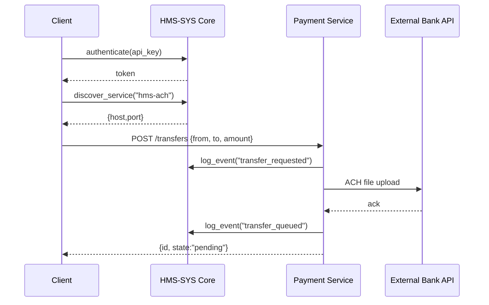

# Chapter 12: HMS-ACH Payment & Finance

In [Chapter 11: HMS-GOV Admin/Gov Portal](11_hms_gov_admin_gov_portal_.md) we built the command center for policy review and approval. Now it’s time to handle real money flows—**HMS-ACH Payment & Finance**, the treasury of your HMS platform, ensuring all payments, invoices, and audit trails are secure, compliant, and traceable.

---

## 1. Motivation: Why a Dedicated Finance Subsystem?

Imagine the U.S. Department of Education disbursing Pell Grants to students via ACH. You need to:

- Initiate ACH transfers from the Department’s bank account  
- Issue invoices or chargebacks to partner institutions  
- Keep a full audit trail for every cent moved  

Without a central finance module, each service builds its own payment logic, leading to security holes, inconsistent billing, and fractured audit logs. **HMS-ACH Payment & Finance** acts like the Treasury Department:

- One place to configure bank credentials  
- Standard APIs to send or request funds  
- Built-in billing and audit reporting  

Just as the Treasury manages the nation’s money, HMS-ACH manages your platform’s money flows.

---

## 2. Key Concepts

1. **ACH Transfer**  
   Automated Clearing House (ACH) is the electronic network for money transfers—used for payrolls, benefits, refunds.

2. **Invoice & Billing**  
   Generate and track invoices for agencies or external partners, including payment due dates and statuses.

3. **Audit Trail**  
   Immutable logs of who did what, when, and how much—essential for compliance with federal regulations.

4. **Compliance Checks**  
   Built-in rules to validate account numbers, enforce daily transfer limits, and flag suspicious transactions.

5. **Reconciliation**  
   Matching internal transaction records against bank statements, ensuring no mismatches.

---

## 3. Using HMS-ACH Payment & Finance

Let’s walk through a simple use case: disbursing a $1,200 benefit payment to a citizen’s bank account and then querying its status.

### 3.1 Initialize the Finance Client

```python
# app.py
from hms_ach import PaymentClient

# First, authenticate and find the finance service
ach = PaymentClient(core_url="https://core.gov.example", api_key="EDU_PAY_KEY")
```
This code logs into [HMS-SYS Core Infrastructure](01_hms_sys_core_infrastructure_.md) and discovers the Payment & Finance service.

### 3.2 Create an ACH Payment

```python
payment = ach.create_transfer(
  from_account="USDEPT001",  # Department’s bank ID
  to_account="CITIZEN12345",  # Student’s bank ID
  amount=1200.00,
  description="Pell Grant Disbursement"
)
print("Created payment ID:", payment["id"])
```
  
This requests an ACH debit from `USDEPT001` and credit to `CITIZEN12345`. The service returns a unique `payment["id"]` for tracking.

### 3.3 Check Payment Status

```python
status = ach.get_transfer_status(payment_id=payment["id"])
print(f"Payment status: {status['state']}")
# e.g. "pending", "completed", or "failed"
```

You can poll or schedule a job to reconcile until `state == "completed"`.

### 3.4 Generate an Invoice

```python
invoice = ach.generate_invoice(
  recipient="UNIVERSITY_A",
  items=[{"description":"API Usage Fee", "amount":500.00}]
)
print("Invoice PDF URL:", invoice["pdf_url"])
```

This issues an invoice to a partner institution, with a link to download a PDF for your records.

---

## 4. Under the Hood: Sequence Flow

Here’s what happens when you call `create_transfer`:



1. **Client** logs into **HMS-SYS Core** and discovers the ACH service.  
2. **Client** posts a transfer request to **Payment Service**.  
3. Payment Service logs events for audit.  
4. It sends an ACH batch file to the **Bank**.  
5. Bank acknowledges and Payment Service returns a `pending` state.

---

## 5. Internal Implementation Details

### 5.1 Service Discovery & Auth (`hms_ach/client.py`)

```python
from hms_sys import CoreClient
import requests

class PaymentClient:
    def __init__(self, core_url, api_key):
        # Authenticate and discover
        self.core = CoreClient(base_url=core_url)
        self.token = self.core.authenticate(api_key=api_key)
        svc = self.core.discover_service("hms-ach")
        self.base = f"http://{svc['host']}:{svc['port']}"

    def _post(self, path, body):
        headers = {"Authorization": f"Bearer {self.token}"}
        url = f"{self.base}{path}"
        return requests.post(url, json=body, headers=headers).json()
```

- We reuse [HMS-SYS Core Infrastructure](01_hms_sys_core_infrastructure_.md) for auth and discovery.  
- `_post` handles HTTP calls with the bearer token.

### 5.2 Payment Endpoints

```python
    def create_transfer(self, from_account, to_account, amount, description):
        data = {
          "from_account": from_account,
          "to_account": to_account,
          "amount": amount,
          "description": description
        }
        return self._post("/transfers", data)

    def get_transfer_status(self, payment_id):
        return requests.get(
          f"{self.base}/transfers/{payment_id}",
          headers={"Authorization":f"Bearer {self.token}"}
        ).json()

    def generate_invoice(self, recipient, items):
        return self._post("/invoices", {"recipient": recipient, "items": items})
```

Each method maps to a backend route that:
- Validates account numbers and daily limits  
- Logs events via the Core  
- Stores records in a secure ledger database

---

## 6. Conclusion

In this chapter you learned how **HMS-ACH Payment & Finance** provides:

- A unified client to initiate ACH transfers and issue invoices  
- Built-in audit logging with [HMS-SYS Core Infrastructure](01_hms_sys_core_infrastructure_.md)  
- Status tracking for reconciliation and compliance  

With this treasury-like subsystem, your platform can move money securely, maintain transparency for auditors, and stay in line with financial regulations—just like the Federal Treasury manages the nation’s funds.  

Thank you for following along through the full HMS-ETL tutorial!

---

Generated by [AI Codebase Knowledge Builder](https://github.com/The-Pocket/Tutorial-Codebase-Knowledge)