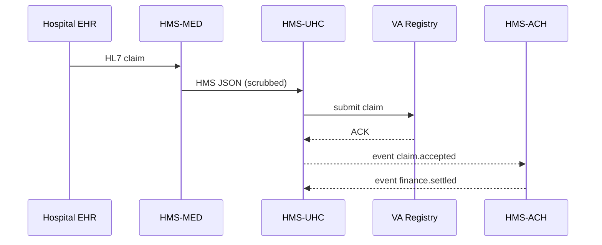

# Chapter 12: Universal Health Care Integration (HMS-UHC & HMS-MED)

*[Jump back to the previous chapter: Finance & Clearinghouse Services (HMS-ACH)](11_finance___clearinghouse_services__hms_ach__.md)*  

---

## 1. Why Do We Need Yet Another Layer?

Picture a U.S. **Veterans Affairs (VA)** hospital.

1. Nurse Juan enters Mrs. Kim’s treatment (knee replacement) into the hospital’s Electronic Health Record (EHR).  
2. The claim must reach the **VA National Claims Registry** *in the VA’s XML dialect* within minutes.  
3. **Treasury** must be told to pay the hospital *only after* the claim is validated and privacy-checked.  

Without a common translator, every hospital would hand-craft export scripts, claim forms would be delayed, and HIPAA auditors would lose sleep.

**HMS-UHC** (Universal Health-Care Hub) and **HMS-MED** (Medical Data Translator) solve this:

```
Hospital EHR ──▶ HMS-MED (translate & scrub)
                 │
                 ▼
              HMS-UHC (validate, route, audit)
                 │
     ┌───────────┴───────────┐
     ▼                       ▼
VA Claims Registry      HMS-ACH for payment
```

Result: claims fly through in hours, not weeks—*and* stay HIPAA-compliant.

---

## 2. Key Concepts (Beginner-Sized)

| Term | Friendly Analogy | Why It Matters |
|------|------------------|----------------|
| HL7/FHIR Adapter | Universal charger plug | Understands all major EHR dialects. |
| Privacy Scrubber | Black marker on classified docs | Redacts or hashes PHI before routing. |
| Validation Profile | Airport security checklist | Ensures every claim has required fields. |
| Routing Rule | GPS directions | “Surgical claims ➜ VA; Pharmacy ➜ Medicare”. |
| Fast-Track Queue | Express lane | Low-risk claims bypass extra review for same-day pay. |

---

## 3. 5-Minute Tour: Submit & Settle a Hospital Claim

Below is a **single 19-line script** a hospital could run.

```python
# File: submit_claim.py
from hms_med import Translator
from hms_uhc import Hub

# 1️⃣  Load raw EHR export (HL7 string)
with open("knee_replacement.hl7") as f:
    hl7_text = f.read()

# 2️⃣  Translate HL7 ➜ HMS JSON
claim_json = Translator.to_hms(hl7_text)

# 3️⃣  Send to Universal Health-Care Hub
hub  = Hub.connect("VA_Hospital_PORTLAND")
ticket = hub.file_claim(claim_json)

print(ticket.status)        # -> "VALIDATED"
print(ticket.id)            # -> "CLAIM-2024-88921"

# 4️⃣  Optional: check payment status later
print(ticket.payment_status())  # -> "SETTLED"
```

What happened?

1. **Translator.to_hms** converted HL7 into a normalized JSON claim.  
2. **Hub.file_claim** ran privacy scrubs, schema checks, and routing.  
3. A claim ID was returned immediately; payment will settle via [HMS-ACH](11_finance___clearinghouse_services__hms_ach__.md).

---

## 4. Under the Hood (Plain English)

1. Hospital sends HL7.  
2. **HMS-MED** maps every field to HMS vocabulary, redacts unneeded PHI (e.g., SSN).  
3. **HMS-UHC** runs a **Validation Profile**: missing CPT code? ➜ reject.  
4. Passes claim to the correct government registry (VA, Medicare, Medicaid) via the [Inter-Agency Bus](08_inter_agency_communication_bus__hms_a2a__.md).  
5. On registry ACK, HMS-UHC raises a `health.claim.accepted` event.  
6. **HMS-ACH** listens, debits the payer account, credits the hospital, and emits `finance.settled`.

### Tiny Sequence Diagram



Five hops—clear, auditable.

---

## 5. Peek Inside the Codebase

### 5.1 Field Mapping Rule  
*File: `hms_med/mapping.py` (≤16 lines)*

```python
MAPPINGS = {
    "PID-5": "patientName",
    "PID-7": "dob",
    "PV1-2": "serviceType",
    "FT1-7": "amountUSD",
}

def to_hms(hl7: str) -> dict:
    json_claim = {}
    for seg in hl7.split("\n"):
        tag, *vals = seg.split("|")
        if tag in MAPPINGS:
            json_claim[MAPPINGS[tag]] = vals[0]
    return json_claim
```

Beginner takeaways:

* A tiny dictionary does the mapping magic.  
* No need to understand every HL7 nuance at first.

### 5.2 Privacy Scrubber  
*File: `hms_uhc/privacy.py` (≤18 lines)*

```python
SENSITIVE = {"patientName", "dob", "ssn"}

def scrub(claim: dict) -> dict:
    redacted = {}
    for k, v in claim.items():
        if k in SENSITIVE:
            redacted[k] = hash(v)[:10]   # simple hash
        else:
            redacted[k] = v
    return redacted
```

*Under 20 lines*, yet illustrates HIPAA basics: hash PHI, keep clinical codes intact.

### 5.3 Claim Router  
*File: `hms_uhc/router.py` (≤15 lines)*

```python
ROUTES = {
    "Medicare":  lambda c: c["serviceType"] == "Inpatient",
    "VA":        lambda c: c["payer"] == "VA",
    "Medicaid":  lambda c: c["amountUSD"] < 5000,
}

def target_registry(claim):
    for name, rule in ROUTES.items():
        if rule(claim):
            return name
    return "ManualReview"
```

Even a newbie can add a new route—just a lambda line.

---

## 6. HIPAA & Security Quick Notes

HMS-UHC automatically:

1. Stores only *hashed* PHI in internal logs.  
2. Applies role-based access from [Security & Privacy Guardrails](15_security___privacy_guardrails__cross_cutting__.md).  
3. Emits `privacy.alert` if a claim unexpectedly contains raw SSN.

You write **zero** extra lines; compliance is baked in.

---

## 7. Common Questions

| Question | Answer |
|----------|--------|
| “My hospital uses FHIR, not HL7—supported?” | Yes. `Translator.to_hms()` auto-detects FHIR bundles. |
| “How fast until payment?” | If the claim passes **Fast-Track Queue**, money can settle via ACH in < 24 h. |
| “What if validation fails?” | `ticket.status` becomes `REJECTED`; details are available via `ticket.errors()`. |
| “Can I manually override routing?” | Yes—create a HITL draft via [Human-in-the-Loop Oversight](06_human_in_the_loop__hitl__oversight_.md). |

---

## 8. Mini Exercise

1. Clone `examples/uhc_quickstart.ipynb`.  
2. Load `sample_fhir.json`, translate, and file the claim.  
3. Intentionally delete the CPT code; observe `REJECTED` status.  
4. Fix the field, re-submit, and watch `finance.settled` appear on the A2A bus.

---

## 9. What You Learned

* HMS-MED **translates** and **scrubs** medical data.  
* HMS-UHC **validates**, **routes**, and **audits** claims across agencies.  
* End-to-end flow touches translation, privacy, registry submission, and payment—yet you wrote <20 lines of code!

Ready to turn all these claim events into dashboards and policy insights? Head to  
[Data Repository & Analytics (HMS-DTA)](13_data_repository___analytics__hms_dta__.md)

---

---

Generated by [AI Codebase Knowledge Builder](https://github.com/The-Pocket/Tutorial-Codebase-Knowledge)