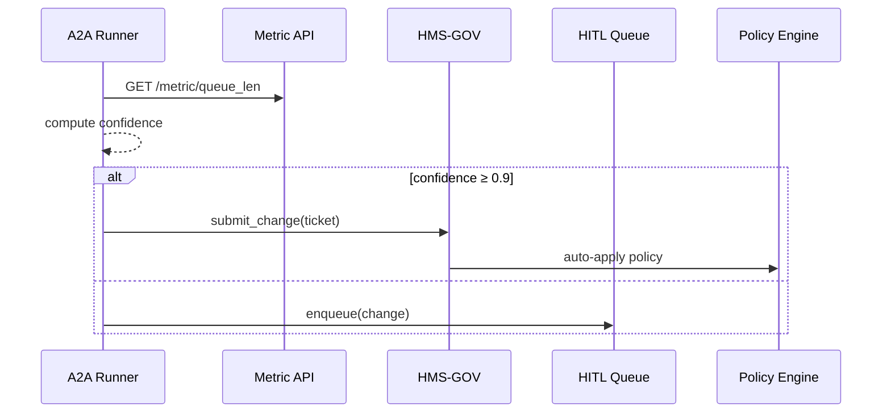

# Chapter 13: AI Representative Agent (HMS-A2A)
*[Link back to Chapter 12: KPI & Metrics Dashboard](12_kpi___metrics_dashboard_.md)*  

---

## 1. Why Do We Need an “AI Representative”?

Central use-case (3 sentences)  
• The **Railroad Retirement Board (RRB)** must process disability claims within **60 days** or risk Congressional penalties.  
• Overnight, the backlog jumps—dashboards show queue length > 1 000, but nobody notices until the next staff meeting.  
• An **AI Representative Agent (HMS-A2A)** would read the live KPIs at 2 a.m., propose a policy tweak (e.g., auto-route simple cases to fast-track) and either **push** the change or queue it for next-morning review.

Think of A2A as a *seasoned policy analyst* who never sleeps, constantly reading every log, metric, and rule to keep the system humming.

---

## 2. Key Concepts (Plain-English Cheat-Sheet)

| “Human Analyst” Analogy | A2A Term | Newbie Take |
|-------------------------|----------|-------------|
| Reads yesterday’s reports | Continuous Ingestion | Pulls logs, KPIs, feedback 24 × 7 |
| Writes a memo | Optimization Proposal | YAML file describing a suggested change |
| Confidence level | Confidence Score | 0–1 number; high ⇒ auto-apply |
| Sends memo to boss | HITL Queue | Waiting area for human approval |
| Uses agency handbook | Guardrails | Hard rules from [Governance Layer](01_governance_layer__hms_gov__.md) |
| Edits live form | Auto-Push | Agent can commit directly if allowed |

Keep this table handy—the rest of the chapter is just these six ideas in action!

---

## 3. What Does A2A Actually Do? (60-Second Tour)

1. **Ingest**: Pull `/metric/queue_len` (Chapter 12) every 5 min.  
2. **Detect**: If queue > 500 for 3 intervals, flag “backlog risk.”  
3. **Propose**: Draft a new rule: “Route *low-complexity* claims to FastTrack service.”  
4. **Decide**:  
   • Confidence ≥ 0.9 ➜ **Auto-Push** via [Policy & Process Engine](02_policy___process_engine_.md).  
   • Else ➜ send to [Human-in-the-Loop Workflow (HITL)](14_human_in_the_loop_workflow__hitl__.md).

---

## 4. Hands-On: Your First Agent in 3 Files

### 4.1 Agent Playbook (9 lines)

`agents/rrb_fasttrack.yaml`
```yaml
id: RRB_FASTTRACK_AGENT
metric: license_queue_length
detect_when: "value > 500 for 3"
propose:
  patch_policy: "FASTTRACK_ROUTING"
  change: "threshold_complexity = 2"
confidence_formula: "min(1, (value-500)/500)"
auto_push_over: 0.9      # else send to HITL
```
Explanation  
• Plain YAML = no code.  
• `confidence_formula` is a one-liner math rule.  
• `patch_policy` refers to an existing PPE policy file.

---

### 4.2 18-Line Agent Runner

`a2a/runner.py`
```python
import yaml, time, requests, json
from hms_gov import submit_change      # Chapter 1 helper
from hms_hitl import enqueue_review    # Chapter 14 helper

cfg = yaml.safe_load(open("rrb_fasttrack.yaml"))

def read_metric():
    url = f"http://metric-api/metric/{cfg['metric']}"
    return requests.get(url,timeout=2).json()["value"]

def confidence(v):
    return eval(cfg["confidence_formula"],{},{"value":v})

while True:
    val = read_metric()
    hist.append(val); hist=hist[-3:]
    if len(hist)==3 and all(x>500 for x in hist):
        conf = confidence(val)
        change = {
            "policy_id": cfg["propose"]["patch_policy"],
            "patch": cfg["propose"]["change"],
            "evidence": hist, "confidence": conf,
        }
        if conf >= cfg["auto_push_over"]:
            submit_change(change)           # auto
        else:
            enqueue_review(change)          # HITL
    time.sleep(300)
```
What happens?  
1. Reads the metric every 5 min.  
2. Keeps a tiny 3-value history.  
3. Computes confidence; decides **auto vs human**.

---

### 4.3 Submitting the Proposal (Output Example)

If `confidence = 0.93` the runner calls `submit_change` which opens a **Change Ticket**:

```
✔ Ticket RRB-FT-24 created
✔ Passed governance pre-checks
✔ Policy patch queued for PPE rollout
```

If `confidence = 0.7` it goes to the HITL queue:

```
‣ Proposal queued for human review (queue pos #2)
```

Either way, nobody must wake up at 2 a.m.—the agent handled detection and routing.

---

## 5. Under the Hood (Step-By-Step)


Only **5 participants**—easy to reason about.

---

## 6. Peek Inside A2A Core (≤ 20 Lines Each)

### 6.1 Minimal Ingestion Helper

`a2a/ingest.py`
```python
import requests
def pull(metric):
    url = f"http://metric-api/metric/{metric}"
    return requests.get(url,timeout=2).json()["value"]
```

### 6.2 Confidence Sandbox

`a2a/confidence.py`
```python
def calc(formula, value):
    # tiny, sandboxed eval – do **not** allow imports
    safe = {"min":min,"max":max,"value":value}
    return eval(formula, {"__builtins__":{}}, safe)
```

### 6.3 Governance Bridge

`a2a/bridge.py`
```python
import requests, os, json
def submit(ticket):
    url=os.getenv("GOV_API","http://gov/change")
    requests.post(url,json=ticket,timeout=2)
```

All helpers are small; you can swap them for mocks during testing.

---

## 7. Safety Rails Already in Place

| Layer | What It Adds to A2A |
|-------|---------------------|
| [Governance](01_governance_layer__hms_gov__.md) | Blocks proposals that violate standing policies. |
| [Security & Compliance](04_security___compliance_framework_.md) | Runner image carries Seal ID; formulas scanned for unsafe code. |
| [Access & Identity](05_access___identity_management_.md) | Agent has a **service role** with `scope:policy.write`. |
| [Observability](11_observability___audit_log_.md) | Every proposal emits `AI_PROPOSAL_CREATED` with hash+signature. |
| [KPI Dashboard](12_kpi___metrics_dashboard_.md) | Supplies the metrics the agent analyzes. |
| [HITL](14_human_in_the_loop_workflow__hitl__.md) | Receives low-confidence proposals. |

You get these protections *for free*.

---

## 8. Common Pitfalls & Quick Fixes

| “Oops!” | Root Cause | Quick Fix |
|---------|-----------|-----------|
| Agent spams proposals every loop | No deduping | Track `last_submitted_hash` and skip repeats. |
| Formula division by zero | Metric suddenly zero | Wrap formula: `max(1,value-500)` |
| Auto-push applied bad patch | Guardrail missing | Set `auto_push_over` higher (e.g., 0.98) until confidence model improves. |

---

## 9. Mini-Lab: Dry-Run Mode in 4 Lines

Add to YAML:

```yaml
dry_run: true
```

Update runner loop:

```python
if not cfg.get("dry_run"):
    submit_change(change)  # real
else:
    print("DRY-RUN", change)
```

Run the agent—you’ll see proposals printed but **no** real tickets filed. Perfect for staging!

---

## 10. What You Learned

✓ Why an AI Representative Agent keeps the platform *self-optimizing*.  
✓ Core ideas: ingestion, proposal, confidence, guardrails, HITL.  
✓ Built a full agent in < 20 lines and wired it to Governance & KPI APIs.  
✓ Saw internal helpers and a 5-node sequence diagram.  
✓ Practiced safe experimentation with **dry-run** mode.

Ready to explore how humans interact with these AI-generated proposals?  
Continue to [Human-in-the-Loop Workflow (HITL)](14_human_in_the_loop_workflow__hitl__.md).

---

Generated by [AI Codebase Knowledge Builder](https://github.com/The-Pocket/Tutorial-Codebase-Knowledge)