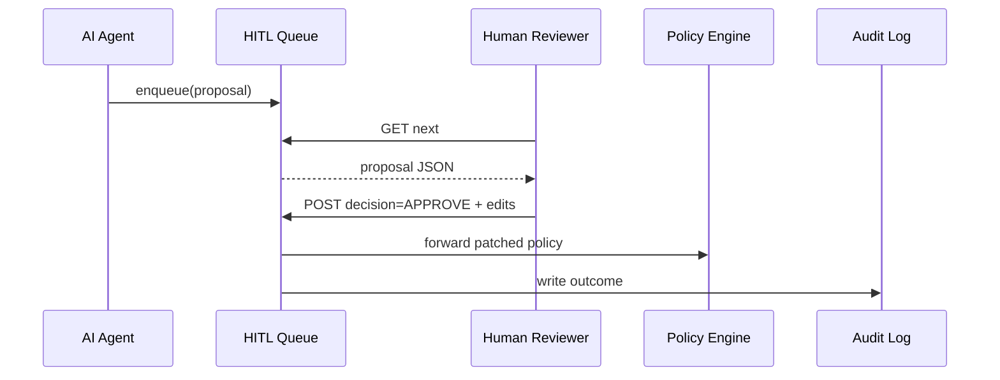

# Chapter 14: Human-in-the-Loop Workflow (HITL)  
*[Link back to Chapter 13: AI Representative Agent (HMS-A2A)](13_ai_representative_agent__hms_a2a__.md)*  

---

## 1 . Why Bother With Humans at All?

Central use-case (2 sentences)  
• At 2 a.m. the **Railroad Retirement Board (RRB)** AI agent notices a disability-claim backlog and proposes a *Fast-Track* rule (see Chapter 13).  
• Before that rule “goes live,” a *real* claims officer must eyeball it—exactly like Congress marking-up a bill—otherwise the change might deny benefits to thousands of retirees.  

The **Human-in-the-Loop Workflow (HITL)** is our digital **markup session**:  
1. **Queues** every AI (or automated) policy proposal.  
2. Lets human officials **approve, edit, or reject** the item.  
3. Records the outcome in an immutable audit log for public trust.  

Without HITL we’d be letting robots legislate—no thanks!

---

## 2 . Key Concepts (Plain-English Cheat-Sheet)

| Capitol Analogy | HITL Term | One-Liner |
|-----------------|-----------|-----------|
| Congressional inbox | Proposal Queue | Where new AI changes wait for review |
| Markup meeting | Review Session | Humans inspect, tweak, vote |
| “Yea / Nay” vote | Decision | APPROVE, REJECT, or REQUEST_CHANGES |
| Committee clerk | HITL Service | API that stores & updates proposals |
| Congressional Record | Outcome Ledger | Audit-log entry for every decision |
| Whip tally | SLA Timer | Max time a proposal may sit un-reviewed |

Keep this table visible—the rest of the chapter is just these six ideas in practice.  

---

## 3 . Use-Case Walk-Through (From A2A → Human → Policy)



Only **5 hops**—easy to reason about and to debug.  

---

## 4 . Hands-On: Queue → Review → Decision in < 20 Lines Each

### 4.1 Enqueue From Your AI Agent  
*(called in Chapter 13’s runner)*

```python
# hms_hitl/client.py  (18 lines)
import requests, os, json, time, hashlib

def enqueue_review(change: dict):
    payload = {
        "ts": time.time(),
        "proposed_by": os.getenv("HMS_ACTOR", "UNKNOWN"),
        "change": change,
        "hash": hashlib.sha1(json.dumps(change).encode()).hexdigest()
    }
    r = requests.post("https://hitl.local/queue", json=payload, timeout=2)
    print("Queued for review →", r.json()["id"])
```

Explanation  
1. Wraps the change with timestamp & SHA-1 for tamper evidence.  
2. POSTs to the HITL service; returns a queue **id** for tracking.

---

### 4.2 Minimal Queue Service  

```python
# hitl_service/app.py  (20 lines)
from fastapi import FastAPI, HTTPException
import uuid, time, json, pathlib

DB = pathlib.Path("/var/hitl/proposals.jsonl")
app = FastAPI()

@app.post("/queue")
def add(item: dict):
    item["id"] = str(uuid.uuid4())
    DB.write_text(json.dumps(item)+"\n",append=True)
    return {"id": item["id"]}

@app.get("/next")
def next_for_review():
    for line in DB.read_text().splitlines():
        p = json.loads(line)
        if p.get("decision") is None:
            return p
    raise HTTPException(404, "No pending items")

@app.post("/decision/{pid}")
def decide(pid: str, body: dict):
    rows = [json.loads(l) for l in DB.read_text().splitlines()]
    for r in rows:
        if r["id"] == pid:
            r["decision"] = body["decision"]
            r["notes"]    = body.get("notes","")
            break
    DB.write_text("\n".join(json.dumps(x) for x in rows))
    return {"status": "stored"}
```

Explanation  
• Stores proposals line-by-line in a plain **JSONL** file—good enough for tutorials.  
• Exposes three endpoints: `POST /queue`, `GET /next`, and `POST /decision/{id}`.

---

### 4.3 Reviewer’s Command-Line Tool  

```python
# hitl_cli.py  (16 lines)
import requests, json, sys

def review():
    p = requests.get("https://hitl.local/next").json()
    print("== Proposed Change ==")
    print(json.dumps(p["change"], indent=2))
    choice = input("Approve (a), Reject (r), Edit (e)? ")
    if choice=="e":
        field = input("Field to edit: ")
        val   = input("New value: ")
        p["change"][field] = val
    decision = {"a":"APPROVE","r":"REJECT","e":"APPROVE"}[choice]
    requests.post(f"https://hitl.local/decision/{p['id']}",
                  json={"decision":decision,"notes":"via CLI"})
    print("✅ Decision sent.")

if __name__=="__main__":
    review()
```

Explanation  
1. Fetches the oldest unhandled proposal.  
2. Shows JSON in the terminal.  
3. Lets the reviewer approve, reject, or live-edit one field.  

---

## 5 . What Happens After a Decision?

* APPROVE → queue service calls [Policy & Process Engine](02_policy___process_engine_.md) to apply the patch.  
* REJECT → proposal is marked closed; nothing is pushed.  
* REQUEST_CHANGES (not shown in CLI) → proposal returned to AI agent with notes.  

All cases write an `HITL_DECISION` entry to the [Audit Log](11_observability___audit_log_.md).  

---

## 6 . Internal Flow (Step-By-Step)

1. **AI Agent** uses `enqueue_review()` → proposal in file-based queue.  
2. **Human** runs `hitl_cli.py`; pulls first pending item.  
3. CLI POSTs decision; service updates line in place.  
4. If `decision == APPROVE` → service PATCHes the policy via PPE API.  
5. Service POSTs an audit event (`actor = INSPECTOR_45`, `decision = APPROVE`).  

Simple, auditable, and requires *zero* fancy infrastructure.

---

## 7 . How Earlier Layers Plug In

| Layer | Contribution to HITL |
|-------|----------------------|
| [Governance](01_governance_layer__hms_gov__.md) | All final approvals still go through change tickets. |
| [Security & Compliance](04_security___compliance_framework_.md) | Queue & CLI containers carry Seal IDs. |
| [Access & Identity](05_access___identity_management_.md) | Reviewer must hold role `RRB_CLAIMS_OFFICER`. |
| [KPI & Dashboard](12_kpi___metrics_dashboard_.md) | Shows pending-queue length & SLA timer. |
| [Audit Log](11_observability___audit_log_.md) | Stores every decision with signature. |

Nothing new to learn—all controls you already know automatically wrap HITL.

---

## 8 . Common Pitfalls & Quick Fixes

| Oops! | Why It Happens | Fast Fix |
|-------|----------------|----------|
| Queue grows, nobody reviews | No SLA alerts | Add KPI widget: `pending_proposals` red > 10. |
| Edited field breaks policy YAML | Free-text edit | Validate patch via PPE before letting reviewer save. |
| Reviewer forgets to click “Save” | Human error | Auto-save decision draft every 30 s. |

---

## 9 . Mini-Lab: SLA Timer in 5 Lines

Append to `hitl_service/app.py`:

```python
import datetime as dt
SLA_SEC = 86400   # 24 h
@app.get("/sla_violations")
def overdue():
    now = time.time()
    return [p for p in map(json.loads, DB.read_text().splitlines())
            if p.get("decision") is None and now-p["ts"]>SLA_SEC]
```

Call `GET /sla_violations` and watch overdue items appear—perfect KPI feed!

---

## 10 . What You Learned

✓ Why robots still need humans in public-sector workflows.  
✓ Core ideas: proposal queue, review session, decision, SLA.  
✓ Enqueued a change, reviewed it via CLI, and stored the outcome—all with < 20 lines of code each.  
✓ Saw the five-hop sequence from AI agent to policy engine.  
✓ Confirmed built-in security, audit, and governance protections still apply.

Ready to **test** your whole pipeline—AI agent, queue, policy engine—without harming real citizens?  
Jump to [Testing & Simulation Sandbox](15_testing___simulation_sandbox_.md).

---

Generated by [AI Codebase Knowledge Builder](https://github.com/The-Pocket/Tutorial-Codebase-Knowledge)