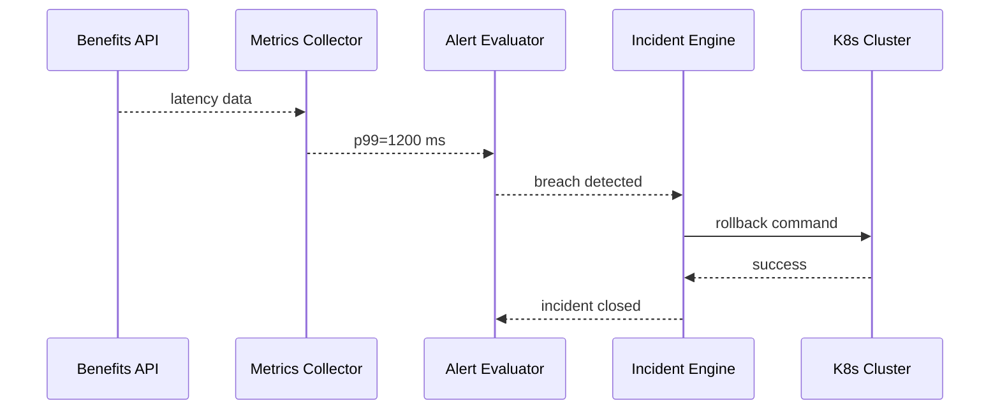

# Chapter 14: Operations, Monitoring & DevOps (HMS-OPS)

*[Jump back to the previous chapter: Data Repository & Analytics (HMS-DTA)](13_data_repository___analytics__hms_dta__.md)*  

---

## 1. Why Do We Need HMS-OPS?

Imagine the **U.S. Digital Service (USDS)** just shipped an online portal that helps unemployed citizens file weekly claims.  

At 10 am on Monday:

* Citizens begin logging in—latency spikes from 120 ms to 1 200 ms.  
* A brand-new AI agent (`ELIGIBILITY_BOT`) crashes every 4th request.  
* Federal law says “99 % of unemployment filings must succeed within 2 seconds” (an SLA baked into legislation).  

Without a **24 × 7 virtual Network-Operations-Center (NOC)** the outage could last hours, hurting thousands of families.

**HMS-OPS** is that virtual NOC.  
It:

1. Collects **metrics**, **logs**, and **traces** from every HMS module.  
2. Compares live data to **regulatory SLAs**.  
3. Fires **alerts** & auto-executes **playbooks** (rollback, scale-up, incident tickets).  
4. Publishes dashboards anyone—developer, analyst, or senator—can read in plain English.

---

## 2. Key Concepts (Zero-Jargon Glossary)

| Term | Everyday Analogy | Why It Matters |
|------|------------------|----------------|
| **Metric** | Speedometer | Shows how fast/slow something is (e.g., API latency). |
| **Log** | Security camera footage | Exact events for forensic replay. |
| **Alert Rule** | Smoke alarm sensitivity switch | “If 99th-percentile latency > 1 s for 5 min → alert.” |
| **Playbook** | Fire-drill checklist | Automated steps to fix or mitigate. |
| **Canary Deployment** | First slice of birthday cake | Test new code on 5 % of traffic before the whole crowd. |
| **Compliance Dashboard** | Public scorecard | Proves the system meets legally-mandated SLAs. |

---

## 3. 5-Minute Tour: Detect → Rollback in < 3 Minutes

Below is a **toy 19-line script** showing how HMS-OPS keeps the Unemployment API healthy.

```python
# File: ops_setup.py
from hms_ops import NOC, Metric, Alert, Playbook

# 1️⃣  Connect to the virtual NOC
noc = NOC.connect("USDS_Unemployment")

# 2️⃣  Declare a latency metric (auto-scraped every 1 min)
latency = Metric(
    name="api.latency_p99",
    unit="ms",
    source="https://benefits.gov/api"
)
noc.register(latency)

# 3️⃣  Create an alert tied to the SLA
alert = Alert(
    name="sla_latency_breach",
    metric="api.latency_p99",
    condition="> 1000",       # >1 000 ms
    window="5m"
)

# 4️⃣  Attach a rollback playbook
play = Playbook.steps([
    "kubectl rollout undo deploy/benefits-api",   # ⬅ step 1
    "notify oncall 'Rollback complete'"           # ⬅ step 2
])
alert.set_playbook(play)

noc.register(alert)
print("✅ Monitoring & auto-rollback armed!")
```

What this does:

1. **Metric**: HMS-OPS begins scraping p99 latency.  
2. **Alert**: If > 1 000 ms for 5 minutes, **trigger**.  
3. **Playbook**: Instantly rolls back the Kubernetes deployment *and* pings on-call.  
4. All actions are logged for auditors.

---

## 4. Watching the Numbers Roll In

Once metrics flow, you—or any policy maker—can open:

```
https://ops.gov/dashboard/usds_unemployment
```

The dashboard shows:

* Live latency graph  
* Error-rate gauge  
* “Reg-SLA 99 % ≤ 2 s” badge (green/yellow/red)  
* List of open incidents with status (“AUTO-ROLLBACK RUNNING”)  

No extra code—the dashboard is generated from the objects you registered.

---

## 5. What Happens Under the Hood?

1. **Scraper** pulls `/metrics` or inserts SDK data into **Metrics DB**.  
2. **Evaluator** checks each Alert rule every 30 seconds.  
3. On breach, **Incident Engine**:  
   • Records an incident row (status: OPEN).  
   • Kicks off attached Playbook steps **in order**.  
4. Each Playbook step streams output; success/failure updates the incident.  
5. A **“sla.breach”** or **“incident.closed”** message is emitted on the [Inter-Agency Bus](08_inter_agency_communication_bus__hms_a2a__.md) so other modules react (e.g., pause new deployments).

### Mini Sequence Diagram



5 participants—short, auditable.

---

## 6. Under-the-Hood Code Peeks (≤ 20 Lines Each)

### 6.1  Evaluator Loop  
*File: `hms_ops/evaluator.py`*

```python
def tick():
    for alert in db.select("alerts"):
        value = metrics.fetch(alert.metric)       # latest datapoint
        if eval(f"{value} {alert.condition}"):
            incident = incidents.open(alert.name)
            playbooks.run(alert.playbook_id, incident.id)
```

*Reads metric → evaluates string condition → opens incident → runs playbook.*

### 6.2  Playbook Runner  
*File: `hms_ops/playbooks.py`*

```python
def run(pb_id, incident_id):
    steps = db.get("playbooks", pb_id)["steps"]
    for cmd in steps:
        ok = _exec(cmd)                 # wraps subprocess
        log.save(incident_id, cmd, ok)
        if not ok:
            incidents.update(incident_id, status="FAILED")
            break
    else:
        incidents.update(incident_id, status="RESOLVED")
```

Runs each step; breaks on first failure; logs everything.

---

## 7. How HMS-OPS Connects to Other Chapters

* Publishes `ops.metric.*` and `ops.incident.*` events on the [A2A Bus](08_inter_agency_communication_bus__hms_a2a__.md).  
* Can pause or resume agents via [Agent Orchestration & Workflow (HMS-ACT)](07_agent_orchestration___workflow__hms_act__.md).  
* Stores long-term traces in [Data Repository & Analytics (HMS-DTA)](13_data_repository___analytics__hms_dta__.md) for trend reports.  
* Relies on [Security & Privacy Guardrails](15_security___privacy_guardrails__cross_cutting__.md) for RBAC—only on-call staff can trigger manual overrides.

---

## 8. FAQ for Beginners

| Question | Quick Answer |
|----------|--------------|
| “Do I need Prometheus or Grafana skills?” | No—HMS-OPS bundles a managed metrics store and dashboards. |
| “Can I add custom playbook steps?” | Yes—any shell command or Python snippet ≤ 30 seconds runtime. |
| “What about staging vs. prod?” | Namespaces! Connect to `NOC.connect("usds_unemployment_staging")`. |
| “Can a senator view SLA dashboards?” | Yes—grant them the *viewer* role in [Security & Privacy Guardrails](15_security___privacy_guardrails__cross_cutting__.md). |

---

## 9. Mini Exercise

1. Clone `examples/ops_quickstart.ipynb`.  
2. Register a fake metric `api.error_rate`.  
3. Set an alert “> 0.05 for 2 m → scale up pods”.  
4. Simulate 10 minutes of spikes; watch HMS-OPS run the playbook and resolve the incident.  
5. Open the auto-generated dashboard URL to verify the incident timeline.

---

## 10. What You Learned

* HMS-OPS is the **eyes, ears, and first-responder** for every HMS service.  
* A few objects—Metric, Alert, Playbook—give you live dashboards, SLA assurance, and one-click (or auto) rollbacks.  
* All actions are auditable, traceable, and policy-aware.

Ready to see how security tokens, encryption, and privacy rules protect all this monitoring data? Head to  
[Security & Privacy Guardrails (Cross-Cutting)](15_security___privacy_guardrails__cross_cutting__.md)

---

---

Generated by [AI Codebase Knowledge Builder](https://github.com/The-Pocket/Tutorial-Codebase-Knowledge)