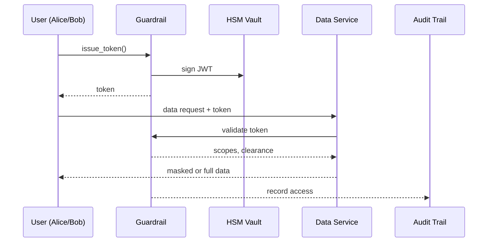

# Chapter 15: Security & Privacy Guardrails (Cross-Cutting)

*[Jump back to the previous chapter: Operations, Monitoring & DevOps (HMS-OPS)](14_operations__monitoring___devops__hms_ops__.md)*  

---

## 1. Why Do We Need Guardrails Everywhere?

Imagine you work for the **Internal Revenue Service (IRS)**.  
An analyst wants to query anonymized income trends, while an auditor needs the **exact** tax-payer IDs for a fraud case.  
If you accidentally give the analyst full records—or block the auditor—you risk:

* **Privacy breaches** → public outrage, lawsuits  
* **Law-enforcement delays** → lost tax revenue  
* **Congressional hearings** → nobody wants that!

**Security & Privacy Guardrails (SPG)** solves this by acting as a **smart turnstile** across *every* HMS layer:

```
Request ─▶ Guardrail ─▶ Token / Encryption / Masking ─▶ Data / Service
```

Whether you are filing health claims, moving ACH money, or training an AI agent, Guardrails make sure **only the right eyes** see **only the right slice** of data—no matter where the request comes from.

---

## 2. Key Concepts (Plain-English Cheatsheet)

| Term | Everyday Analogy | Why It Matters |
|------|------------------|----------------|
| Zero-Trust Gate | Airport TSA | Verify **every** request, even internal. |
| Clearance Level | Military badge color | Determines which data columns you can see. |
| Scope Token | Theater ticket | Permits one person, one seat, one show. |
| HSM Vault | Bank safe deposit box | Holds encryption keys you can’t copy. |
| Data Mask | Frosted glass | Shows “****-12-3456” instead of a full SSN. |
| Audit Trail | Police body-cam | Immutable log of **who** accessed **what**, **when**. |
| Policy Switch | Light dimmer | Turn stronger or looser rules on/off in seconds. |

Remember these seven words. 90 % of Guardrail questions boil down to them.

---

## 3. 5-Minute Tour: “Let an Analyst See Trends, Not Identities”

Goal: An IRS analyst needs income trends, while a fraud auditor needs raw IDs.

### 3.1 Analyst Requests a Scoped Token

```python
from hms_spg import Guardrail

# 1️⃣  Analyst logs in
g = Guardrail.login("alice@irs.gov", "•••")

# 2️⃣  She asks for a token with *MASKED* clearance
token = g.issue_token(
    scopes = ["income.read"],
    clearance = "LEVEL_1_MASKED",
    ttl = "2h"
)

print(token[0:10])    # eyJhbGc...
```

Explanation (≤ 12 lines):

1. `issue_token` reaches the **Zero-Trust Gate**.  
2. A **Scope Token** is minted for 2 h, tied to `LEVEL_1_MASKED`.  
3. Alice can read income but only masked IDs.

### 3.2 Query Data with Automatic Masking

```python
from hms_dta import Query      # Chapter 13

q = Query("""
    SELECT masked_ssn, AVG(income) AS avg_income
    FROM tax_returns_2023
    GROUP BY masked_ssn
""", token=token)

print(q.execute().sample(3))
```

Outputs rows like:

```
masked_ssn      avg_income
****-**-1423     58 230
****-**-9981     62 110
```

IDs are irreversibly hashed, yet the analyst gets her trends.

### 3.3 Auditor Escalates Clearance

```python
auditor = Guardrail.login("bob.audit@irs.gov", "•••")
token2  = auditor.issue_token(
    scopes     = ["income.read","identity.read"],
    clearance  = "LEVEL_4_FULL",
    hsm_factor = True         # require hardware token
)
```

Bob’s token:

* Adds the `identity.read` scope.  
* Requires a **Hardware Security Module (HSM)** check (physical key).  
* Unlocks full SSNs—but every query line is written to the **Audit Trail**.

---

## 4. What Happens Under the Hood?

1. **Login** – Guardrail validates credentials + multi-factor.  
2. **Policy Check** – Reads current policy switches from [Governance Layer](01_governance_layer__hms_gov__.md).  
3. **Token Minting** – Generates a short-lived JWT signed by the **HSM Vault**.  
4. **Data Request** – Down-stream service decrypts the token, sees scopes & clearance.  
5. **Mask / Deny / Allow** – A field-level filter rewrites the SQL or API response.  
6. **Audit Stamp** – Every decision is pushed to the immutable ledger.

### Tiny Sequence Diagram



Five players—easy to audit.

---

## 5. Peek Into the Codebase (≤ 20 Lines Each)

### 5.1 Token Issuer  
*File: `hms_spg/issuer.py`*

```python
def issue_token(user, scopes, clearance, ttl, hsm_factor=False):
    # 1. Verify scopes allowed for user role
    _check_policy(user, scopes, clearance)

    # 2. Build payload
    payload = {
        "sub": user,
        "scp": scopes,
        "clr": clearance,
        "exp": _in(ttl)
    }

    # 3. Ask HSM to sign
    jwt = hsm.sign(payload, require_hsm=hsm_factor)

    # 4. Log issuance
    ledger.append("TOKEN_ISSUED", user, scopes, clearance)
    return jwt
```

### 5.2 Data Masker (used by any HMS service)  
*File: `hms_spg/mask.py`*

```python
MASK_RULES = {
    "ssn":  lambda v: "****-**-" + v[-4:],
    "email":lambda v: v.split("@")[0][:2] + "***@" + v.split("@")[1]
}

def apply(row, clearance):
    if clearance.endswith("_MASKED"):
        for k, fn in MASK_RULES.items():
            if k in row:
                row[k] = fn(row[k])
    return row
```

Simple: if token’s clearance ends in `_MASKED`, run a function per field.

---

## 6. How Guardrails Touch Every Chapter

| Other Chapter | What Guardrails Provide |
|---------------|-------------------------|
| [HMS-SVC](10_core_backend_services__hms_svc__.md) | API gateway validates tokens before any business logic. |
| [HMS-ACH](11_finance___clearinghouse_services__hms_ach__.md) | PCI scope tokens; HSM signs NACHA files. |
| [HMS-UHC](12_universal_health_care_integration__hms_uhc___hms_med__.md) | Auto-scrubs PHI fields via `apply()` above. |
| [HMS-OPS](14_operations__monitoring___devops__hms_ops__.md) | On-call dashboard views restricted by clearance. |
| [HITL Oversight](06_human_in_the_loop__hitl__oversight_.md) | Draft visibility masked if reviewer lacks clearance. |

No HMS component can “skip the line”—all pass through the same turnstile.

---

## 7. Common Questions

| Question | Quick Answer |
|----------|--------------|
| “How long should tokens live?” | Keep them short (≤ 8 h). Rotate services’ signing keys monthly via HSM. |
| “Can I debug with full data in staging?” | Yes—toggle `POLICY_DEV_MODE=ON`; Audit Trail still records the override. |
| “What if the HSM goes offline?” | Services fall back to a **read-only** mode; write actions are blocked to prevent unsigned data. |
| “Is this GDPR compliant?” | Yes—supports field deletion, anonymization, and right-to-be-forgotten via *tombstone* records in HMS-DTA. |

---

## 8. Mini Exercise

1. Clone `examples/spg_quickstart.ipynb`.  
2. Mint a `LEVEL_1_MASKED` token; query the `citizen_profiles` table—confirm SSNs are masked.  
3. Mint a `LEVEL_4_FULL` token; query again—see full SSNs.  
4. Open the Audit Trail via `guardrail.log.tail(5)` and observe both entries.

---

## 9. What You Learned

* **Guardrails** apply zero-trust, encryption, masking, and auditing across *every* HMS layer.  
* Two or three SDK calls (`login()`, `issue_token()`, `apply()`) protect sensitive data without complicated code.  
* Policies can shift instantly—tighten rules during a breach, loosen for sandbox training—without redeploying services.

Ready to practice these guardrails in a safe sandbox before touching real citizens’ data?  
Jump to the next chapter:  
[Simulation & Training Environment (HMS-ESR)](16_simulation___training_environment__hms_esr__.md)

---

---

Generated by [AI Codebase Knowledge Builder](https://github.com/The-Pocket/Tutorial-Codebase-Knowledge)