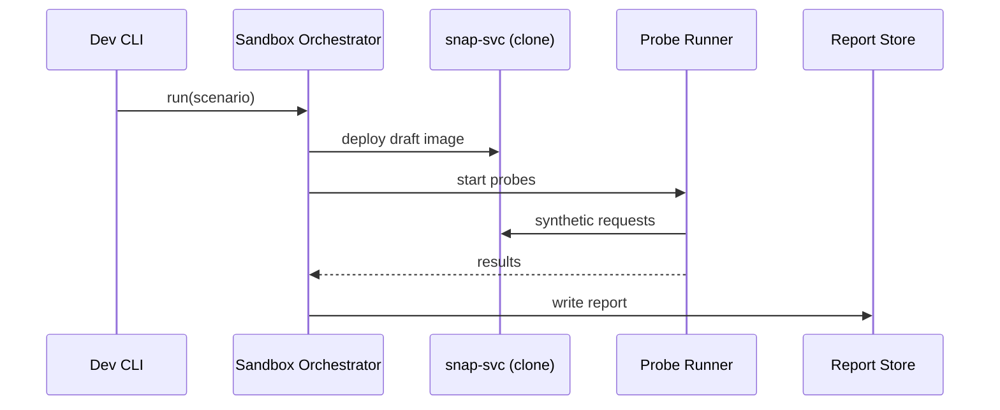

# Chapter 15: Testing & Simulation Sandbox
*[Link back to Chapter 14: Human-in-the-Loop Workflow (HITL)](14_human_in_the_loop_workflow__hitl__.md)*  

---

## 1. Why Do We Need a “Sandbox”?  

Central use-case (2 sentences)  
• The **Food & Nutrition Service (FNS)** is about to publish a new **SNAP eligibility rule** that could approve or deny benefits for 40 million Americans.  
• Before the rule hits production, analysts want to **simulate** its impact on a synthetic population, make sure low-income veterans are not unfairly rejected, and stress-test performance—**without** harming real citizens.  

The **Testing & Simulation Sandbox** is our *CBO scoring room* for software and data:

1. Spins up **isolated copies** of pipelines, policies, and micro-services.  
2. Feeds them **synthetic or replayed traffic** (days or years).  
3. Produces a **report card**—fairness, security, latency—so agencies deploy with confidence.  

One command, zero risk.  

---

## 2. Key Concepts (Plain-English Cheat-Sheet)

| Playground Analogy | Term | TL;DR |
|--------------------|------|-------|
| Toy city | Sandbox Environment | Disposable clone of HMS services & data |
| Action figures | Synthetic Data | Fake citizens, forms, payments |
| “What if…?” story | Scenario | YAML file describing events & probes |
| Test referee | Probe | Script that checks fairness, PII leaks, speed |
| Scoreboard | Report | Pass/Fail & metrics for each probe |
| Big red button | Purge | Deletes the sandbox when done |

Keep this table handy—the rest of the chapter is just these six ideas in action.

---

## 3. 5-Minute Walk-Through

### Scenario: “Will the new SNAP rule reject too many veterans?”

1. **Spin** a sandbox with the current production image of `snap-svc` **plus** the draft rule.  
2. **Load** 50 000 synthetic household profiles (incl. 5 000 veteran households).  
3. **Run** probes:  
   - *Fairness*: Veteran approval rate within ±2 % of non-veterans.  
   - *Security*: No PII leaked in logs.  
   - *Performance*: 95th-percentile latency < 200 ms.  
4. **Review** the auto-generated report.  
5. **Approve** or tweak the rule in [HITL](14_human_in_the_loop_workflow__hitl__.md).

---

## 4. Hands-On: Your First Sandbox

### 4.1 Describe the Scenario (11 lines)

`scenarios/snap_vet.yaml`
```yaml
id: SNAP_VET_FAIRNESS
services:
  - snap-svc:v-next        # draft rule image
data:
  synthetic_profiles: 50000
probes:
  - fairness.veteran_gap
  - security.no_pii_logs
  - perf.latency_95_pct
timeout: "10m"
```
Explanation  
• YAML lists **what to spin**, **how much fake data**, **which probes**, and **how long** to run.

---

### 4.2 Run It (single line)

```bash
hms-sim run SNAP_VET_FAIRNESS
```

Sample output (truncated):

```
✓ Sandbox ready (ns=sim-7f2c)
✓ Loaded 50 000 synthetic profiles
✓ Probe fairness.veteran_gap..... PASS (gap 1.2 %)
✓ Probe security.no_pii_logs..... PASS
✓ Probe perf.latency_95_pct...... FAIL (250 ms > 200 ms)
⚠️ 1 of 3 probes failed → see report sim-7f2c/report.html
```

What happened?  
1. A Kubernetes namespace `sim-7f2c` cloned the needed services.  
2. Synthetic data flooded the `/eligibility` endpoint.  
3. Probes inspected results & logs, then printed the scoreboard.  

---

### 4.3 Inspect the Report (auto-generated)

Open `sim-7f2c/report.html` in your browser:

```
┌────────────┬────────────┬────────┐
│ Probe      │ Result     │ Notes  │
├────────────┼────────────┼────────┤
│ Fairness   │   PASS     │ 1.2 %  │
│ Security   │   PASS     │ -      │
│ Performance│   FAIL     │ p95=250│
└────────────┴────────────┴────────┘
Recommendation:   Increase lambda memory or optimize DB.
```

Copy-paste the link into your [HITL queue](14_human_in_the_loop_workflow__hitl__.md) for discussion.

---

## 5. Under the Hood (Step-By-Step)


Only **5 participants**—simple enough for beginners to trace.

---

## 6. Peek Inside the Sandbox Engine

### 6.1 Orchestrator (≤ 18 lines)

`sim/orchestrator.py`
```python
import yaml, subprocess, time, tempfile, json

def run(scn_id):
    spec = yaml.safe_load(open(f"scenarios/{scn_id}.yaml"))
    ns = f"sim-{int(time.time())}"
    subprocess.run(["kubectl","create","ns",ns])
    for svc in spec["services"]:
        subprocess.run(["kubectl","run",svc.split(":")[0],
                        "--image=hms/"+svc,"-n",ns])
    data_path = gen_synth(spec["data"]["synthetic_profiles"])
    results = probes.run_all(spec["probes"], ns, data_path)
    report = {"spec": spec, "results": results}
    fname = tempfile.mktemp(prefix=ns, suffix=".json")
    open(fname,"w").write(json.dumps(report, indent=2))
    summarize(report)

def gen_synth(n):
    # returns path to generated JSONL (mocked)
    p="/tmp/synth.jsonl"; open(p,"w").write("{}\n"*n); return p
```
Explanation  
1. Creates a **K8s namespace**.  
2. Launches each listed service image.  
3. Generates fake data, calls probe runner, saves JSON report.

### 6.2 Probe Runner Stub (≤ 15 lines)

`sim/probes.py`
```python
import importlib, time
def run_all(ids, ns, data_path):
    out = {}
    for pid in ids:
        mod, fn = pid.split(".")
        probe = getattr(importlib.import_module(f"probes.{mod}"), fn)
        out[pid] = probe(ns, data_path)
    return out
```
Probes are just Python functions—easy to add or swap.

### 6.3 Example Probe (8 lines)

`probes/perf.py`
```python
import time, requests
def latency_95_pct(ns, data):
    t0 = time.time()
    # simplified: fire 100 fake requests
    for _ in range(100):
        requests.post(f"http://snap-svc.{ns}/eligibility", json={})
    p95 = (time.time()-t0)/100*95
    return {"pass": p95<0.2, "value": round(p95,3)}
```
Outputs a dict; Orchestrator turns it into PASS/FAIL.

---

## 7. How Other Layers Plug In  

| Layer | How It Helps the Sandbox |
|-------|--------------------------|
| [Governance](01_governance_layer__hms_gov__.md) | Blocks deployment until required probes PASS. |
| [Policy Engine](02_policy___process_engine_.md) | Draft rules loaded via PPE API into sandbox. |
| [Security & Compliance](04_security___compliance_framework_.md) | Sandbox images must carry Seal IDs. |
| [Audit Log](11_observability___audit_log_.md) | Every sandbox run emits `SANDBOX_RUN` with hash & outcome. |
| [HITL](14_human_in_the_loop_workflow__hitl__.md) | Failed probes route proposal back for revision. |

All protections you already know carry over automatically.

---

## 8. Common Pitfalls & Quick Fixes

| Oops! | Cause | Quick Fix |
|-------|-------|----------|
| Sandbox spins forever | Probe stuck | Set `timeout` in YAML; Orchestrator auto-kills namespace. |
| PASS in sandbox, fail in prod | Synthetic data too “clean” | Seed generator with *edge-cases* (all zeros, max ints). |
| Latency probe flaky | Shared dev cluster noisy | Ask Orchestrator for `resource_limits: cpu=2` in YAML. |

---

## 9. Mini-Lab: Red-Team Probe in 6 Lines

Add file `probes/security.py`:

```python
import requests, re
def sql_injection(ns, _):
    r = requests.post(f"http://snap-svc.{ns}/eligibility",
                      json={"name":"'; DROP TABLE users;--"})
    leak = bool(re.search(r"syntax|error", r.text, re.I))
    return {"pass": not leak, "detail": r.text[:50]}
```

Add `"security.sql_injection"` to `probes:` array, re-run scenario, and watch the sandbox shield you from a classic attack.

---

## 10. What You Learned

✓ Why an **isolated sandbox** is essential before touching real citizen data.  
✓ Core ideas: scenario YAML, synthetic data, probes, report, purge.  
✓ Ran a full fairness + security + performance test with **one CLI command**.  
✓ Peeked at internals: Orchestrator, Probe Runner, example probe (< 20 lines each).  
✓ Saw integrations with Governance, Policy Engine, Audit Log, and HITL.  
✓ Added your own red-team probe in 6 lines.

Ready to let **citizens and case-workers** interact with the polished, safe system you just validated?  
Continue to [User Portal (HMS-MFE)](16_user_portal__hms_mfe__.md).

---

Generated by [AI Codebase Knowledge Builder](https://github.com/The-Pocket/Tutorial-Codebase-Knowledge)