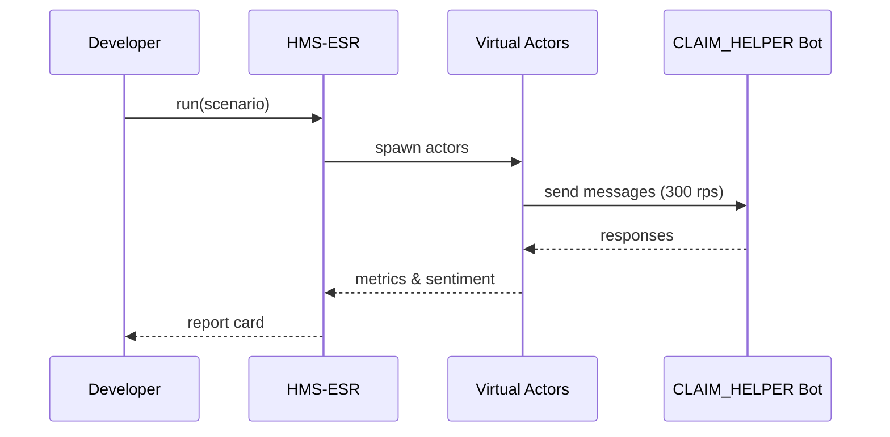

# Chapter 16: Simulation & Training Environment (HMS-ESR)

*[Jump back to the previous chapter: Security & Privacy Guardrails (Cross-Cutting)](15_security___privacy_guardrails__cross_cutting__.md)*  

---

## 1. Why Do We Need a “Flight Simulator” for Government Software?

Picture the **U.S. Department of Labor (DoL)** about to launch a brand-new  
chat-bot called **CLAIM_HELPER** that guides citizens through weekly unemployment filings.

Questions start flying:

* Will the bot stay alive when **25 000 users** log in at 9 AM Monday?
* What happens if someone submits a claim with **emoji in the name field**?
* Does the bot treat non-native English speakers fairly?
* Could a frustrated user expose hidden bias or crash a backend?

Testing on real citizens would be *unethical* and *illegal*.  
**HMS-ESR** is the **flight simulator** that lets DoL crash-test the bot in a **safe, synthetic world**:

```
Virtual Citizens & Employees  ─▶  CLAIM_HELPER & Backends
             ▲                             │
             └────── HMS-ESR orchestrates ─┘
```

If something breaks, only pixels get hurt—not people.

---

## 2. Key Concepts (Bite-Sized)

| Term | Everyday Analogy | Why It Matters |
|------|------------------|----------------|
| Scenario | Movie script | Describes who does what during the simulation. |
| Virtual Actor | Video-game NPC | A fake citizen, clerk, or hacker with goals + personality. |
| Spike Engine | Crowd at stadium gates | Generates traffic bursts to test scale. |
| Edge-Case Library | Bag of oddball props | Rare names, long attachments, unusual time-zones, etc. |
| Sentiment Probe | Customer-satisfaction survey | Measures frustration, delight, or bias in responses. |
| Report Card | Flight-sim de-brief | Summarizes bugs, slow spots, and ethical red flags. |

You only need these six ideas to get started.

---

## 3. 5-Minute Tour: Stress-Test a Chat-Bot Before Launch

Below is a **single 18-line script** that a DoL developer can run.

```python
# File: bot_stresstest.py
from hms_esr import Sandbox, Scenario, Actor, Probe

# 1️⃣  Connect to the sandbox
box = Sandbox.connect("dol_test_lab")

# 2️⃣  Write a tiny scenario
s = Scenario("monday_morning_rush")\
    .add_spike(rps=300, duration="10m")          # peak 300 req/s
    .add_actor(Actor.citizen(locale="es-ES"))    # Spanish speaker
    .add_actor(Actor.citizen(edge_case="emoji")) # 🤯 name field
    .attach_probe(Probe.sentiment())             # track emotions

# 3️⃣  Point it at the new bot URL
report = box.run(s, target="https://claim_helper.gov/chat")

# 4️⃣  Review results
print(report.status)            # -> "FAIL"
print(report.top_issue())       # -> "Bias: Spanish users 2× more retries"
```

What you did, in plain English:

1. **Connected** to a safe, private sandbox.  
2. **Described** traffic (300 req/s), weird inputs (emoji names), and user types (Spanish).  
3. **Ran** the scenario against the staging bot.  
4. **Read** a one-line verdict: FAIL—Spanish speakers had trouble.

No citizens were harmed in the making of this bug.

---

## 4. How Does HMS-ESR Work Under the Hood?

1. **Read Scenario** – Parse spike, actors, probes.  
2. **Spin Up Virtual Actors** – Lightweight workers with personas.  
3. **Fire Requests** – Actors hit the target URL using [Model Context Protocol](05_model_context_protocol__hms_mcp__.md) messages or raw HTTP.  
4. **Collect Signals** – Response time, error codes, sentiment scores.  
5. **Generate Report Card** – Classify bugs, bias, SLA breaches.  
6. **Emit Event** – `esr.report.finished` on the [A2A Bus](08_inter_agency_communication_bus__hms_a2a__.md) so QA teams and [HITL Oversight](06_human_in_the_loop__hitl__oversight_.md) can review.

### Mini Sequence Diagram



Five participants—simple and traceable.

---

## 5. Peeking at the Codebase (≤ 20 Lines Each)

### 5.1 Scenario DSL

*File: `hms_esr/scenario.py`*

```python
class Scenario:
    def __init__(self, name):
        self.name = name
        self.steps = []

    def add_spike(self, rps, duration):
        self.steps.append(("spike", rps, duration))
        return self

    def add_actor(self, actor):
        self.steps.append(("actor", actor))
        return self

    def attach_probe(self, probe):
        self.steps.append(("probe", probe))
        return self
```

A **fluent API**: chain `.add_*()` and get a ready script.

### 5.2 Spike Engine

*File: `hms_esr/spike.py`*

```python
def run_spike(target, rps, duration):
    end = time.time() + _parse(duration)
    while time.time() < end:
        for _ in range(rps):
            _fire_async_request(target)
        time.sleep(1)
```

• Fires `rps` async requests each second—simple but powerful.

### 5.3 Sentiment Probe (toy version)

*File: `hms_esr/probe.py`*

```python
import textblob

def sentiment(text):
    return textblob.TextBlob(text).sentiment.polarity  # −1..1
```

Real builds may use ML, but beginners can grok this in seconds.

---

## 6. Common Pitfalls & FAQs

| Question | Quick Answer |
|----------|--------------|
| “Will synthetic data leak into prod logs?” | No—every request carries a `X-ESR-SIM` header; [Security & Privacy Guardrails](15_security___privacy_guardrails__cross_cutting__.md) auto-redact it from public logs. |
| “Can I test backend ACH payments?” | Yes—point HMS-ESR at the **staging** [HMS-ACH](11_finance___clearinghouse_services__hms_ach__.md) endpoint; sandbox tokens prevent real money moves. |
| “How big can a spike be?” | Up to the sandbox quota (configurable in [Governance Layer](01_governance_layer__hms_gov__.md)); large government clouds handle > 1 M rps. |
| “Does ESR replace unit tests?” | No—think of it as *integration* and *stress* testing with realism. Keep your unit tests! |

---

## 7. Mini Exercise

1. Clone `examples/esr_quickstart.ipynb`.  
2. Create a scenario `late_night_mobile` with:  
   • 100 rps,  
   • Mobile browser user-agents,  
   • Actors from three time-zones.  
3. Attach `Probe.accessibility()` to check WCAG responses.  
4. Run against your staging UI.  
5. Open the generated HTML report—find the slowest endpoint.

---

## 8. What You Learned

* HMS-ESR is a **flight simulator** for AI agents and services—stress, edge cases, and sentiment, all without risking real citizens.  
* A few lines of Scenario DSL spin up thousands of virtual actors.  
* Reports flag performance, bugs, and ethical issues before launch.  
* ESR integrates with Guardrails, the A2A Bus, HITL, and other HMS layers.

Ready to see how real citizens will glide through your now-battle-tested app using AI-guided navigation?  
Head over to the next chapter:  
[Intent-Driven Navigation & AI-Guided Journeys](17_intent_driven_navigation___ai_guided_journeys_.md)

---

---

Generated by [AI Codebase Knowledge Builder](https://github.com/The-Pocket/Tutorial-Codebase-Knowledge)