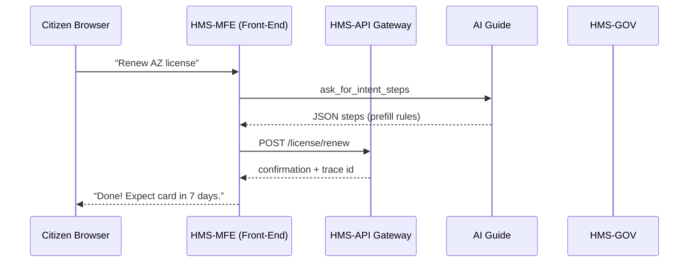
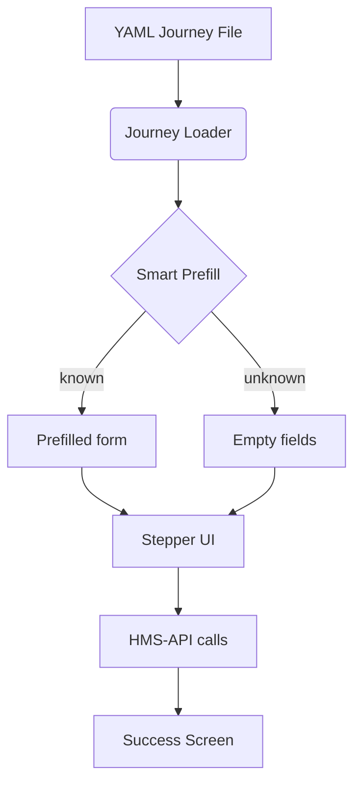

# Chapter 16: User Portal (HMS-MFE)

*[Link back to Chapter 15: Testing & Simulation Sandbox](15_testing___simulation_sandbox_.md)*  

---

## 1 . Why Do We Need a “Digital DMV Counter”?

Central use-case (three short sentences)  
• A **veteran in Arizona** wants to renew a driver’s license *and* check VA housing benefits during the same coffee break.  
• Today she jumps between five agency websites, re-typing her name, address, and DD-214 number until her fingers cramp.  
• The **User Portal (HMS-MFE)** is one single front door that **recognises her intent**, re-uses data across forms, and walks her from *start → finish* with DMV-style ticketing empathy.

Result: fewer abandoned forms, happier citizens, and agencies that look like they talk to each other.


---

## 2 . High-Level Flyover



Only five moving parts—easy to reason about.


---

## 3 . Key Concepts (Plain-English)

| DMV Analogy                        | HMS-MFE Term               | TL;DR for Beginners                                    |
|------------------------------------|----------------------------|--------------------------------------------------------|
| Number-ticket machine              | **Intent Selector**        | Citizen picks “I need to…” instead of hunting menus.   |
| Counter clerk who hands correct form| **Journey Engine**         | Generates the right set of steps for that intent.      |
| “NEXT WINDOW” light                | **Stepper UI**             | Visual progress bar → lowers anxiety.                  |
| Clerk types for you                | **Smart Prefill**          | Fetches known data via HMS APIs to reduce fatigue.     |
| Same stamp on every form           | **Gov UI Kit**             | Shared buttons, alerts, fonts across all agencies.     |
| ADA accessibility ramp             | **A11y Guardrail**         | Automated tests block non-accessible components.       |


---

## 4 . Bootstrapping Your First Journey (≤ 20 Lines Each!)

### 4.1 Declare a Journey in YAML (12 lines)

`journeys/license_renew.yaml`
```yaml
id: AZ_LICENSE_RENEW
intent: "Renew a Driver’s License"
steps:
  - id: CONFIRM_IDENTITY   # 1
  - id: UPDATE_ADDRESS     # 2
  - id: PAY_FEE            # 3
  - id: DOWNLOAD_TEMP_CARD # 4
prefill:
  UPDATE_ADDRESS: "/profile/address"
policy: "DMV_RULE_V2024_07"
```

What it does  
• Lists the **four** screens the citizen will see.  
• Says: “If we already know the address, pre-fill step 2 from `/profile` API.”  
• Points to the governing rule so policy stays transparent.

---

### 4.2 Minimal React-ish Component (18 lines)

`src/JourneyRunner.jsx`
```jsx
import React, {useState, useEffect} from "react";
import steps from "../journeys/license_renew.yaml";
export default function JourneyRunner(){
  const [idx,setIdx]=useState(0);
  const step=steps[idx];

  useEffect(()=>{            // simple prefill
    if(step.prefill){
      fetch(step.prefill).then(r=>r.json())
        .then(data=>setForm(s=>({...s,...data})));
    }
  },[idx]);

  function next(){ setIdx(i=>i+1); }

  return (
    <div>
      <Progress total={steps.length} current={idx+1}/>
      <StepRenderer step={step} onNext={next}/>
    </div>
  );
}
```

Explanation  
1. Loads the YAML at build-time (webpack loader).  
2. Shows a progress bar + current step.  
3. Auto-prefills when the step has a `prefill` URL.  

---

### 4.3 Submitting to the Backend (16 lines)

```jsx
function PayFee({formData,onNext}){
  async function pay(){
    const res=await fetch("/api/pay",{
      method:"POST",headers:{'Content-Type':'application/json'},
      body:JSON.stringify({caseId:formData.caseId, amount:25})
    });
    const ok=await res.json();
    if(ok.status==="PAID") onNext();
  }
  return <button onClick={pay}>Pay $25</button>;
}
```

What happens?  
• Makes one fetch call to **HMS-API Gateway** (see [Backend Service Mesh](07_backend_service_mesh__hms_api__.md)).  
• Upon success moves the citizen to the next step.  

---

## 5 . Under the Hood—How Does the Journey Engine Work?



• **Loader** reads YAML → an array.  
• **Prefill** hits APIs defined in YAML to save typing.  
• **Stepper** renders screens and tracks progress.  

---

## 6 . Little Peek into the Loader (≤ 18 Lines)

`lib/loader.js`
```js
import YAML from 'yaml';
export async function loadJourney(file){
  const text=await fetch(file).then(r=>r.text());
  const spec=YAML.parse(text);
  return spec.steps.map(s=>({
    id:s.id,
    prefill:s.prefill || null
  }));
}
```

Tiny & readable—perfect for beginners.


---

## 7 . How HMS-MFE Talks to Other Layers

| Layer | What HMS-MFE Consumes or Emits |
|-------|--------------------------------|
| [Access & Identity](05_access___identity_management_.md) | Uses JWT from Login.gov for all API calls. |
| [Policy & Process Engine](02_policy___process_engine_.md) | Reads policy id (`DMV_RULE_V2024_07`) for legal copy. |
| [AI Representative Agent](13_ai_representative_agent__hms_a2a__.md) | Provides anonymous usage stats so the agent can improve journey flow. |
| [Event Bus](08_event_bus___streaming_layer_.md) | Publishes `STEP_COMPLETED` events for analytics. |
| [Observability & Audit Log](11_observability___audit_log_.md) | Emits `FORM_SUBMITTED` with trace id. |


---

## 8 . Common Pitfalls & Quick Fixes

| Oops! | Why it Happens | Fast Fix |
|-------|----------------|---------|
| “Spinner forever” | Step fetch lacks timeout | Add `fetch(url,{timeout:4000})`. |
| Inconsistent look across agencies | Teams bypass UI Kit | Governance linter blocks merges w/o `<GovButton>` usage. |
| Screen-reader issues (508) | New component missing labels | `npm run a11y-test` before commit—fails CI if bad. |


---

## 9 . Mini-Lab: Build an Intent Selector in 7 Lines

Add to `src/IntentSelector.jsx`:

```jsx
export default function IntentSelector({onPick}){
  const intents=[
    {id:"AZ_LICENSE_RENEW",label:"Renew License"},
    {id:"FILE_USDA_LOAN",label:"Apply for Farm Loan"}
  ];
  return intents.map(i=>
    <button key={i.id} onClick={()=>onPick(i.id)}>{i.label}</button>);
}
```

Wire it at the app root—citizens now click **one** button and the right journey loads.  
You just eliminated three levels of confusing menus!


---

## 10 . What You Learned

✓ The User Portal is a **micro-frontend** that hides agency silos behind intent-based journeys.  
✓ Core pieces: Intent Selector, Journey Engine, Stepper UI, Smart Prefill, Gov UI Kit.  
✓ Declared a journey in 12-line YAML, rendered it with < 20 lines of React, and posted to HMS-API.  
✓ Saw internal loader logic and how every step automatically feeds Audit, AI, and Policy engines.  
✓ Practiced a mini-lab to add an Intent Selector.

Ready to make the portal **anticipate** what the citizen needs *before* they click anything?  
Jump to [Intent-Driven Navigation](17_intent_driven_navigation_.md).

---

Generated by [AI Codebase Knowledge Builder](https://github.com/The-Pocket/Tutorial-Codebase-Knowledge)