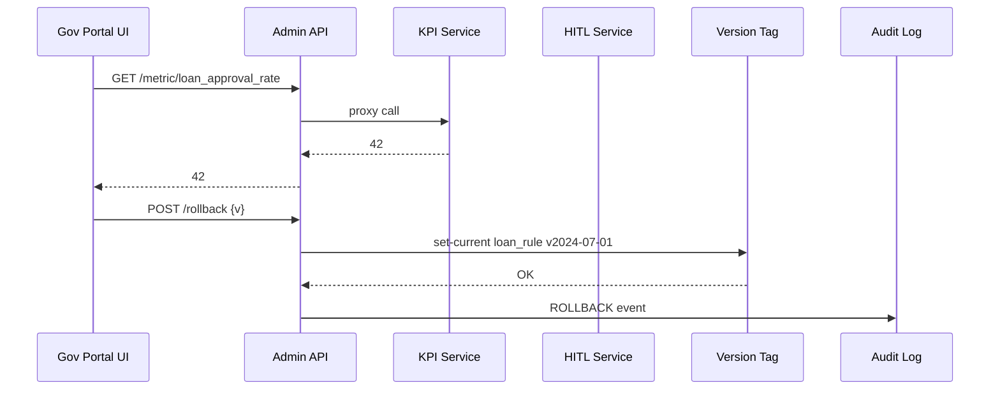

# Chapter 18: Admin/Gov Portal  
*[Link back to Chapter 17: Intent-Driven Navigation](17_intent_driven_navigation_.md)*  

---

## 1. Why Another Portal? (30-Second Pitch)

Central use-case  
• It is 3 p.m. at the Farm Credit Administration (FCA). Loan approvals suddenly drop from 500 / hr to 50 / hr.  
• A program manager wants to know **right now** whether the new “Rural-Loan-AI” policy is at fault, roll the change back if needed, or start a limited pilot in just two counties.  

The **Admin/Gov Portal** is the platform’s **control tower**:  
1. **Sees** live metrics, audit trails, and AI proposals in one place.  
2. **Acts**—approve, roll back, or launch a pilot with one click.  
3. **Proves** every click via immutable logs for GAO auditors.  

No SSH, no SQL consoles—just a web console that speaks *public-sector*.

---

## 2. Key Concepts (Plain-English Cheat-Sheet)

| Air-Traffic Analogy | Admin/Gov Portal Term | TL;DR |
|---------------------|-----------------------|-------|
| Radar screen        | Live Metrics Panel    | Pulls data from [KPI Dashboard](12_kpi___metrics_dashboard_.md). |
| Tower clearance     | Approval Workflow     | Approves AI or human proposals from [HITL](14_human_in_the_loop_workflow__hitl__.md). |
| Holding pattern     | Pilot Toggle          | Enable a feature for a slice of users/regions. |
| Emergency runway    | Rollback Button       | Instant pointer flip via [Versioning & Rollback](03_versioning___rollback_mechanism_.md). |
| Flight log          | Audit Pane            | Reads from [Observability & Audit Log](11_observability___audit_log_.md). |

Keep this table open; the rest of the chapter is just these five ideas in action!

---

## 3. 5-Minute Walk-Through (from Panic to Resolution)

1. **Alert**: Metric `loan_approval_rate` turns red on the portal’s radar.  
2. **Drill-down**: Manager clicks “View recent policy changes” → sees that **AI Proposal #842** auto-pushed a new eligibility rule 10 min ago.  
3. **Decision**: She clicks **Rollback to v2024-07-01**.  
4. **Result**: Approval rate climbs back to green within 30 seconds; an audit entry is written automatically.

You just prevented a nationwide loan freeze without calling DevOps.

---

## 4. Hands-On: Building a Tiny Control Tower

We’ll create three widgets and one action button—each file under 20 lines.

### 4.1 HTML Skeleton (18 lines)

```html
<!-- admin_portal/index.html -->
<h1>FCA Control Tower</h1>

<section id="metrics">
  <h2>Live Metrics</h2>
  <div id="rate" class="widget">--</div>
</section>

<section id="proposals">
  <h2>Pending Approvals</h2>
  <ul id="queue"></ul>
</section>

<section id="actions">
  <h2>Emergency Actions</h2>
  <button id="rollback">Rollback to Stable</button>
</section>

<script src="portal.js"></script>
```

What it does  
• Three areas: metrics, proposal queue, and an action button.  
• Loads one JS file (`portal.js`) for logic.

---

### 4.2 Front-End Logic (19 lines)

```javascript
// admin_portal/portal.js
async function refresh() {
  // 1. Live metric
  const rate = await fetch("/metric/loan_approval_rate").then(r=>r.json());
  document.getElementById("rate").innerText = rate.value + " / hr";

  // 2. Pending proposals
  const q = await fetch("/hitl/queue?limit=5").then(r=>r.json());
  const list = document.getElementById("queue");
  list.innerHTML = "";
  q.forEach(p => {
    const li = document.createElement("li");
    li.textContent = `${p.id}: ${p.change.policy_id}`;
    li.onclick = () => approve(p.id);
    list.append(li);
  });
}
setInterval(refresh, 5000); refresh();

// 3. Rollback
document.getElementById("rollback").onclick = () =>
  fetch("/rollback", {method:"POST",body:JSON.stringify({tag:"v2024-07-01"})});
```

Explanation  
1. Polls the **KPI API** every 5 s.  
2. Lists the first five **HITL** proposals; clicking approves.  
3. “Rollback” posts to a tiny backend (next section).

---

### 4.3 Back-End Routes (Python, 17 lines)

```python
# admin_api.py
from fastapi import FastAPI, Body
import requests, os, time
app = FastAPI()

# proxy KPI & HITL so browsers don’t need many domains
@app.get("/metric/{name}")
def metric(name:str):
    return requests.get(f"http://kpi-api/metric/{name}").json()

@app.get("/hitl/queue")
def queue(limit:int=5):
    return requests.get(f"http://hitl/next?limit={limit}").json()

@app.post("/rollback")
def rollback(payload=Body(...)):
    tag = payload["tag"]
    # call Version Tag service (Chapter 3)
    requests.post("http://tag/set-current",
                  json={"artifact":"loan_rule","version":tag})
    log_event("ROLLBACK",tag)
    return {"status":"OK"}

def log_event(act,detail):
    requests.post("http://audit/pub",json={
        "ts":time.time(),"actor":"ADMIN_UI","action":act,"detail":detail})
```

What happens?  
• Acts as a **facade**: collects data from existing services, hides authentication complexity.  
• Posts a `ROLLBACK` audit event so inspectors can trace it.

---

## 5. Under the Hood – Step-By-Step



Only six participants—simple, auditable.

---

## 6. How Other HMS Layers Plug In

| Layer | What the Portal Uses |
|-------|----------------------|
| [Access & Identity Management](05_access___identity_management_.md) | Officials log in via Login.gov; UI gets a JWT. |
| [KPI & Metrics Dashboard](12_kpi___metrics_dashboard_.md) | Dash widgets read KPI APIs directly. |
| [HITL Workflow](14_human_in_the_loop_workflow__hitl__.md) | Proposal queue shown & approve / reject buttons call HITL API. |
| [Versioning & Rollback](03_versioning___rollback_mechanism_.md) | One-click rollback flips the pointer. |
| [Observability & Audit Log](11_observability___audit_log_.md) | Every portal action is auto-logged. |
| [Security & Compliance](04_security___compliance_framework_.md) | Portal containers carry Seal IDs; CSP headers enforced. |

Nothing new to learn—just re-using existing layers.

---

## 7. Common Pitfalls & Quick Fixes

| Oops! | Why It Happens | Quick Fix |
|-------|----------------|-----------|
| “Rollback did nothing.” | Wrong artifact name | Double-check `set-current` JSON (`artifact` key). |
| Blank metrics panel | KPI API CORS blocked | Use same origin via Admin API proxy (see code). |
| Unauthorized access | Missing role | Ensure IAM role `FCA_MANAGER` includes `can: ["GET","/admin/*"]`. |

---

## 8. Mini-Lab: Launch a County-Level Pilot in 3 Steps

1. Add a **Pilot Toggle** endpoint to `admin_api.py`:

```python
@app.post("/pilot")
def pilot(body=Body(...)):
    requests.post("http://ppe/patch_policy", json={
       "policy_id":"loan_rule",
       "patch":f"enabled_counties={body['county_list']}"})
```

2. Wire a new button in HTML:

```html
<button onclick="fetch('/pilot',{method:'POST',
  body:JSON.stringify({county_list:['AZ-MARICOPA']})})">
Start Maricopa Pilot
</button>
```

3. Click the button—the policy engine now limits the feature to one county.  
Congratulations! You performed a safe, targeted rollout without touching code or YAML.

---

## 9. What You Learned

✓ Admin/Gov Portal = **control tower** for metrics, proposals, pilots, and rollbacks.  
✓ Built a minimal front-end & back-end (< 20 lines each) that:  
  • fetches KPIs, shows proposal queue, posts rollback.  
✓ Saw internal flow and how it leverages existing HMS layers.  
✓ Added a county-level pilot in three quick steps.  

You now have the full picture—from citizen intents to agency oversight.  
Grab a coffee—mission accomplished! ☕️

*(No next chapter – you reached the end of the HMS-ETL beginner guide. 🎉)*

---

Generated by [AI Codebase Knowledge Builder](https://github.com/The-Pocket/Tutorial-Codebase-Knowledge)